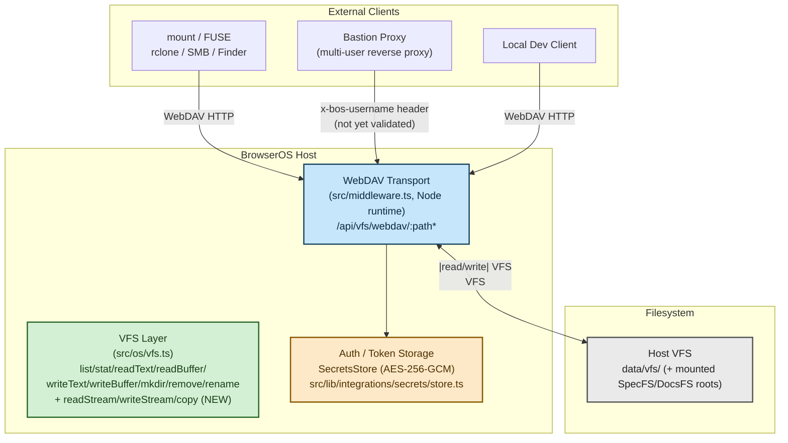
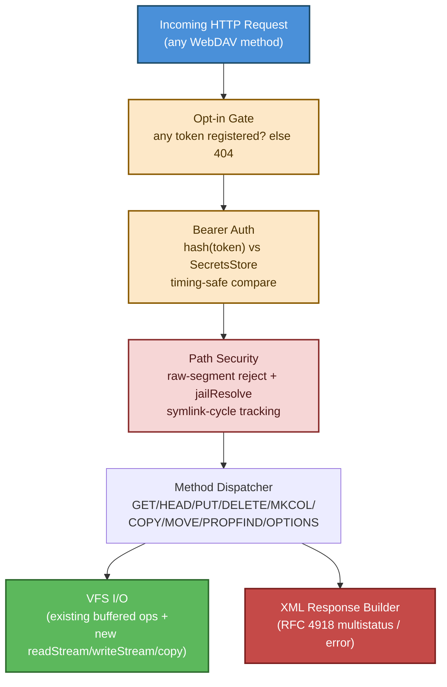
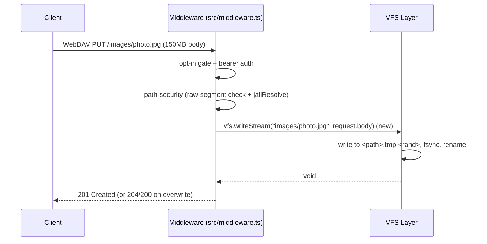
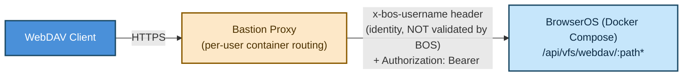
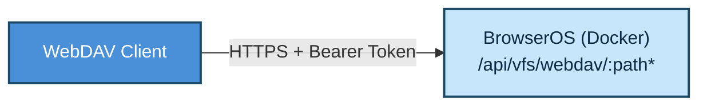
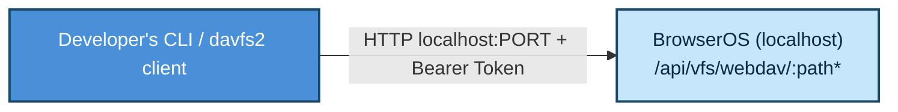
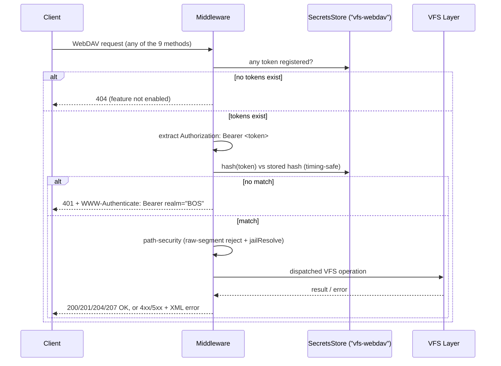

# VFS Mount — Technical Solution Design

> **Status:** Draft (corrected per `plan.md` §0)
> **Date:** 2026-07-31
> **Owner:** BrowserOS / VFS Mount Team

This revision applies the correction table in `plan.md` §0: CryptFS → `SecretsStore`, the real VFS API surface, the real module layout (Node middleware, not `route.ts`, for the WebDAV verbs), the real Bastion header, the `431` truncation status, and an honest "what's new" assessment. Treat `plan.md` as authoritative wherever the two disagree.

---

## 0. System Context (C4 Level 1)

The VFS Mount exposes the host's virtual file system (VFS) over WebDAV. From the perspective of a client (e.g., `mount -t davfs`, `rclone`, or a macOS Finder mount), the entire system boundary is a single WebDAV server sitting inside BrowserOS.



**Key observation:** There is exactly one external actor type (WebDAV clients) and one internal component (the WebDAV transport). The complexity is not in actor count — it is in the intersection of **security** (path traversal, symlink cycles), **RFC compliance** (XML error responses per RFC 4918), **three distinct deployment modes** that each change the authentication boundary, and — as §1 makes explicit — **the fact that the transport itself and several VFS primitives don't exist yet.**

---

## 1. Current State Analysis

- **No existing WebDAV code** in BrowserOS. The protocol layer is greenfield.
- BrowserOS already provides:
  - A VFS layer (`src/os/vfs.ts`) exposing `list`, `stat`, `readText`, `readBuffer`, `writeText`, `writeBuffer`, `mkdir`, `remove`, `rename`, `hostPath`, `registerMount` — all buffered (whole-`Buffer` reads/writes via `fs.promises`), routed through `findMount()` so `/Specs`, `/Docs`, `/Templates` transparently resolve to their own `FSBackend`. **No streaming, no `copy`.**
  - A Next.js App Router with a Node.js runtime available — but **only in Middleware**, not in `route.ts` handlers (see §2b).
  - `SecretsStore` (`src/lib/integrations/secrets/store.ts`), AES-256-GCM encryption-at-rest, keyed `"<owner>:<name>"` — the real mechanism for storing anything that needs to be encrypted at rest. There is no `CryptFS` module and no bcrypt anywhere in `src/` (bcrypt exists only in `bastion/`, a separate project this feature does not touch).
  - Session auth for the dashboard UI (`src/app/(dashboard)/layout.tsx`) — this gates browser sessions, not headless WebDAV clients, and is not reused here.
- The feature is distributed through the BrowserOS Marketplace as a service item (`data/user-apps/items/vfs-webdav-mount/`).
- The settings panel is planned for **Settings → Integrations → Local Mount**, pending confirmation during implementation of whether `Integrations`' custom component supports a sub-panel (see `plan.md` Phase 7).

**Implication — this is NOT a "lean on existing infrastructure" feature.** Four things must be built that don't exist today:
1. **The transport itself.** Next.js 16's App Router route handlers only accept `GET/HEAD/OPTIONS/POST/PUT/DELETE/PATCH` — `PROPFIND`/`MKCOL`/`COPY`/`MOVE` are rejected with a bare `400` before handler code runs. The whole protocol must live in `src/middleware.ts` (Node runtime), not in a `route.ts`.
2. **VFS streaming** (`readStream`/`writeStream`) — needed so multi-hundred-MB files don't get buffered fully in memory.
3. **VFS `copy`** — no analogue exists today; only `rename` (move) does.
4. **Token hashing** — FR-003 asks for bcrypt; none exists in `src/`. `crypto.scrypt` (built into Node) is the default substitute, stored via `SecretsStore`.

What genuinely *is* reusable: the VFS's mount dispatch (`findMount`), the atomic-write discipline (`src/os/atomic-write.ts`), the traversal-rejection primitive (`src/os/path-jail.ts`), and `SecretsStore` itself as the encryption-at-rest mechanism (just not for streaming/copy/transport).

---

## 2. Architecture Design (C4 Level 2 & 3)

### 2a. Container Level

```mermaid
graph LR
    subgraph "BrowserOS Host"
        MW["Node Middleware\nsrc/middleware.ts\nmatcher: /api/vfs/webdav/:path*"]
        ADAPTER["WebDAV Handler\nsrc/lib/webdav/handler.ts\n(path security, method dispatch, streaming)"]
        XMLBUILDER["XML Response Builder\nsrc/lib/webdav/xml.ts\n(RFC 4918 multistatus + error)"]
        TOKENSTORE["Token Storage\nSecretsStore namespace \"vfs-webdav\"\n(AES-256-GCM at rest)"]
        TOKENROUTE["Tokens API\nsrc/app/api/vfs/webdav/tokens/route.ts\n(standard verbs: GET/POST/DELETE)"]
    end

    subgraph "Deployment Environments"
        COMPOSE["Docker Compose + Bastion\n(x-bos-username header, unvalidated)"]
        DOCKER["Standalone Docker\n(bearer token only)"]
        LOCAL["Local Dev\n(bearer token only)"]
    end

    MW --> ADAPTER
    ADAPTER --> XMLBUILDER
    ADAPTER --> TOKENSTORE
    TOKENROUTE --> TOKENSTORE

    style MW fill:#c6e6fb,stroke:#1b4965,stroke-width:2px,color:#0b2942
    style ADAPTER fill:#d4f0d4,stroke:#2d6a2d,stroke-width:2px,color:#183d18
    style XMLBUILDER fill:#f6d6d6,stroke:#8a2d2d,stroke-width:2px,color:#4d1717
    style TOKENSTORE fill:#fde8c8,stroke:#8a5a00,stroke-width:2px,color:#4d3200
    style TOKENROUTE fill:#e7dcf5,stroke:#5b3a8a,stroke-width:2px,color:#33204d
```

The Settings panel (Phase 7) talks to `TOKENROUTE`, a normal `route.ts` — it only needs standard HTTP verbs. The WebDAV protocol itself never touches `route.ts`; it is handled entirely in `MW`.

### 2b. Component Level — The WebDAV Handler

**Decision (not conditional): the whole WebDAV protocol runs in `src/middleware.ts` (Node runtime, `matcher: ["/api/vfs/webdav/:path*"]`).** A spike against the installed `next@16.2.9` confirmed `PROPFIND`/`MKCOL`/`COPY`/`MOVE` are silently rejected with `400` by App Router route resolution — this is not a fallback path to keep in reserve, it is the reason `route.ts` is unusable for this feature at all. Middleware intercepts every method, for every request matching the matcher, before Next's per-method route resolution runs, and can terminate the request by returning a `Response` directly.



The dispatcher routes each HTTP method to the corresponding VFS operation. Operations marked **(new)** don't exist in `src/os/vfs.ts` today and are Phase 1 work; everything else is already there:

| HTTP Method | VFS Operation | Notes |
|---|---|---|
| `GET` | `vfs.readStream()` **(new)** | Local backend streams; mounted backends (`SpecFS`/`DocsFS`/`ReadonlyFS`) fall back to buffered `readBuffer` until they grow their own `readStream` |
| `PUT` | `vfs.writeStream()` **(new)** | Local backend streams via tmp-file+rename (same discipline as `writeFileAtomic`); mounted backends fall back to buffered `writeBuffer` |
| `HEAD` | `vfs.stat()` (existing) | Metadata only (Content-Length, Last-Modified, ETag), no body |
| `DELETE` | `vfs.remove()` (existing) | Single file or directory |
| `MKCOL` | `vfs.mkdir()` (existing) | Create a directory |
| `COPY` | `vfs.copy()` **(new)** | Local: read+write; mounted: backend `copy()` if implemented, else `409`/`502` |
| `MOVE` | `vfs.rename()` (existing) | Cross-mount-boundary already refused by `rename` today; surfaced as a client-facing error, not a crash |
| `PROPFIND` | `vfs.list()` (existing) | Depth 0/1; capped at 5,000 children — `431`, not `413`, if exceeded (see §5.3) |
| `OPTIONS` | — | Returns `DAV:`/`Allow:` headers only |

(9 methods total — `HEAD` appears once.)

---

## 3. Data Flow — Typical Request

### 3a. GET /api/vfs/webdav/documents/report.pdf

```mermaid
sequenceDiagram
    participant C as Client
    participant MW as Middleware (src/middleware.ts)
    participant V as VFS Layer

    C->>MW: WebDAV GET /documents/report.pdf
    MW->>MW: opt-in gate + bearer auth
    MW->>MW: path-security (raw-segment check + jailResolve)
    MW->>V: vfs.stat("documents/report.pdf")
    V-->>MW: StatResult (size, mtime, isDirectory=false)
    MW->>V: vfs.readStream("documents/report.pdf")  (new; buffered fallback if mounted)
    V-->>MW: Readable
    MW-->>C: 200 OK, Content-Type/Content-Length, streamed body
```

**Key detail:** for files under the default local VFS root, `readStream` returns a real `Readable` piped directly to the HTTP response — nothing is buffered in memory. For a file under a mounted subtree whose backend hasn't implemented `readStream`, the handler falls back to `vfs.readBuffer` and sends the whole buffer; this is a documented, scoped limitation (see §1 and `plan.md` §2), not an oversight.

### 3b. PUT /api/vfs/webdav/images/photo.jpg



**Streaming detail:** the request body arrives in Middleware as a genuine readable stream (confirmed in the Phase 0 spike, including with a >10MB body) and is piped straight to `fs.createWriteStream` for the local backend — never accumulated in a `Buffer`. The tmp-file+rename discipline is required so a WebDAV `PUT` racing a BOS-side write can't corrupt data.

---

## 4. Deployment Mode Architectures

Each mode changes the authentication boundary. The core logic (path security, VFS I/O, XML builder) is identical across all three.

### 4a. Docker Compose + Bastion (multi-user)



**Architecture:** Bastion (`bastion/src/proxy.ts`) forwards the authenticated user's identity via the `x-bos-username` header. **Nothing on the BOS side validates this header today**, and this feature's default scope (`plan.md` Phase 8) is to keep it that way: WebDAV auth relies **solely on the bearer token**, ignoring `x-bos-username`. Additionally validating the header against an expected user is explicitly deferred as new trust-boundary work, not part of this feature.

**Key difference:** Bastion routes the request to the right per-user container; auth within that container is identical to standalone Docker.

### 4b. Standalone Docker (Bearer Token)



**Architecture:** No reverse proxy in front. The WebDAV endpoint validates the bearer token directly from the `Authorization` header. There is **no safe "trust loopback" shortcut** here: inside a container, `localhost` from the client's perspective is the container itself, and Docker port-forwarding means an external client's request also arrives looking like an ordinary request — so the token check applies unconditionally, regardless of source address.

### 4c. Local Dev



**Architecture:** Same auth path as the other two modes — **there is no loopback bypass**. The only mode-specific behavior is the *opt-in gate*: if no token has ever been generated (`listKeys("vfs-webdav").length === 0`), the endpoint returns `404` regardless of deployment mode, so a fresh local dev checkout is simply invisible over WebDAV until a token is created in Settings.

**Key difference:** topology only — same host, no proxy hop.

---

## 5. Security Considerations

### 5.1 Path Traversal Prevention

- Every incoming path segment is checked **raw, before any URL-decoding is trusted** — reject `\`, doubly/percent-encoded traversal (`%2e%2e`, `%2f`, `%5c`), `./`, `//`.
- The decoded path is then resolved with `jailResolve` (`src/os/path-jail.ts`) — the same shared traversal-rejection primitive already used by directory-rooted backends — against the VFS root.
- Any path that resolves outside the root is rejected with `403 Forbidden`.

```
Input:  "/documents/../../etc/passwd"
Result: jailResolve rejects — outside VFS root → 403
```

### 5.2 Symlink Cycle Detection

- During a recursive `PROPFIND`/`GET` walk, maintain a `Set<string>` of resolved real paths visited in that single walk.
- If a resolution repeats a path already in the set, return **`508 Loop Detected`** with an RFC 4918 `<d:error>` body describing the cycle.
- This prevents infinite recursion and arbitrary file reads beyond the VFS root via symlink chains.

### 5.3 Bounded PROPFIND

- `PROPFIND` lists children of a directory (`Depth: 1`).
- Maximum: 5,000 children. If exceeded, return **`431 Request Header Fields Too Large`** (per spec FR-016 and Edge Cases — **not** `413`), truncating the listing.
- This prevents memory exhaustion when a directory contains an unbounded number of entries.

### 5.4 Bearer Token Auth

- **Generation:** `crypto.randomBytes(32)` (the same primitive already used in `src/lib/integrations/secrets/keyfile.ts`), base64url-encoded for display/transport. Shown to the user exactly once at creation time.
- **Hashing:** FR-003 asks for bcrypt, but no bcrypt exists in `src/` (only in `bastion/`, a separate project). Default substitute: Node's built-in `crypto.scrypt` + `crypto.timingSafeEqual` — irreversible, salted, constant-time compare, zero new dependency. Adding `bcryptjs` instead is possible but is a `package.json` change and requires explicit sign-off per `CLAUDE.md`.
- **Storage:** `getSecretsStore().set("vfs-webdav", tokenId, { hash, createdAt, label })` — AES-256-GCM at rest via the real `SecretsStore` (`src/lib/integrations/secrets/store.ts`), **not** a "CryptFS-encrypted `data/vfs/bearerToken` file" (no such module or file exists). `tokenId` is a short random lookup key so raw tokens are never stored or scanned.
- **Validation:** hash the presented token, compare against the stored hash with `crypto.timingSafeEqual` — never a plain string comparison.
- **Revocation:** delete the `SecretsStore` entry for that `tokenId`; multiple tokens are just multiple keys under the `"vfs-webdav"` namespace.
- **Opt-in gate:** before any of the above, the middleware checks whether any token exists at all; if none, return `404` (feature is invisible until a token is generated).
- **Bastion mode:** the bearer token is the only credential checked; the `x-bos-username` header is ignored (see §4a).

### 5.5 XML Error Responses (RFC 4918)

All error responses follow RFC 4918 structure, e.g. for a bounded-PROPFIND overflow:

```xml
<?xml version="1.0" encoding="utf-8"?>
<d:error xmlns:d="DAV:">
  <d:propfind-finite-depth/>
  <d:message>Directory has more than 5000 entries; listing truncated</d:message>
</d:error>
```

and for a rejected traversal attempt:

```xml
<?xml version="1.0" encoding="utf-8"?>
<d:error xmlns:d="DAV:">
  <d:forbidden/>
  <d:message>Path traversal detected</d:message>
</d:error>
```

This ensures compatibility with standard WebDAV clients that parse errors per the RFC.

---

## 6. Streaming Implementation

Large files (the SC-006 target is 200MB) must not be loaded into memory. **`readStream`/`writeStream` do not exist in `src/os/vfs.ts` today — this section describes Phase 1 additions, not current behavior.**

### 6.1 Download (GET / HEAD)

```typescript
// src/lib/webdav/methods/get.ts (Phase 4)
const stat = await vfs.stat(path);
if (stat.isDirectory) {
  return xmlDirectoryListing(path, await vfs.list(path));
}
const stream = await vfs.readStream(path); // NEW: src/os/vfs.ts Phase 1
return new Response(stream, {
  headers: {
    "Content-Type": "application/octet-stream",
    "Content-Length": String(stat.size),
  },
});
```

`vfs.readStream` is implemented for the default local backend with `fs.createReadStream`. For a backend that hasn't implemented the optional `readStream?` member of `FSBackend` (`SpecFS`, `DocsFS`, `ReadonlyFS`), `vfs.ts` falls back to `readBuffer` internally and the caller sees an ordinary (non-streamed) `Readable` wrapping the full buffer.

### 6.2 Upload (PUT)

```typescript
// src/lib/webdav/methods/put.ts (Phase 5)
await vfs.writeStream(path, request.body); // NEW: src/os/vfs.ts Phase 1
// Local backend: pipes to a tmp file, fsyncs, renames over the target —
// the same crash-safety discipline writeFileAtomic already uses for
// buffered writes (src/os/atomic-write.ts), so a WebDAV PUT racing a
// BOS-side write can't corrupt data.
```

**Key design decision:** the Middleware receives the request body as a genuine `Readable` (confirmed in the Phase 0 spike, including under a >10MB body without full buffering) and passes it straight through to `vfs.writeStream`. `FSBackend` (`src/os/fs-types.ts`) gains **optional** `readStream?`/`writeStream?`/`copy?` members; backends that don't implement them keep working via the buffered fallback.

---

## 7. Auth Flow Across All Modes



**Auth decision:** bearer-token validation is intentionally simple (hash + constant-time compare, no rotation/refresh flow) — WebDAV clients rarely support modern auth flows (OAuth, JWT), so a static bearer token matches the protocol's traditional authentication model. There is no localhost bypass in any deployment mode (see §4c).

---

## 8. Key Design Decisions & Tradeoffs

### 8.1 Node Middleware vs. App Router Route Handlers vs. Separate Process

| Aspect | Node Middleware (chosen) | App Router `route.ts` | Separate Process |
|---|---|---|---|
| Supports `PROPFIND`/`MKCOL`/`COPY`/`MOVE` | Yes — no method gate | **No** — Next 16 rejects with bare `400` before handler code runs | Yes, but duplicates transport |
| Integration with BOS | Native — shares VFS, `SecretsStore` in-process | Native | Isolated |
| Complexity | Moderate (hand-rolled dispatch in middleware) | Low, but non-viable for this protocol | High (separate Docker image, IPC to VFS) |

**Decision:** Node Middleware (`src/middleware.ts`, `runtime: "nodejs"`, `matcher: ["/api/vfs/webdav/:path*"]`). This is the only option confirmed to work for non-standard WebDAV verbs; `route.ts` is not a fallback to consider, it is ruled out. A small conventional `route.ts` is still used, but only for the token-management API (`src/app/api/vfs/webdav/tokens/route.ts`), which needs nothing beyond `GET`/`POST`/`DELETE`.

### 8.2 WebDAV Library vs. Custom Handler

| Aspect | `webdav-server` (lib) | Custom Handler |
|---|---|---|
| RFC compliance | Good | Manual |
| Flexibility | Moderate | Full |
| New dependency | Yes — `package.json` change | None |
| Maintainability | Low (external release cadence) | High (under our control) |

**Decision:** Custom handler. A library would also need to be adapted to run inside Middleware rather than a Node HTTP server, eroding most of its convenience. A custom handler gives full control over streaming, path security, and XML error responses without a `package.json` change.

### 8.3 Streaming vs. Buffering for Large Files

| Aspect | Buffering | Streaming |
|---|---|---|
| Memory for 1GB file | ~1GB heap | ~16KB buffer |
| Client disconnect | Lost progress | Continues or fails fast |
| Implementation | Trivial (existing `readBuffer`/`writeBuffer`) | Requires **new** `vfs.readStream`/`writeStream` (Phase 1) |

**Decision:** Streaming for the default local VFS root — non-negotiable for the SC-006 200MB target. This requires extending `src/os/vfs.ts` and `src/os/fs-types.ts`; it is not available today. Mounted-backend paths (`SpecFS`/`DocsFS`/`ReadonlyFS`) fall back to buffering until/unless those backends grow their own stream implementations — an explicitly scoped limitation, not a gap to silently paper over.

---

## 9. Implementation Guidance

### 9.1 Module Boundaries

```
src/
├── middleware.ts                          # NEW — Node runtime, matcher: /api/vfs/webdav/:path*
│                                           #   entire WebDAV protocol dispatch lives here
├── lib/webdav/
│   ├── handler.ts                         # dispatch(request) → Response
│   ├── auth.ts                            # bearer-token check against SecretsStore("vfs-webdav")
│   ├── tokens.ts                          # generate/hash/verify/revoke/list
│   ├── path-security.ts                   # raw-segment reject + jailResolve
│   ├── xml.ts                             # RFC 4918 multistatus + <d:error> builders
│   ├── logging.ts                         # logger() with COMPONENT = "vfs.webdav"
│   └── methods/
│       ├── options.ts   propfind.ts   get.ts   head.ts
│       └── put.ts   delete.ts   mkcol.ts   copy.ts   move.ts
├── app/api/vfs/webdav/tokens/route.ts     # NEW — standard verbs only (GET/POST/DELETE), for the Settings panel
└── os/
    ├── vfs.ts                             # + readStream/writeStream/copy (Phase 1)
    └── fs-types.ts                        # + optional readStream?/writeStream?/copy? on FSBackend

data/user-apps/items/vfs-webdav-mount/     # marketplace item (Phase 6/7)
  services/vfs-webdav-mount/service.json
  settings/  doc/  spec/

tests/webdav/*.test.ts                     # unit (Playwright unit runner)
e2e/vfs-webdav.spec.ts                     # e2e (Playwright)
```

No file under `src/api/` or `src/webdav/` is used — the App Router convention is `src/app/api/**/route.ts`, and business logic lives in `src/lib/**` per `CLAUDE.md`.

### 9.2 Interface Contract

**Existing today** (`src/os/vfs.ts`):

```typescript
interface VFS {
  list(path: string): Promise<DirectoryEntry[]>;
  stat(path: string): Promise<StatResult>;
  readText(path: string): Promise<string>;
  readBuffer(path: string): Promise<Buffer>;
  writeText(path: string, contents: string): Promise<void>;
  writeBuffer(path: string, buf: Buffer): Promise<void>;
  mkdir(path: string): Promise<void>;
  remove(path: string): Promise<void>;
  rename(from: string, to: string): Promise<void>;
}
```

**New in Phase 1** — additive only, nothing above is removed or changed:

```typescript
interface VFS {
  // ...existing members above...
  readStream(path: string): Promise<Readable>;
  writeStream(path: string, stream: Readable): Promise<void>;
  copy(from: string, to: string): Promise<void>;
}
```

`FSBackend` (`src/os/fs-types.ts`) gains matching **optional** members (`readStream?`, `writeStream?`, `copy?`); `vfs.ts` calls them when present and falls back to `readBuffer`/`writeBuffer` when absent.

### 9.3 Settings Panel (Required)

Path: **Settings → Integrations → Local Mount** (tentative — confirm sub-panel support during implementation; see `plan.md` Phase 7).

Fields / behavior:
- **Tokens list** with revoke buttons; **Generate token** shows the raw token exactly once (copy-once display) — after that only the label/creation date are retrievable, never the raw value (it isn't stored raw).
- **Bearer Token** is stored via `SecretsStore` (AES-256-GCM), namespace `"vfs-webdav"` — not "CryptFS-encrypted."
- **Mount instructions** per OS/deployment mode: macOS `mount_webdav`, Linux `davfs2` (including the `use_locks 0` note), plus the reachable URL for the current deployment mode (§4).

---

## 10. Summary

The VFS Mount feature is architecturally simple in shape — one transport wrapping a standardized protocol (WebDAV) over an I/O layer (VFS) — but it is **not** a lean-on-existing-infrastructure feature. Four concrete things must be built:

1. **The transport itself** — Node Middleware (`src/middleware.ts`), because App Router route handlers cannot carry `PROPFIND`/`MKCOL`/`COPY`/`MOVE` at all.
2. **VFS streaming** (`readStream`/`writeStream`) for the local backend, with buffered fallback for mounted backends.
3. **VFS `copy`**, with the same buffered/backend-optional pattern.
4. **Token hashing** via `crypto.scrypt` (no bcrypt in `src/`) plus `SecretsStore` (AES-256-GCM) for storage — not a "CryptFS" module, which doesn't exist.

Layered on top of those new primitives: **security** (path traversal, symlink cycles → `508`, bounded enumeration → `431`), **three deployment modes** with no loopback-trust shortcut in any of them, and **RFC 4918 compliance** for XML responses.
