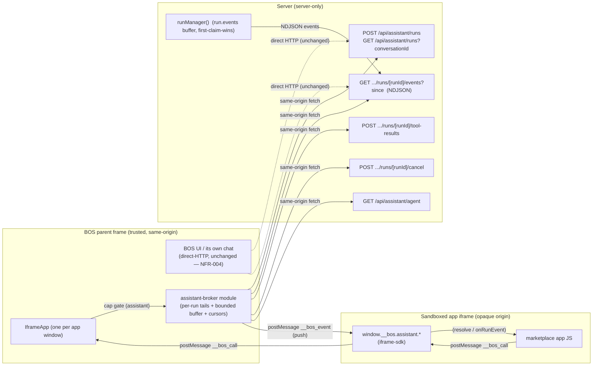

# Design: Assistant Broker Capability

**Feature**: `040-assistant-broker-capability` · **Branch**: `bos/040-assistant-broker-capability`
**Spec**: `spec.md` (same dir) · **App Target (spec)**: `bos-core`

This design lets an opaque-origin (marketplace) app drive the assistant run API through
the sandbox postMessage broker, instead of a direct `fetch` that fails cross-origin with
no CORS. The parent frame (trusted, same-origin) performs the calls and relays results —
the exact pattern `fs`/`settings`/`services:read` already use
(`docs/dev/design-heuristics.md` § "Opaque-origin sandboxed apps can't `fetch()` BOS APIs directly").

---

## 1. Classification

**App Target: `bos-core`** — agrees with `spec.md`'s `App Target` field. No disagreement.

Rationale: this is a genuine change to BOS's own source — it touches the sandbox
capability type (`src/os/types.ts`), the capability-validation allowlist
(`src/app/api/apps/[id]/capabilities/route.ts`), the capability grant UI
(`src/components/apps/settings/AppsTab.tsx`), and the iframe broker
(`src/components/apps/IframeApp.tsx` + a new sibling module), plus the iframe SDK.
None of it is a self-contained app folder (`src/apps/<id>/`) and none of it is a
marketplace item. It is a new *capability* on the existing sandbox subsystem, which is
BOS core infrastructure by definition.

It is **not** a `marketplace-item` service facet: there is no new background daemon, no
worker thread, no own port, no raw/non-standard protocol. The "streaming" requirement is
satisfied entirely inside the existing browser parent frame, which already owns a
same-origin fetch context and can hold the run's NDJSON reader — no new process is
needed. (This directly avoids the "technical limitation forces a new container" trap the
classification checklist warns about: the NDJSON-can't-cross-postMessage problem is
solved by having the *parent* — which already exists — own the stream, not by adding a
new service.)

---

## 2. Constitution check

| Principle | Status |
|---|---|
| **II. Server Authority & SSR Boundary** | ✅ Compliant. The run API (`/api/assistant/runs/**`) stays server-only. The broker is a *client-side relay* that calls same-origin `fetch`; it sets **no** CORS headers and leaks **no** secrets. The parent's per-run event buffer is a cache of data already public to the BOS origin. |
| **IV. Minimize Blast Radius** | ✅ Compliant. Change lands on the feature branch named in the spec. Additive capability; existing capabilities and direct-HTTP consumers are untouched (NFR-004). |
| **V. VFS Is Not the Source** | ✅ N/A — this edits `src/` via the developer sub-agent; no VFS writes. |
| **VI. Specs & Docs Stay in Sync** | ⚠️ Requires a companion doc (see File Plan, docs line). Record the pre-existing `storage`/`VALID_CAPS` drift if not fixed (see Risks). |
| **Technology Constraints** | ✅ Follows the existing sandbox/capability pattern (installed apps are sandboxed iframes; capabilities gate broker methods). No new external dependency is introduced — only a new capability string and a client module. |

No conflicts requiring papering over. One deliberate deviation from the spec's literal
"return the API response body" (the list-agents method) is called out in ADR-4.

---

## 3. Architecture

### 3.1 Key insight (grounded in source)

The run's event log **already lives server-side** in `run-manager.ts`: `run.events` is
an append-only, monotonically-sequenced array, bounded to `MAX_EVENTS = 50_000`, kept
attachable for `RETENTION_MS = 5 * 60_000` after finish. `runManager().subscribe(run,
since, onEvent)` replays `seq > since` synchronously then tails live
(`src/lib/assistant/run-manager.ts`). The `events` route
(`src/app/api/assistant/runs/[runId]/events/route.ts`) is purely a *viewer* — "N tabs
are N viewers, never N executors."

Therefore the parent frame needs no new streaming primitive: it is **just another
viewer** of the same server stream, running the same reader loop `run-client.ts`
already runs (`src/lib/assistant/client/run-client.ts` `attachToRun`). The parent's job
is to read the NDJSON in-process and `postMessage` each parsed `RunEvent` into its child
iframe. The server buffer remains the **authoritative** source for any reconnect past
the parent's cache.

### 3.2 Context

The broker is **per-iframe**: `IframeApp` is one React component instance per app
window, each holding its own `iframeRef`, `capSet`, and `appId`. So each app's parent
side is isolated to its window, and multiple apps / runs do not interfere (spec edge
case "Multiple active runs across apps").

### 3.3 Container

- **BOS parent frame** (Next.js client bundle, "use client"): the existing
  `IframeApp` component gains a broker instance; a new client module
  `src/components/apps/assistant-broker.ts` owns the per-run state. This runs entirely
  in the browser, in the trusted same-origin context.
- **Sandboxed iframe** (opaque origin for marketplace apps): unchanged container; the
  app talks to it through `window.__bos` (iframe-sdk), which gains an `assistant` group.
- **Server**: the existing run routes + `runManager()` singleton (`globalThis`,
  hot-reload-safe). **Unchanged** — this feature only *calls into* it.

### 3.4 Component

New/changed modules, and what each owns:

1. **`src/os/types.ts`** — `AppCapability` union: add `"assistant"`.
2. **`src/app/api/apps/[id]/capabilities/route.ts`** — `VALID_CAPS`: add `"assistant"`.
   (Server-side allowlist that silently drops unlisted caps on `PUT` — must include it
   or the Settings toggle is a no-op.)
3. **`src/components/apps/settings/AppsTab.tsx`** — `ALL_CAPABILITIES`: add one row
   `{ id: "assistant", label: "Assistant", description: "…" }`, mirroring the existing
   checkbox rows. No new mockup; it reuses the exact `toggleCap`/row pattern.
4. **`src/components/apps/assistant-broker.ts`** (NEW, client-side) — the stream owner.
   Owns, per app window (one instance per `IframeApp`):
   - a **run table** `Map<runId, RunSession>` where `RunSession = { events: RunEvent[],
     lowWater, highWater, finished, abort }`;
   - **one live server tail per run** (a `fetch(.../events?since=N)` + `ReadableStream`
     reader loop, the same shape as `run-client.ts attachToRun`) that appends each parsed
     event to the session's buffer and pushes it to the child;
   - **replay from the buffer** on (re)attach: serve every buffered event with
     `seq > childCursor`, then continue live;
   - **authoritative fallback**: if the child's cursor is below the buffer's
     `lowWater` (missed more than the cache holds), tear down the current tail and re-open
     the server stream at `?since=cursor` (the server replays the gap — `run.events`
     is the source of truth);
   - **cross-app isolation map** `Map<runId, appId>` at **module level** (survives iframe
     reload, unlike in-iframe state) populated on `startRun`; used to refuse a child
     reading/driving a run it did not start (see ADR-5).
   Methods: `listAgents`, `startRun`, `attach(runId, since)`, `postToolResult(runId,
   callId, result)`, `activeRun(conversationId)`, `cancelRun(runId)`, `dispose()`.
5. **`src/components/apps/IframeApp.tsx`** — (a) add `assistant:*` entries to
   `CAP_FOR_METHOD` (all → `"assistant"`); (b) in `handleMessage`, after the existing
   synchronous cap gate, route `assistant:*` methods to the broker instance instead of
   the stateless `dispatch()`; (c) instantiate the broker in the effect and
   `dispose()` on cleanup (abort tails).
6. **`src/lib/iframe-sdk/index.ts`** — add `window.__bos.assistant.*` wrappers (the 5th
   "place") so an app gets promise/callback parity with `run-client.ts`:
   `listAgents()`, `startRun({conversationId, agentId, message, surfaceTools?})`,
   `onRunEvent(runId, cb) → unsubscribe` (internally tracks last-seen `seq` per run and
   calls the parent's `attach`), `postToolResult(runId, callId, result)`,
   `getActiveRun(conversationId)`, `cancelRun(runId)`.

### 3.5 The event-transport decision (parent-push + bounded buffer)

**Chosen transport: PARENT-PUSH** (parent owns the server tail and pushes each event
into the child over `postMessage` as it arrives), with a **bounded per-run ring buffer**
and a **per-child cursor**, falling back to an authoritative server re-fetch for stale
cursors. See ADR-1 for the full parent-push vs child-poll analysis.

**Why a buffer is needed even with a single child:** on an iframe reload the child loses
its JS state but the parent's live tail is still open. To replay the gap *without* a
server round-trip and *without* opening a second (out-of-order) subscription, the parent
keeps the recent events in memory. The buffer's `lowWater` = the minimum cursor across
attached children for that run; events at or below `lowWater` are dropped (NFR-002:
already-delivered-and-acked events may be discarded). The buffer is capped
(`MAX_BROKER_BUFFER`, default ~2000 events / ~1 MB — well below the server's 50k
`MAX_EVENTS`); a child cursor older than `lowWater` triggers the authoritative
re-fetch, so the cache is a fast path, never a correctness dependency.

**Ordering (FR-003):** the parent's reader loop is single-threaded per run; it replays
buffer events in `seq` order and appends/ pushes live events in increasing `seq`.
`postMessage` from one source to one iframe is FIFO, so the child observes strictly
increasing `seq` per run. `ping` keepalive lines (no `seq`) are skipped, exactly as
`run-client.ts` does.

**Terminal flag (spec edge "run finishes between polls"):** when the reader sees
`run_finished`, the parent sets the session `finished` and the child's `attach`/
`onRunEvent` completes after delivering `run_finished`; subsequent `attach` calls return
the buffered terminal event. This is the "done" signal (the `done` half of the
`{events, done}` shape the spec sketches for child-poll is preserved as the push model's
"stream ended" + final-event semantics).

**Non-blocking (NFR-003):** `postMessage` pushes are fire-and-forget and never block
other broker request/response calls (which use the existing correlated
`__bos_call`/`__bos_response` channel). There is no tied-up long-poll.

**Latency (NFR-001 ≤ 500 ms):** event → parent reader → `postMessage` → child handler
is a single in-page hop with no poll interval; the only added latency over direct HTTP
is the postMessage + a microtask, comfortably within budget. (SC-003.)

### 3.6 Surface tools & first-claim-wins (FR-009, FR-010)

- **Surface tools ride along** in the `startRun` body: the broker passes the app's
  `surfaceTools: ToolDeclaration[]` (each `execution: "frontend"`) straight into
  `POST /api/assistant/runs`, where `startAssistantRun` merges them into `run.tools`
  (`src/lib/assistant/start-run.ts` `manager.addSurfaceTools(run, opts.surfaceTools)`).
  Identical to the direct-HTTP path, so "exactly as if started via direct HTTP" holds.
  A mid-run `assistant:push-surface-tools` method is **out of scope** (not in FR-002) —
  see Risks; the start-body path fully satisfies FR-009.
- **Frontend tool round-trip:** when the model calls a frontend tool, the run loop calls
  `awaitFrontendResult(run, callId, timeout)` — a pending promise on the server
  (`run-manager.ts`). The `tool_call` event (`execution: "frontend"`, with `name`,
  `callId`, `args`) flows through the event buffer to the child; the child executes it
  locally and calls `assistant:postToolResult(runId, callId, result)`; the parent
  `POST`s `/tool-results`, which calls `submitToolResult(run, callId, result)` —
  **first claim wins, duplicates return `{claimed:false}`** (`run-manager.ts`,
  `tool-results` route). FR-010 is preserved *by delegation to the unchanged server
  semantics* — the broker adds no new claim logic.
- **Post after finish (edge case):** `submitToolResult` on a finished/unknown run returns
  `false` (or 404); the broker relays that as a no-op, matching the spec's "accepted,
  ignored."

### 3.7 Capability grant flow (FR-001, FR-007, FR-008)

1. **Declare** — the item's `app.json` may list `"assistant"` in `capabilities` (the
   pre-035 default). Real grants are BOS-owned state, not item content:
   `data/system/config/<id>/capabilities.json` (`src/system/items/capabilities.ts`),
   migrated from the manifest on first read via `resolveCapabilities`
   (`src/lib/apps/store.ts readApp`).
2. **Grant/revoke** — Settings → Apps → expand an app → toggle "Assistant"
   (`AppsTab.tsx toggleCap`) → `PUT /api/apps/[id]/capabilities` → `setAppCapabilities`
   → `writeCapabilities` (sticky). `VALID_CAPS` must include `assistant` or the PUT
   silently drops it.
3. **Gate** — `IframeApp.handleMessage` already resolves `requiredCap =
   CAP_FOR_METHOD[method]` and **synchronously** rejects with `Capability "..." not
   granted` before any dispatch, when `capSet` (from `resolveCapabilities`, passed as
   `params.capabilities` on the manifest) lacks it. Adding the `assistant:*` methods to
   `CAP_FOR_METHOD` makes the gate work for free, and the synchronous reject meets SC-002
   (denial within 100 ms). Revoking mid-run: the cap set is re-read per window launch,
   so in-flight polls keep delivering (server-owned run) while new `startRun` calls
   reject — matching the spec edge case.

### 3.8 Backward compatibility (NFR-004)

Direct-HTTP consumers (same-origin `origin:"local"` apps, the BOS UI's own chat) are
untouched: they keep using `/api/assistant/runs/**` directly; the broker is a parallel
path. Adding a new `AppCapability` string and new broker methods is additive. A
same-origin app that does *not* declare `assistant` and uses direct `fetch` is unaffected
(spec US-4).

---

## 4. File / module plan (only what this feature creates or modifies)

| Path | Action | Change |
|---|---|---|
| `src/os/types.ts` | modify | Add `"assistant"` to the `AppCapability` union (with a comment, mirroring `services:read`). |
| `src/app/api/apps/[id]/capabilities/route.ts` | modify | Add `"assistant"` to `VALID_CAPS`. |
| `src/components/apps/settings/AppsTab.tsx` | modify | Add one `ALL_CAPABILITIES` row for `assistant`. |
| `src/components/apps/assistant-broker.ts` | **create** | Client-side stream owner: per-run tails, bounded ring buffer + low-water, per-cursor replay, authoritative re-fetch, `runId→appId` isolation map, the six method implementations. No server-only imports. |
| `src/components/apps/IframeApp.tsx` | modify | Add `assistant:*` → `"assistant"` to `CAP_FOR_METHOD`; route those methods to a per-instance broker in `handleMessage` (post cap-gate); construct/dispose the broker in the effect. |
| `src/lib/iframe-sdk/index.ts` | modify | Add `assistant` group to `BosApi` + a `__bos_event` listener (returns unsubscribe) + wrappers; keep dependency-free. |
| `docs/dev/assistant/assistant-broker.md` | **create** | Dev doc: the capability, the broker methods, the parent-push + buffer model, the four(+SDK) places, reconnect semantics, isolation rule. (Constitution VI.) |

No changes to `src/app/api/assistant/**` or `src/lib/assistant/run-manager.ts` — they are
integration points, not deliverables (below).

---

## 5. Integration points (existing mechanisms this design calls into, does not modify)

- **`POST /api/assistant/runs`** (`src/app/api/assistant/runs/route.ts`) — start a run;
  `201 {runId}`; `409 {error, activeRunId}` on `ActiveRunError`.
- **`GET /api/assistant/runs?conversationId=`** (same route) — active run or `{runId:null}`.
- **`GET /api/assistant/runs/[runId]/events?since=`** (`.../events/route.ts`) — NDJSON
  replay-then-tail; keepalive pings; `maxDuration=3600`; any number of viewers.
- **`POST /api/assistant/runs/[runId]/tool-results`** — first-claim-wins; `{claimed}`.
- **`POST /api/assistant/runs/[runId]/cancel`** — server-side stop; idempotent; `{ok, cancelled, status}`.
- **`GET /api/assistant/agent`** (`src/app/api/assistant/agent/route.ts`) — agent list.
- **`runManager()`** (`src/lib/assistant/run-manager.ts`) — authoritative `run.events`
  buffer (50k cap, 5-min post-finish retention), `subscribe` replay-then-tail,
  `submitToolResult` first-claim-wins, `activeFor`, `cancel`. The parent buffer is a
  client cache in front of this; the server is the source of truth for stale cursors.
- **`startAssistantRun`** (`src/lib/assistant/start-run.ts`) — merges `surfaceTools` into
  `run.tools` (FR-009 parity comes from here).
- **Capability store** — `resolveCapabilities`/`writeCapabilities`
  (`src/system/items/capabilities.ts`) and `setAppCapabilities` (`src/lib/apps/store.ts`);
  grants at `data/system/config/<id>/capabilities.json`.
- **Existing postMessage protocol** — `{__bos_call, seq, method, params}` ↔
  `{__bos_response, seq, result, error}` (`IframeApp.tsx` / `iframe-sdk`). This design
  adds one **unsolicited** parent→child message type `{__bos_event: true, runId, event}`
  (no seq correlation, fire-and-forget) for streaming; the request/response channel is
  unchanged.
- **`RunEvent` shape** (`src/lib/assistant/run-events.ts`) — the event objects relayed
  verbatim to the child (`seq`, `ts`, `runId`, `type`, …).

---

## 6. Broker method contract (1:1 with the HTTP API / `run-client.ts`)

`method` names use `assistant:` prefix; all require capability `assistant`; `params`/
response mirror the equivalent HTTP call (FR-006).

| method | params | response (success) | error mapping |
|---|---|---|---|
| `assistant:list-agents` | `{}` | the `GET /api/assistant/agent` body (see ADR-4) | HTTP error → `{error, status}` |
| `assistant:start-run` | `{conversationId, agentId, message, surfaceTools? , attachments?}` | `{runId}` (from `201`) | `409` → `{error, activeRunId}` (run not started) |
| `assistant:events-attach` | `{runId, since}` | opens the push stream for that run (no return value; completion signal via `__bos_event` `run_finished` / a terminal push) | unknown run → `{error, status:404}`; not-owned → `{error}` |
| `assistant:tool-result` | `{runId, callId, result}` | `{claimed}` | unknown run → `{error, status:404}` |
| `assistant:active-run` | `{conversationId}` | `{runId, agentId, startedAt, status}` or `{runId:null}` | HTTP error → `{error, status}` |
| `assistant:cancel-run` | `{runId}` | `{ok, cancelled, status}` | unknown run → `{error, status:404}` |

FR-006 parity: on success the broker relays the API response body; on error it relays
the API `error` message and status, so the app behaves identically to a direct `fetch`.

The child-side SDK (`window.__bos.assistant`) exposes the ergonomic layer: `startRun`
returns the `runId`; `onRunEvent(runId, cb)` internally calls `events-attach` with the
child's last-seen `seq` for that run and dispatches each pushed `__bos_event` to `cb`;
the SDK tracks `lastSeq` per run so a reload reconnects at the right cursor.

---

## 7. ADRs

### ADR-1 — Transport: parent-push + bounded buffer (vs child-poll)

**Context.** The NDJSON `ReadableStream` cannot cross `postMessage`, so the parent must
own the run's stream. Two viable transports: (a) parent-push — parent attaches to the
stream and `postMessage`s each event as it arrives; (b) child-poll — child sends
"events since N" (long/short-poll) and the parent replies with a batch `{events, done}`.
Both need a parent-side per-run buffer for reconnect/reload replay.

**Options.**
- *Parent-push.* True streaming; event→child is one in-page hop. Reconnect needs a small
  bounded buffer (fast path) + authoritative server re-fetch (slow path). No tied-up
  requests → NFR-003 trivially satisfied. Most ergonomic SDK (async `onRunEvent`).
- *Child-poll (short).* Simple parent (stateless per request), but adds a poll interval
  (100–500 ms) to every event batch — right at the NFR-001 edge — and pushes the
  reconnect/backoff logic into every child app.
- *Child-poll (long).* Better latency, but the parent must hold a pending request per
  poll (timeout/keepalive management) — more moving parts than push, with no latency
  advantage over push (push has no poll gap at all).

**Decision.** **Parent-push + bounded per-run ring buffer + per-child cursor, with an
authoritative server re-fetch when the cursor is stale.**

**Consequences.** + Lowest, poll-free latency (NFR-001). + Non-blocking by construction
(NFR-003). + Matches the server's own "subscribe = replay-then-tail" model and the
existing `run-client.ts` reader, so the parent code is a thin port of proven logic. −
The parent must hold a bounded buffer and manage one long-lived `fetch` reader per run
(see Risks: connection count, page unload). − Slightly more parent state than a stateless
poll. The buffer is a *fast path*, not a correctness dependency — the server `run.events`
buffer is always authoritative, so a lost/over-long cache degrades to a re-fetch, never
to data loss.

### ADR-2 — Parent buffer is a cache; the server buffer is authoritative

**Context.** Where does the replay-on-reconnect buffer live?

**Decision.** The parent keeps a bounded in-memory ring buffer (default ~2000 events /
~1 MB, tunable) per run, low-water = min attached-child cursor. Anything older than
low-water is not in the cache; the parent re-opens the server stream at `?since=cursor`
to replay authoritatively. The cap is far below the server's `MAX_EVENTS=50_000`, so
there is always server-side headroom for a stale cursor.

**Consequences.** + Bounded memory (NFR-002) — "delivered-and-acked" events drop from
  the cache. + Reload gaps replay instantly; longer gaps (e.g. >5 min after finish, when
  the server itself evicted the run) return the server's 404 and the app falls back to
  history — the same behavior as any viewer. − A child that falls behind its buffer by a
  lot incurs one server round-trip (acceptable; reconnect is not the steady-state path).

### ADR-3 — Per-iframe broker isolation, with a module-level `runId→appId` map

**Context.** Multiple app windows run concurrently; a child iframe reloads and loses
in-iframe state; and a malicious/buggy app should not be able to read or drive *another*
app's runs by guessing a `runId`.

**Decision.** Each `IframeApp` instance owns one broker instance bound to its iframe
(per-window isolation, matching the existing per-iframe `capSet`/`appId`). Ownership of
runs is tracked in a **module-level** `Map<runId, appId>` (parent-side, survives iframe
reload) populated on `startRun`. `events-attach`/`tool-result`/`cancel`/`active-run`
only proceed for runs whose recorded owner matches the requesting app.

**Consequences.** + Cross-app isolation: app A cannot read/drive app B's run even with a
  valid `runId` (it needs the runId *and* to be the app that started it). Matches the
  `storage` capability's trust model (app id comes from the parent, never the iframe). +
  Survives iframe reload (the map is parent-side). − Slight extra bookkeeping. − Runs
  started via *direct* HTTP by a same-origin app are not in the map (they bypass the
  broker); that's harmless because such an app already has direct-HTTP access and no
  isolation is being violated.

### ADR-4 — `list-agents` relays the full body, not a trimmed `agents` subset

**Context.** `GET /api/assistant/agent` returns `{agents, composed, catalog}`; `catalog`
is the large tool/skill/mcp/KB picker payload. FR-006 says relay "the API response body."

**Decision.** Relay the full response body (with `agentId` omitted, so `composed` is
absent and `catalog` is present). The app reads `agents`.

**Consequences.** + Strict FR-006 parity and zero divergence to maintain. − Ships the
  catalog into the sandbox each call (bandwidth). If that proves wasteful, a follow-up
  may trim to `{agents}` — noted here as an allowed refinement, not the default, so the
  contract stays 1:1 with HTTP now.

### ADR-5 — No new external dependency / no new container

**Context.** Could streaming be done with a WebSocket side-channel, an in-app HTTP
proxy, or a new service?

**Decision.** Reuse the existing in-browser `fetch` ReadableStream reader (the
`run-client.ts` pattern) in the parent frame. No WebSocket, no new API route, no
service, no new npm dependency.

**Consequences.** + Minimal blast radius; no new container to reason about
  (avoids the "limitation → new container" classification trap). + The events route
  already supports long-lived viewer connections (`maxDuration=3600`, keepalive). − The
  parent holds a browser fetch connection per run (see Risks).

---

## 8. Risks / open questions

- **Long-lived `fetch` connections in the browser (per run).** The parent holds an open
  `ReadableStream` reader per active run (same as `run-client.ts` for the BOS chat).
  With many concurrent broker runs the browser's per-origin connection pool is the
  ceiling. Mitigation: reuse one tail per run (not per poll); runs are per-conversation
  (≤1 active per conversation, enforced server-side); the cap is unlikely to be hit in
  practice but is the main scaling constraint. *Open question:* is an explicit
  max-concurrent-tails limit worth adding, or is server-side one-run-per-conversation
  sufficient? (Recommend: no extra limit for v1; monitor.)
- **Page unload / long gaps.** If the parent window closes or the app is idle >5 min
  after a run finishes, the server evicts the run and a reconnect returns 404; the app
  must fall back to conversation history. Same as any viewer; document it, don't solve
  it here.
- **Event ordering across reload+live.** Handled by single tail + seq-ordered buffer
  replay in one thread, but the implementer must not open a *second* concurrent
  subscription for the same run→child channel (that reintroduces the out-of-order
  hazard the buffer exists to avoid). Call out in the doc.
- **Pre-existing `storage` drift (do NOT copy it).** `VALID_CAPS`
  (`capabilities/route.ts`) and `AppsTab ALL_CAPABILITIES` both currently **omit
  `storage`** even though `AppCapability` and `CAP_FOR_METHOD` include it — `storage` is
  grantable at install (manifest/`installItem`) but not via the Settings toggle. `assistant`
  **must be added to both** `VALID_CAPS` and `AppsTab` so the Settings toggle actually
  works; do not replicate the `storage` gap. (Flagged for `bos-system-specs/discrepancies.md`;
  not fixed here to keep blast radius minimal.)
- **SDK surface growth.** Adding `window.__bos.assistant.*` grows the SDK; it must stay
  small and dependency-free (design-heuristic for the SDK). The push listener
  (`__bos_event`) is new plumbing in the SDK; keep it minimal.
- **Information disclosure via run events.** Granting `assistant` lets the app read the
  events of runs *it* starts (which can include the user's data). Per-app isolation
  (ADR-3) prevents cross-app leakage. This is inherent to the capability (the app is
  trusted with assistant access) and consistent with how `fs:read`/`storage` already
  trust the app within its namespace — but it should be stated in the Settings row's
  description ("Drive the BOS assistant; see the assistant's replies for runs this app
  starts").
- **Mid-run surface tools (deferred).** `run-client.ts` can push new surface tools
  mid-run (`POST /surface-tools`) because the BOS UI auto-contributes every open
  window's tools. A sandboxed app that opens sub-panes mid-run would need a
  `assistant:push-surface-tools` method. FR-002 does not require it (tools ride the
  start body), so it is deferred; add later if a real app needs it.
