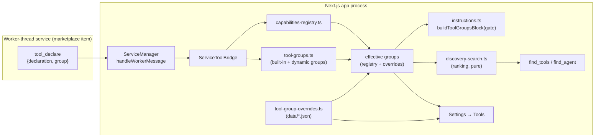

# Design: Tool Groups, Better Tool Discovery, and Group-Aware Settings

Spec: `assistant/041-tool-groups/spec.md` (bos-system-specs). Written after reading
`docs/dev/architecture-overview.md` §8, `docs/dev/assistant/actions-and-tools.md`,
`docs/dev/apps/services.md` §15, the constitution, and the live source cited
throughout. Where the docs and the source disagree, the source wins and the
disagreement is noted.

## 1. Classification

**App Target: `bos-core`.** Agrees with `spec.md`'s own `App Target` field.

Rationale, in the taxonomy's vocabulary: the feature's substance is server-only
composition and gating logic inside the Next.js app process — the capability
registry (`src/lib/agent/capabilities-registry.ts`), instruction composition
(`src/lib/agent/instructions.ts`), the discovery tools
(`src/lib/assistant/tools/server/discovery.ts`), and one Settings tab
(`src/components/apps/settings/ToolsTab.tsx`). None of it is a self-contained
window app, and none of it is installable. There is no service facet: nothing here
binds a port, so `services.md` §11 reachability does not apply.

**A consequence that is deliberately *not* a reclassification:** this feature changes
a contract that two `marketplace-item`s already implement (`deploymentMode: "tools"`,
services.md §15), so migrating those items is in scope (spec FR-042). Those item
edits are downstream migrations of a `bos-core` contract change, not a second
classification — the feature does not become `marketplace-item` because it obliges
items to change.

## 2. Constitution check

| Principle | Assessment |
|---|---|
| I. Spec-Driven | Complies — `spec.md` exists and precedes this design; `plan.md`/`tasks.md` follow. |
| II. Server Authority & SSR Boundary | Complies — group overrides are read/written only under `src/app/api/**`; the group registry and ranking modules stay framework-free so the client, the server tools, and tests share one implementation. No secret is involved. |
| III. Always Delegate; Claude Codes | Implementation is a BOS-source change and MUST run on a Claude sub-agent (Developer). Noted for `plan`. |
| IV. Minimize Blast Radius | Complies — `bos/tool-groups` feature branch; the two marketplace items are separate repos with their own branches. |
| V. The VFS Is Not the Source | Complies — all edits in `src/`, `seed/`, `docs/`; runtime overrides in `data/`. |
| VI. Specs & Docs Stay in Sync | In scope: `docs/dev/assistant/actions-and-tools.md`, `docs/dev/apps/services.md` §15, a **new** Settings → Tools page under `docs/usage/settings/` (no such page exists today — that directory holds 8 pages, none for Tools), and 039's superseded group statement. |
| VII. Respect Boundaries | No dependency changes; ranking is hand-written and deterministic, so no new package. `tsc --noEmit` + `lint` gate the change. |

One consequence worth naming: principle VI obliges updating
`bos-system-specs/app-infrastructure/039-service-tool-exposure` in the same change,
because this feature supersedes its `"Service Tools"` group. Two precise citations,
since the obvious ones are wrong: 039's `spec.md:67` FR-005 is about *gating*
(allowlist/deferred parity with built-ins) and its `design.md:223` ADR-007 is about
*gating identity* (tool name, not capability id) — neither mentions the group. The
group is pinned in that design's file plan (`design.md:175`,
`registerAdditionalCapabilities(..., group: 'Service Tools')`) and left open in its
own open-questions list (`design.md:252`, "exact naming convention for service tool
capability descriptors under the `Service Tools` group"). This feature closes that
open question. Both specs live in the **same** store (different Projects: `assistant`
and `app-infrastructure`), so this is an ordinary same-branch edit, not a cross-store
coordination problem.

## 3. Architecture

### 3.1 Context

Nothing user-visible changes about *how* an agent calls a tool. What changes is what
the agent is told exists, how it searches for the rest, and how a user curates that.
Three audiences touch the same group model:

- the **model**, via a generated system-prompt block and `find_tools`;
- the **user**, via Settings → Tools and Settings → Agents;
- a **marketplace item**, via its `service.json` manifest.

### 3.2 Container

All of this is inside the **Next.js app process**, except the declaration side, which
originates in a **worker-thread service process** and crosses the existing worker IPC
boundary. No new container.



The two things worth reading off the diagram: **effective groups** (registry ∪
overrides) is a single resolved view consumed by the prompt, the search, and the UI —
there is no second place where a group description is authored (spec FR-002); and
**ranking is a pure module** with no I/O, so its callers resolve the effective view
and hand it in, which is what keeps it unit-testable (spec FR-028).

### 3.3 Component

Six clusters, in dependency order.

**(a) Group registry — `src/lib/agent/tool-groups.ts` (new, framework-free).**
Owns `ToolGroup { id, name, description, aliases, origin }`, the built-in group
table (moved out of `capabilities-registry.ts`'s `GROUP_DEFINITIONS`), and a
`globalThis`-backed dynamic layer with `registerToolGroups()` /
`unregisterToolGroups()` / `listToolGroups()` / `resolveGroup(query)`. `resolveGroup`
implements FR-030's tolerance with a **fixed precedence** — exact id, then
case/whitespace-normalized display name, then alias — returning the first match and
never guessing between two candidates; an alias that collides with another group's id
therefore loses, deterministically, and a collision at registration time is itself an
error (FR-041). The dynamic
layer mirrors `registerAdditionalCapabilities()`
(`capabilities-registry.ts`, the `__bos_dynamic_capabilities__` pattern) so it
survives HMR the same way. This module imports nothing from
`capabilities-registry.ts` — membership is computed by callers — which is what keeps
the two free of a cycle.

`Capability.group` becomes a **group id** (slug), not a display name (ADR-1).

**(b) Effective view — `src/lib/agent/tool-group-overrides.ts` (new, server-only).**
Deliberately shaped after the existing `tool-metadata-overrides.ts`: a JSON file at
`dataDir()/tool-group-overrides.json`, `readGroupOverrides()`,
`setGroupOverride(id, patch)`, `getEffectiveGroups()`. Two deviations from the tool
equivalent, both required by the spec: `setGroupOverride` must accept a group that is
present only while a service runs, and an override is never deleted because its group
left the catalog (FR-049) — so unlike `setMetadataOverride`
(`tool-metadata-overrides.ts`, which throws `unknown tool: ${id}`), it validates
shape rather than membership.

**FR-046 ("takes effect without a restart") is a property of this module's read
path, and must stay one.** It holds because the effective view is resolved per
invocation — `gateFromAgent()` (`src/lib/assistant/gate.ts`) already calls
`readMetadataOverrides()` on every gate construction, and `getEffectiveGroups()`
follows that pattern. A process-lifetime cache here would silently break FR-046; if
one is ever needed for cost, it must key off a file mtime/revision, never be
unconditional.

**(c) Ranking — `src/lib/agent/discovery-search.ts` (new, framework-free), replacing
`discovery-score.ts`'s `scoreCapability`.** A pure pipeline:

1. `tokenize(text)` — lowercase, split on non-alphanumerics, drop stopwords, apply
   light suffix folding (`s|es|ing|ed`) (FR-018/FR-019).
2. `buildIndex(caps, groups)` — per-term document frequency over the corpus of
   `{id, description, aliases, groupName, groupDescription}`, memoized against a
   catalog fingerprint (capability count + group count + override revision) so it is
   recomputed when the live registry changes and not otherwise (FR-003).
3. `score(cap, queryTerms, index)` — per-term field-weighted accumulation with IDF
   weighting and a distinct-term coverage bonus, returning `{score, reasons[]}`
   where each reason names the field and the term that hit (FR-016/FR-017/FR-021/
   FR-023).
4. `search(query, {caps, groups, index, threshold})` — filter by threshold, sort by
   `(score desc, groupOrder, id)` for total determinism (FR-022).

**Group-level fields need no special weighting, and must not be given any.** Because a
group's name and description repeat across every member, IDF discounts those terms
automatically — a term appearing on all 13 Gmail tools is, correctly, weak evidence
for any one of them, while still lifting the whole group above unrelated tools. That
is the desired behaviour and it falls out of step 2 for free. An implementer who reads
the dilution as a bug and "fixes" it by boosting group fields will reintroduce exactly
the group-level flooding the old flat `+1`/`+2` rules produced.

`scoreAgent` stays as-is and moves across unchanged — `find_agent` is out of scope.

**(d) Discovery tools — `src/lib/assistant/tools/server/discovery.ts` (modify).**
`find_tools` gains an optional `group` parameter and a response envelope
`{ results, totalMatches, withheld, alreadyVisible?, groups? }` replacing the bare
array. **Each result carries `{ id, description, group, reasons }` and no schema
(FR-024a) — see ADR-7.** Modes:

| Input | Behavior |
|---|---|
| `query` only | Ranked free-text search over granted deferred tools (FR-016–FR-023). Free-text that names a group also surfaces that group's members (FR-034), because group name/description/aliases are indexed fields. |
| `group` only | Every granted deferred tool of the resolved group, **uncapped** (FR-029/FR-024b). |
| both | Free-text ranking restricted to the resolved group. |
| unresolved `group` | Error naming the groups available to this agent (FR-032). |
| resolved group, no granted deferred members | Explicit "nothing hidden here" (FR-033). |
| no match | `groups` populated with the agent's group index instead of an empty result (FR-025). |
| query too short / all stopwords | Explanatory message (FR-027). |

`alreadyVisible` is computed from the same gate the search uses: capabilities that
scored above threshold but are **not** deferred (FR-026). They are reported, not
revealed — they need no revealing.

**(e) Prompt block — `src/lib/agent/instructions.ts` (modify).** A new
`buildToolGroupsBlock(gate, tools, groups)` alongside `buildSkillsIndexBlock` /
`buildMcpIndexBlock` / `buildKbIndexBlock`, which it deliberately mirrors: same
"index + how to expand it" shape, same "return `''` when empty" contract (FR-014).
`composeInstructions(agentId)` gains an optional second argument carrying the run's
gate and tool map; when absent the block is omitted rather than guessed at.

The block has two parts.

**The preamble (FR-013)** is a fixed, BOS-authored paragraph — not per-agent prose —
stating when to reach for `find_tools` (no visible tool fits; the task implies a
specialized tool; a group below advertises hidden tools) and, explicitly, that MCP
tools are **not** reachable this way but through the MCP gateway tools (FR-050). It is
emitted by `buildToolGroupsBlock` itself, so it reaches named, ephemeral, and surface
agents identically (SC-011) — which is the whole reason it moves out of
`AGENT.md`. It is emitted whenever the block is emitted, including when no group has
hidden tools, since it also tells the agent what the group list *is*.

**Membership** is computed as: for each id in `gate.allow` that resolves against
`listCapabilities()`, take its group; a group is emitted iff it has ≥1 such id
(FR-007); its discovery instruction is emitted iff ≥1 of those ids is in
`gate.deferred` (FR-008). Nothing about `revealed` enters the block (FR-011).

**Per-group rendering follows D1's asymmetry (FR-015): visible tools are named,
hidden tools are counted.** Roughly:

```
WEB — <group description>
  web_search, web_fetch
  2 more available here — call find_tools(group: "web")
```

The name list costs ~1–3 tokens per tool inside the cached system block and is what
makes group membership real for the model, which cannot otherwise recover it from the
flat provider tool array. The count line is emitted only when the group has hidden
tools; enumerating those names would defeat deferral, while counting them does not.
A group with no hidden tools gets no second line at all.

Two rules that must be written as rules, not left to fall out of the set arithmetic:

- **Non-registry tools are excluded by construction (FR-005).** Discovery tools,
  consent/elicitation tools, and window-scoped surface Tier-2 tools are exactly the
  class that bypasses the allowlist in `visibleTools()`
  (`src/lib/assistant/tools.ts` — `gate.registryIds.has(name)` short-circuits the
  allow and deferred checks). They have no `Capability`, therefore no group, and the
  builder must never synthesize a "General"/empty bucket for them. The intersection
  with `listCapabilities()` above already achieves this; stating it prevents a later
  "helpful" fallback from reintroducing them.
- **Ordering (FR-012) comes from the group table, not from capability order.** Today
  group order is an accident of first-seen capability order. Under ADR-1 the built-in
  group table in `tool-groups.ts` *is* the declared order; dynamic groups follow it,
  sorted by id. That is what makes the cacheable prefix of the prompt stable across
  service restarts.

**(f) Settings + panel surfaces.** `ToolGroupList` — one shared collapsible-group
component and one shared grouping helper — replaces the duplicated
`groupByCategory` in `ToolsTab.tsx` and `assistant/ToolAccordions.tsx` (FR-048).
Every group renders collapsed on load (FR-043) with a header carrying its display
name and its tool count (FR-044), each independently expandable. `ToolsTab`
additionally renders the per-group description/alias editor, reusing `useAutoSave`
(`src/components/apps/settings/hooks/useAutoSave.ts`) + `AutoSaveStatus`
(`src/components/apps/settings/AutoSaveStatus.tsx`) exactly as `ToolRow` does, and a
filter box (FR-047).

**No fallback bucket survives this change (FR-041).** Both existing helpers coerce a
missing group into a placeholder — `ToolsTab.tsx:327` and `ToolAccordions.tsx:181`
each do `t.group?.trim() || "General"`. Once `group` is an id, that would quietly
collect every capability whose group failed to resolve into a phantom group, which is
exactly the generic bucket FR-041 forbids, relocated from the registry into the UI.
The shared component MUST NOT carry the fallback forward: an unresolvable group id is
an error, surfaced to the user (Settings → Services for a service-declared tool,
Settings → Tools for a built-in). The same applies in the registry —
`groupDescription()` (`capabilities-registry.ts:257`) today synthesizes
`Capabilities in the "<name>" group.` for an unknown group; it is removed with
`GROUP_DEFINITIONS` rather than reimplemented against the new table.

A third consumer surfaced during this design and is folded in:
`src/lib/agent/tool-manifest.ts` builds `ASSISTANT_TOOLS` from `actionCapabilities()`,
which filters the **static** `CAPABILITIES` array — so `InfoPanelV2.tsx`'s Tools panel
groups by `c.group` and **never shows a service-declared tool at all**. With group ids
replacing display names this file must change regardless; it switches to
`listCapabilities()` and resolves ids to display names.

**(g) Service-declared groups.** `ToolGroupDeclaration { id, name, description,
aliases? }` is added to `src/core/service/serviceToolTypes.ts`, where
`ToolDeclaration` already lives. **This is a compile-time type only, and an installed
item's worker never imports it.** That module's own header comment describes itself as
"shared between … worker entrypoints", which is true for BOS-internal fixtures and
misleading for a marketplace item: an item's service entry runs unbundled, outside the
`@/` module graph, and cannot import any `src/` TypeScript module. An item declares a
group by posting a **plain object literal** over the existing `tool_declare` IPC
message — exactly as it already posts `declaration` today
(`docs/dev/apps/services.md` §15) — and the type exists solely so BOS's own side of
that boundary is checked;
`ServiceManifest.toolGroups?: ToolGroupDeclaration[]` in `src/core/service/types.ts`;
`ToolDeclaration.group?: string` naming one of them. `manifestValidator.ts` — which
today validates only the `deploymentMode` enum — requires a non-empty, well-formed,
id-unique `toolGroups` whenever `deploymentMode === "tools"` (FR-039).
`ServiceManager.handleWorkerMessage`'s `tool_declare` case resolves the declaration's
group against the manifest before calling the bridge; `registerTool` takes the
resolved group and registers the capability under it, and registers the group itself
on first use. `unregisterServiceTools` gains group cleanup mirroring the existing
`syncCapabilityAfterRemoval` (FR-004). Rejection sets the service's `lastError`
(`ServiceDefinition.lastError`, `types.ts`) so Settings → Services shows it, in
addition to the existing `tool:register-rejected` warn (FR-040).

The unused `ToolDeclaration.categories?: string[]` is removed in the same change
rather than left as a second, silent grouping concept.

## 4. Concrete file/module plan

Files this feature creates or modifies. Existing mechanisms merely called into are in
§5, not here.

### Created

| Path | Purpose |
|---|---|
| `src/lib/agent/tool-groups.ts` | `ToolGroup` type, built-in group table, dynamic register/unregister, `resolveGroup` |
| `src/lib/agent/tool-group-overrides.ts` | Persisted group overrides + `getEffectiveGroups()` |
| `src/lib/agent/discovery-search.ts` | Tokenizer, IDF index, scorer, `search()` — pure |
| `src/app/api/tool-groups/route.ts` | GET effective groups; PATCH one group's description/aliases |
| `src/components/apps/settings/tools/ToolGroupList.tsx` | Shared collapsible group shell + grouping helper |
| `tests/agent/discovery-search.test.ts` | Ranking unit tests + the SC-004 natural-language benchmark (see note below) |
| `tests/agent/tool-groups.test.ts` | Group registry, dynamic lifecycle, override persistence, `resolveGroup` precedence, and the ADR-1 invariant that every `Capability.group` resolves to a live group |
| `tests/agent/service-tool-groups.test.ts` | Manifest validation, group resolution at `tool_declare`, rejection + `lastError` surfacing |
| `tests/assistant/tool-groups-block.test.ts` | Block membership/hint rules per gate kind, D1 rendering, and the preamble's presence for named/ephemeral/surface agents (SC-011) |
| `tests/assistant/prompt-tool-names.test.ts` | SC-010: every tool name appearing in generated prompt text resolves against the live registry — the enforcement for FR-050/FR-051 |
| `tests/assistant/revealed-ids-shapes.test.ts` | ADR-4/R1/R9: reveal derivation over a transcript carrying both the legacy array and the new envelope, and over a compacted view |
| `docs/usage/settings/tools.md` | Settings → Tools user page (none exists today) |

Unit tests live under **`tests/<area>/*.test.ts`**, not beside the source.
`playwright.unit.config.ts` sets `testDir: "./tests"` with `testMatch: /.*\.test\.ts/`
and is run via `npm run test:unit` (which sets
`NODE_OPTIONS=--conditions=react-server`, required for anything importing a
`server-only` module); `playwright.config.ts` sets `testDir: "./e2e"`. `tests/agent/`
and `tests/assistant/` already exist — e.g. `tests/agent/service-tool-bridge.test.ts`
from 039.

Worth knowing while working here: eight files under `src/**/__tests__/*.test.ts`
(`src/lib/assistant/__tests__/`, `src/lib/agent/scratchpad/__tests__/`,
`src/lib/integrations/__tests__/`) are matched by **neither** config and therefore
never run; only `agent-loop.test.ts` has a live counterpart under `tests/`. Out of
scope here — noted so nobody adds a ninth by pattern-matching on them.

### Modified

| Path | Change |
|---|---|
| `src/lib/agent/capabilities-registry.ts` | `Capability.group` becomes a group id; `GROUP_DEFINITIONS` moves to `tool-groups.ts`; `groupDescription()` removed in favour of the effective view; optional `aliases` on `Capability` |
| `src/lib/agent/discovery-score.ts` | `scoreCapability` removed (superseded); `scoreAgent` retained or relocated |
| `src/lib/agent/instructions.ts` | `buildToolGroupsBlock()`; `composeInstructions` accepts the run's gate/tools; MCP + KB block tool-name corrections (FR-050/FR-051) |
| `src/lib/agent/tool-metadata-overrides.ts` | Group-aware effective catalog (unchanged storage) |
| `src/lib/agent/tool-manifest.ts` | `listCapabilities()` instead of `actionCapabilities()`; id→display-name resolution |
| `src/lib/agent/service-tool-bridge.ts` | `registerTool` takes a resolved group; group registration + cleanup; `lastError` surfacing |
| `src/lib/agent/tool-gate.ts` | `deriveRevealedIds` accepts both the legacy array and the new envelope (FR-036) |
| `src/lib/assistant/messages.ts` | Same dual-shape reveal derivation (FR-036) |
| `src/lib/assistant/tools/server/discovery.ts` | `group` parameter, envelope, all six response modes |
| `src/lib/assistant/tools/server/mcp.ts` | Tool descriptions naming non-existent legacy tools (FR-051) |
| `src/lib/assistant/start-run.ts` | Pass the run's gate + tool map into `composeInstructions` |
| `src/lib/assistant/delegation-gate.ts` | Same for named/ephemeral/surface compose functions (FR-010) |
| `src/lib/agent/subagents/tools.ts` | **Deleted** — dead code (spec D4) |
| `src/app/api/assistant/discovery/route.ts` | **Deleted** — dead route, its only importer of the above (spec D4) |
| `src/app/api/tool-descriptions/route.ts` | Catalog carries group ids; group editing lives in the new route |
| `src/components/apps/settings/ToolsTab.tsx` | Collapsed groups, group editor, filter |
| `src/components/apps/settings/assistant/ToolAccordions.tsx` | Adopt the shared component |
| `src/components/agent/v2/InfoPanelV2.tsx` | Group ids → display names |
| `src/core/service/serviceToolTypes.ts` | `ToolGroupDeclaration`; `ToolDeclaration.group`; remove `categories` |
| `src/core/service/types.ts` | `ServiceManifest.toolGroups` |
| `src/core/service/manifestValidator.ts` | Validate `toolGroups` when `deploymentMode === "tools"` |
| `src/core/service/ServiceManager.ts` | Resolve a declaration's group before registering |
| `seed/agents/default_agent/AGENT.md` | Trim `# Tools` to agent-specific guidance (FR-052) |
| `seed/agents/assistant/AGENT.md` | Same; move delegation line to the delegation section (FR-052) |
| `docs/dev/assistant/actions-and-tools.md` | Group model, discovery modes. **Rewrite, don't patch:** the file opens with a "Stale (v1 CopilotKit path)" banner and its tool tables describe the retired `*Actions.tsx` registration path, so appending current group content would bolt truth onto a doc that is wrong above the fold |
| `docs/dev/apps/services.md` §15 | `toolGroups` declaration contract |
| `docs/usage/settings/overview.md` | Link the new Tools page |
| `docs/dev/architecture-overview.md` §8.2/§8.3 | Group model; §8.2's group list and "80+ capabilities, 20+ groups" figures; drop the §8.3 reference to the deleted module |

### Modified — outside this repo (spec FR-042)

| Repo / path | Change |
|---|---|
| `bos-marketplace/items/workflows/services/service.json` | Declare group `workflows` ("Workflows"); 12 `workflow_*` tools |
| `bos-marketplace/items/workflows/{spec,docs}/**` | Tool-surface docs referencing the group model |
| `bos-marketplace/items/okf-knowledge-base/services/service.json` | Declare its group(s) for ~35 `okf_*` tools |
| `bos-marketplace/items/okf-knowledge-base/spec/tool-surface.md` | Same |
| `bos-marketplace/items/okf-knowledge-base/` bundled agents/skills | Prompt text naming tools / describing discovery |
### Modified — in this spec store, same branch

| Path | Change |
|---|---|
| `bos-system-specs/app-infrastructure/039-service-tool-exposure/design.md` | The `"Service Tools"` group in its file plan (`:175`) is superseded, and its open question (`:252`) about naming service-tool capability descriptors is closed by ADR-5 (constitution VI) |
*(No `discrepancies.md` entry is needed — see R4: `architecture-overview.md` §8.3 was
already correct, and the deletion makes it true.)*

## 5. Integration points

Existing mechanisms this design calls into and does **not** create or modify:

- **Tool gate** — `visibleTools()` and `ToolGateConfig` (`src/lib/assistant/tools.ts`).
  The block and the discovery tools read the same gate the loop enforces; neither
  widens it.
- **Agent loop system composition** — `runAgentLoop`'s `composeSystem` thunk, called
  once per run (`src/lib/assistant/agent-loop.ts`), and the Anthropic
  `cache_control: {type:"ephemeral"}` system block (`src/lib/assistant/model-turn.ts`).
  This is what makes FR-011's "static for the run" a real requirement rather than a
  preference.
- **Provider tool field** — `model-turn.ts`'s three provider paths, unchanged. Visible
  tools keep flowing natively; the block never restates them (FR-015).
- **Config namespace `tools`** — `getMaxFindResults()` (`src/lib/config/registry.ts`,
  clamped 5–25, default 10) governs **free-text search only**. Group mode is uncapped
  (FR-024b) — bounded by the group's own declaration, and affordable because ADR-7
  removed schemas from the response.
- **Worker IPC** — the `tool_declare` message and `ServiceManager`'s dispatcher
  (`docs/dev/apps/services.md` §15). The message gains a field; the transport does not
  change.
- **Auto-save affordance** — `useAutoSave` + `AutoSaveStatus`
  (`src/components/apps/settings/`), reused verbatim for the group editor.
- **Unresolved-id warning** — `unresolvedToolIds()` (`src/lib/assistant/gate.ts`),
  which already covers the granted-but-unregistered case an omitted group creates.

## 6. ADRs

### ADR-1 — `Capability.group` becomes a stable id, not a display name

**Context.** Groups are free-text display names today, and `GROUP_DEFINITIONS` is
keyed by that same string. Once a user can override a group's description, the key
must survive a rename, and the prompt renders `WEB` while the registry stores `Web`.

**Options.** (a) Keep display-name keys and normalize on lookup — zero churn, but a
real rename still orphans overrides, which is the bug we are fixing. (b) Add a
parallel id field while keeping `group` as the name — two sources of identity, and
every consumer must know which to use. (c) Make `group` the id and put the display
name in the group record.

**Decision.** (c). The churn is bounded: one table in one framework-free file, plus
four render sites (`ToolsTab`, `ToolAccordions`, `InfoPanelV2`, discovery results),
all of which already read `c.group` in one place each.

**Consequences.** A mechanical rename of ~20 group strings; every consumer must
resolve id→name, which is precisely what forces the `tool-manifest.ts` /
`InfoPanelV2` service-tool gap into the open. Overrides key off an identifier that
survives renames.

### ADR-2 — Group scoping is a parameter, not a query convention

**Context.** The prompt must contain an instruction the model can invoke verbatim to
reveal a group's hidden tools. A prefix convention (`find_tools("web_")`) was the
original idea.

**Options.** (a) Prefix hint per group. (b) A magic query prefix (`group:web`).
(c) A real `group` parameter.

**Decision.** (c). (a) is unsound: `Scheduler` (`list_scheduled_tasks`,
`create_scheduled_task`, `run_task_now`) has no common prefix at all, `Files` mixes
`file_*` with `view_image`/`video_keyframes`, and conversely `app_` spans Apps and
Specs while `bos_` spans OS and Dev — so a prefix hint is wrong in both directions and
wrong *silently*. (b) keeps the unsoundness and adds parsing.

**Consequences.** A schema change to `find_tools`, and the group name becomes part of
the model-facing contract — hence tolerant resolution (FR-030) so the model need not
reproduce an exact string. Free-text remains the primary mode; group scoping is
additive (FR-034).

### ADR-3 — Deterministic lexical ranking with curated aliases, not embeddings

**Context.** The current scorer matches the **whole query string** as a substring
against descriptions and group names, so for any multi-word natural-language query
only the id-word rule can fire — every description and group signal is dead weight
for exactly the queries they exist to serve.

**Options.** (a) Keep it. (b) Embeddings/semantic search. (c) Term-level lexical
ranking with IDF, stopwords, light stemming, and curated aliases.

**Decision.** (c). (b) would need a model call or a new dependency inside a path that
runs on every discovery call, would make ranking non-deterministic, and would break
the framework-free purity that lets one implementation serve the server tool, the API
route, and tests.

A correction to the obvious version of that argument: `discovery-score.ts` is **not**
unit-tested today — nothing in `src/**` imports it except its three call sites
(`src/lib/assistant/tools/server/discovery.ts`,
`src/lib/agent/subagents/tools.ts`, `src/app/api/assistant/discovery/route.ts`). So
this feature does not *preserve* testability; it establishes it, and the benchmark in
§4 is the first test the ranking has ever had. That makes SC-004 load-bearing rather
than confirmatory.
Curated aliases (FR-020) are the deliberate substitute for semantic reach: "email" →
`gmail_*` is authored once, by a human, and is inspectable.

**Consequences.** Discovery quality becomes a function of authored metadata, so the
alias fields must be editable (FR-020/FR-045) and the benchmark (SC-004) must be a
real test, not an aspiration. A query in genuinely unanticipated vocabulary still
misses — mitigated by FR-025's fallback to the group index.

### ADR-4 — A response envelope, and dual-shape reveal derivation

**Context.** The "revealed" set is not stored; it is derived by re-parsing prior
`find_tools` results out of the transcript, in two independent places
(`src/lib/assistant/messages.ts`, `src/lib/agent/tool-gate.ts`), both of which expect
a **JSON array of `{id}`**. Truncation counts, match reasons, and the empty-result
group index all need fields that do not fit a bare array.

**Options.** (a) Keep the array and smuggle metadata into a synthetic entry — abuses
the contract and would reveal a non-existent id. (b) Envelope, and update both
parsers to accept either shape.

**Decision.** (b). Both parsers accept the legacy array *and* the envelope's
`results`, indefinitely — not as a migration window, because old conversations are
replayed from disk forever and a transcript is never rewritten.

`results` is the **only** reveal source. `alreadyVisible` and `groups` carry ids too,
and neither may be read as a reveal: `alreadyVisible` is harmless today (those tools
are visible by definition) but would become a gate bypass the moment it ever carries
something the agent is not granted, and `groups` is an index, not a grant.

**Consequences.** Two parsers must change together; a test must cover a transcript
containing both shapes. This is the single highest-risk edit in the feature: a miss
here does not throw — it silently stops revealing tools.

### ADR-5 — Service groups are declared in the manifest, assigned per tool

**Context.** A service could declare its group on each `tool_declare`, or once in
`service.json`. `registerTool` currently hardcodes `"Service Tools"`.

**Options.** (a) Per-declaration group name only — one description repeated per tool,
free to drift. (b) Manifest only — one group per service, cannot express an item that
contributes two families. (c) Manifest declares the groups; each declaration names one.

**Decision.** (c). One authoritative description per group, install-time validation
(FR-039), and multi-group items remain expressible (FR-038).

**Consequences.** A manifest schema change and a signature change to `registerTool`.
Existing items break loudly by design (FR-040) rather than silently defaulting — with
`lastError` surfacing so the failure is visible in Settings, not only in a log.

### ADR-6 — Emit the block only when it carries information

**Context.** `deferredCapabilityIds()` returns empty
(`capabilities-registry.ts`) — deferral is entirely per-agent. An agent with nothing
deferred gains no discovery value from the block, only tokens.

**Decision.** Groups are listed whenever the agent has granted registry tools
(FR-006/FR-007) — the grouping itself has value for a large flat tool list — but
discovery instructions appear only where something is actually hidden (FR-008), and
the whole block is omitted when the agent has no granted registry tools (FR-014).

**Consequences.** Two agents with identical tools but different deferral get
different prompts, which is correct and must be asserted in tests.

### ADR-7 — Revealing IS the schema-delivery mechanism; the response carries none

**Context.** `find_tools` returns each hit's full JSON schema
(`discovery.ts:47`, `schema: tool.parameters`). That is what made an uncapped group
mode look expensive: 35 `okf_*` schemas would enter the transcript permanently and be
replayed on every later step.

**The observation that dissolves it.** BOS *already* un-gates a discovered tool into
the provider's native tool field. `agent-loop.ts:294-295` re-derives visibility every
step —

```ts
const revealed = deriveRevealedIds(messages);
const declarations = visibleTools(deps.tools, deps.gate, revealed);
```

— and `deriveRevealedIds` (`src/lib/assistant/messages.ts:123`) reads **`id` only**;
it never touches `schema`. `visibleTools` then builds the declaration from
`deps.tools[name].parameters`, the live registry. So on the next step the model
receives the tool's real schema natively, from the provider. The copy in the tool
result is dead weight that no code path reads back.

**Options.** (a) Keep schemas and cap group mode (breaks SC-001, needs pagination).
(b) Keep schemas, add a two-step list-then-schema protocol (a round trip to rebuild
something the provider already does). (c) Drop schemas; let the existing reveal
deliver them.

**Decision.** (c). Results carry identity and relevance only. A whole 35-tool group
becomes a few hundred tokens, so FR-024b's uncapped group mode is affordable and
SC-001 holds with no pagination. `description` is still returned, deliberately: the
model must judge relevance at *find* time, before the native declaration exists.

**Consequences.**
- The reveal is **sticky for the conversation**, and must be — the model calls the
  tool on the step *after* `find_tools`, so a same-request-only un-gating would make
  it unreachable. Reveals are transcript-derived, so they also persist across runs in
  the same conversation.
- Cost moves rather than vanishing: revealed tools stay in the tools array for every
  later step. Cheaper than the transcript (the array is re-sent but not accumulated;
  the transcript grows monotonically), not free.
- **Each reveal invalidates the prompt cache.** Anthropic's cacheable prefix is
  ordered tools → system → messages and BOS marks only the `system` block
  (`model-turn.ts:191`), so any change to the tools array evicts it. Already true
  today. It argues for revealing a whole group in one call rather than trickling tools
  in — an argument *for* uncapped group mode.
- Rejected: expiring reveals (after K steps or first use). It would pull a tool out
  from under a multi-step plan, re-bust the cache on every change, and make behaviour
  depend on step counting.

## 7. Risks / open questions

**R1 — Reveal derivation (highest).** ADR-4's dual-shape parsing. Failure mode is
silent: deferred tools simply never become callable. Must be covered by a test that
feeds a transcript containing both shapes.

**R2 — Prompt-cache invalidation.** The system block is cached
(`model-turn.ts`), and dynamic groups appear/disappear with service lifecycle.
FR-012's ordering rule keeps the built-in prefix stable, but a service restarting
mid-session still changes the block for the *next* run. Accepted; worth a note in
`plan`.

**R3 — Group-id migration.** ADR-1 renames ~20 group strings. Any missed consumer
degrades to an unresolved id rendering as a slug in the UI rather than throwing.
A test asserting every `Capability.group` resolves to a live group is cheap insurance.

**R4 — RESOLVED (spec D4): there is only one live discovery implementation.**
Reachability analysis settled this before `plan`. `makeDiscoveryTools`
(`src/lib/agent/subagents/tools.ts`) has zero callers; that module's other exports
have zero external references; every remaining mention of it in `src/` is a code
comment; its one importer, `getToolSchema` in
`src/app/api/assistant/discovery/route.ts`, sits in a route with zero callers
repo-wide. Both are deleted rather than updated, so FR-016–FR-034 land in exactly one
file. `architecture-overview.md` §8.3 was **correct** that the module "was retired" —
so this is not doc/source drift needing a `discrepancies.md` entry; deleting the file
is what finally makes the doc true. The residual risk is only that `tsc` surfaces a
transitive importer the grep missed, which is a compile error, not a silent one.

**R5 — Benchmark subjectivity (SC-004).** "Correct tool in the top three" needs a
fixed, committed query set, or it becomes a moving target that is tuned to pass.
The query set should be written before the ranking is tuned.

**R6 — Item migration is cross-repo and cross-deployment.** The two tool-declaring
items live in `bos-marketplace`; locally `data/user-apps/items/` is empty and
`data/system/okf-knowledge-base` is a dangling symlink, so the live item state is in
the Dokploy deployment. Verify against production, not this checkout.

**R9 — Reveal derivation MUST stay on the canonical transcript, not the model view.**
`agent-loop.ts` holds two arrays: `contextMessages` (line 280 — the compacted,
hook-modified view actually sent to the model, line 304) and `messages` (the canonical
transcript). `deriveRevealedIds(messages)` (line 294) deliberately reads the latter.
That is what makes reveals survive compaction: Layer 1 clears older tool results from
the *view* (`keepToolResults`, default 2), so a `find_tools` result can vanish from
what the model sees while the tools it revealed stay callable — which is the correct
asymmetry, since a tool in the native array is self-describing.

Switching derivation to `contextMessages` would look like a tidy-up and would silently
un-reveal tools mid-conversation the moment compaction kicks in — the same silent
failure class as R1, and not caught by any test that runs short conversations. Two
consequences for `plan`: assert this in a test with a compacted view, and do **not**
pin `find_tools` into the compaction plugin's `unrecoverableTools` list — it looks
like a fix for this and is unnecessary, since derivation never reads the view.

**R8 — Rollout order is load-bearing, because FR-040 fails loudly.** Ship BOS first
and every pre-feature item's tools are rejected at service start until its manifest
catches up — 12 `workflow_*` and ~35 `okf_*` tools offline in production. The safe
order is **items first, BOS second**, and it is available: `manifestValidator.ts`
reads named fields off a `Record` and performs no unknown-key rejection, so adding
`toolGroups` to a manifest is inert on today's BOS and active the moment BOS ships.
`plan` must sequence it that way rather than treating the item edits as follow-up
work.

**R7 — D2's accepted limitation.** A group whose owning service is stopped vanishes
from the block rather than showing as unavailable, because groups are scoped to their
tools' lifecycle (FR-004) and BOS therefore cannot name the group of an unresolvable
id. The agent will report "I have no workflow tools" rather than "the Workflow
Manager service is stopped". Accepted for v1; the upgrade path is registering groups
at install time from the manifest, which would require relaxing FR-004.

**Open questions: none.** `spec.md`'s three clarifications are settled as D1–D4 in its
Resolved Decisions section, and D1 (visible tools named, hidden tools counted) is
implemented in §3.3(e) above.

No UI mockup was provided; the Settings changes are modifications to two existing
panels rather than a new surface.
