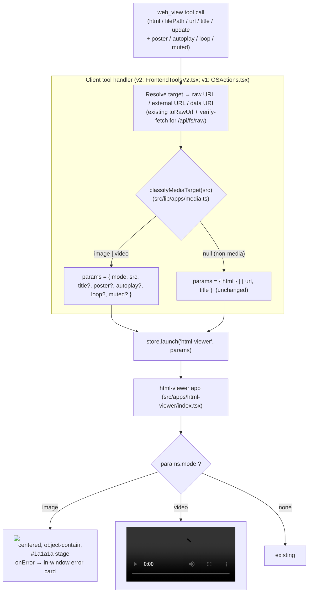

# Design: Media Support in `web_view` (Images & Video)

**Spec**: `/Specs/user-specs/html-viewer/web-view-media/spec.md`
**Mockup**: `/Specs/user-specs/html-viewer/web-view-media/mockup.html`
**Feature Branch**: `web-view-media`
**Status**: Draft (architect-authored)

This document is the design artifact. `plan.md` (written later by Build Studio) references it
rather than repeating it.

---

## 1. Classification

**App Target: `bos-core` (with a built-in-app component)** — agrees with `spec.md`'s `App Target: bos-core`, with one nuance flagged below.

The change is entirely under `src/`, implemented via a single `dev_delegate` on the `web-view-media`
feature branch (the `bos-core`/`builtin-app` mechanism — `references/target-bos-core.md`). No
`marketplace-item` facet is involved and none is justified:

- **The tool handler + declarations + raw-route MIME map** (`src/components/agent/**`,
  `src/lib/assistant/tools/frontend-declarations.ts`, `src/lib/agent/capabilities-registry.ts`,
  `src/app/api/fs/raw/route.ts`) are **`bos-core`** — non-app `src/` changes.
- **The `html-viewer` renderer** (`src/apps/html-viewer/index.tsx`) is a **built-in app** — per
  `references/target-builtin-app.md`, a built-in app is "a special case of modifications to BOS
  itself" with *identical* delegation mechanics (same feature branch, same `dev_delegate`, same
  Supervisor preview worktree, same Topbar Promote/Discard). Only its *anatomy* conventions differ:
  `manifest.ts` + `index.tsx`, folder-name == id, `gen-apps.mjs` auto-discovery, **no central
  registry to edit**.

**Nuance to flag (not a mechanism conflict):** `spec.md` labels the whole feature `bos-core`, which
is correct at the delegation level. A meaningful portion of it, however, lives inside
`src/apps/html-viewer/` and must be authored to the **`builtin-app` anatomy**, not generic
bos-core conventions. Build Studio needs this only to write the `plan`/`tasks` file plan correctly
(it does *not* change the implementation path — one branch, one `dev_delegate`). I confirm there is
no `builtin-app` vs `marketplace-item` tension: the app needs direct OS state (`useOSStore`,
`setTitle`), is a thin preview window that ships inside BOS, and is `hidden: true` — all the
`docs/dev/guides/apps.md` §1 signals for *built-in* over *installed item*.

---

## 2. Constitution check

| Principle | Status |
|---|---|
| **I. Spec-Driven** | ✅ This design precedes implementation; `spec.md` exists and is the source of truth. |
| **II. Server Authority & SSR Boundary** | ✅ No secrets, Node APIs, or new client→server paths. The only server-side edit is the raw route's `MIME` map (a lookup table). Media bytes already stream over `fetch`/iframe-`src` from `src/app/api/fs/raw/route.ts`; the client renders them. No framework types added outside `src/os/types.ts`. |
| **III. Always Delegate; Claude Codes** | ✅ Implemented via `dev_delegate` (the `bos-core`/`builtin-app` path). This design does not itself author source. |
| **IV. Minimize Blast Radius** | ✅ One feature branch. The raw-route MIME map gain is additive (two new keys); `html-viewer`'s media branch is a *new* render path that leaves the existing `html`/`url` iframe path byte-for-byte unchanged (NFR-004). |
| **V. The VFS Is Not the Source** | ✅ No VFS writes; all edits under `src/` via the Developer. |
| **VI. Specs & Docs Stay in Sync** | ⚠️ **Action item** (not a violation): the change MUST update `docs/dev/assistant/actions-and-tools.md` (which lists `web_view` under `OSActions`) and the `docs/usage` page that documents the `web_view` tool, in the same change. See §4 (docs) and §7. |
| **VII. Respect Boundaries** | ✅ No `package.json`/lockfile/build-config change. No new external dependency (uses native ``/`<video>` + Tailwind already in the app). Quality gates (`tsc`, `lint`) run in the Developer's worktree. |

**Potential conflict (flagged, not papered over):** FR-008 mandates that media "MUST remain
sandboxed exactly like HTML preview … (the current `sandbox=\"allow-scripts\"` iframe boundary is
preserved)." The chosen design (native media elements, ADR-1) satisfies FR-008's *normative
security property* (previewed media cannot reach BrowserOS APIs on the parent origin) but **deliberately
does not wrap media in the sandboxed iframe** — because that literal mechanism *blocks* the
fullscreen behavior SC-002 requires. See ADR-1 and Risk R1. This is the single place where the
design trades a *means* named in FR-008 for its *end*; it is surfaced here and in §7 so a reviewer
can reject it explicitly rather than discover it at `implement`.

---

## 3. Architecture

### 3.1 Context (user/agent view)

`web_view` is a first-class agent tool that opens the hidden built-in **`html-viewer`** window to
preview content the agent produced or located. Today it accepts `html` (a full document), `url`
(any URL), and `filePath` (a VFS path rewritten to `/api/fs/raw?path=...`). This feature adds
**image** and **video** as first-class preview targets: the tool detects that a target is media
(extension/MIME/data-URI), and the window renders it with a media presentation mode — an image
centered and fit-to-frame on a neutral stage, or a video with native controls (play/seek/volume/
fullscreen) — plus optional `poster`/`autoplay`/`loop`/`muted`. Non-media targets render exactly
as they do today.

### 3.2 Container (real BOS containers touched)

- **Next.js app process** — the only container changed. The `web_view` tool handler runs client-side
  (a *frontend tool* registered in `FrontendToolsV2.tsx`, dispatched to the attached page by the v2
  kernel); the `html-viewer` window is a client React app; the raw-file route is a Next.js App-Router
  route handler. No new process, no worker-thread service, no Supervisor/preview-worktree change
  beyond the ordinary feature-branch preview that *every* `dev_delegate` edit rides.
- **No Bastion / multi-user implication** — the raw route and the preview are same-origin; media
  served from the VFS is isolated by the per-user container boundary already. External `http(s)://`
  media is fetched directly by the browser (same as today's iframe `src`).

### 3.3 Component (modules this feature creates or modifies)

The tool handler classifies the target and launches `html-viewer` with an explicit media `mode`;
the app branches on `mode` to render native media instead of the iframe. A small shared,
framework-free classifier is the single source of truth for "is this an image / video."

**Data flow for a media call:**

1. Agent calls `web_view({ filePath: "/workspace/chart.png" })` (or `url`/external/data-URI),
   optionally with `poster`/`autoplay`/`loop`/`muted`.
2. Handler resolves the target to a URL exactly as today (`filePath` →
   `fsClient.rawUrl(path, conversationId)`; leading-`/` `url` → same; external/data-URI → as-is).
   It runs the **existing** verify-fetch for `/api/fs/raw` targets (returns a tool failure, no
   window, if the file is missing — FR-007).
3. Handler calls `classifyMediaTarget(resolvedUrl)` → `"image" | "video" | null`:
   - `/api/fs/raw?path=...` or a VFS path → read the extension from `path`.
   - `data:` URI → read the `data:<mime>` prefix (`image/*` → image, `video/*` → video).
   - `http(s)://...` → read the **pathname** extension (query stripped) — per A-2.
4. If media: launch `html-viewer` with `{ mode, src, title?, poster?, autoplay?, loop?, muted? }`
   (`poster` rewritten to a raw URL if it is a leading-`/` VFS path, like `url`). Default `title`
   to the target's basename when the agent omits it (the mockup shows the filename in the titlebar).
   If non-media: launch with the existing `{ html }` / `{ url, title }` (unchanged).
5. The app reads `params.mode`:
   - `image` → a native `` on a `#1a1a1a` stage, `object-contain`,
     `max-w-full`/`max-h-full`, centered (the mockup's `.fit` rule). `onError` → in-window error card.
   - `video` → a native `<video src={src} controls playsinline preload="metadata">` with
     `poster`/`autoplay`/`loop`/`muted` applied, same stage. `onError` → in-window error card.
   - none → the current iframe (byte-for-byte unchanged).
6. `update=true` closes the prior `html-viewer` window and launches a fresh one with the new params
   (the app remounts and reads fresh params — FR-009 works with no extra logic; the media element is
   `key`'d on `src` so a refresh always re-fetches).

### 3.4 The media stage (UI)

Matches the mockup verbatim: the window **body** (not the titlebar) swaps from the current
`bg-white` iframe to a `#1a1a1a` stage (`position: relative; overflow: hidden`) containing either a
centered fit-to-frame `` or a centered fit-to-frame `<video controls>`, both with
`border-radius` + `shadow` per the mockup. The titlebar, traffic lights, pin, close, and fullscreen
come from the existing `Window.tsx` chrome — untouched (NFR-001). Resizing re-fits the media because
`object-contain` + max-dimensions recompute on layout (NFR-003).

---

## 4. Concrete file / module plan

**Create**
- `src/lib/apps/media.ts` — framework-free (no React, no `server-only`) shared module. Exports:
  - `IMAGE_EXTENSIONS` / `VIDEO_EXTENSIONS` — `Set<string>` (lowercased, no dot), mirroring the
    raw-route MIME map. Images: `png jpg jpeg gif webp svg avif`. Videos: `mp4 ogv webm mov m4v avi`.
  - `classifyMediaTarget(src: string): "image" | "video" | null` — handles `/api/fs/raw?path=…`
    and raw VFS paths (extension from `path`), `data:` URIs (mime prefix), and `http(s)://…`
    (pathname extension, query stripped). Returns `null` for anything unmapped → non-media.
  - `mediaTypeFromMime(mime: string)` helper used by the data-URI path.

**Modify**
- `src/apps/html-viewer/index.tsx` — add the media branch (see §3.3/§3.4). Keep the existing
  `iframeProps`/`html`/`url` path identical. Read `mode`, `src`, `title`, `poster`, `autoplay`,
  `loop`, `muted` from `params`. Implement the `#1a1a1a` stage, native ``/`<video>`, and an
  in-window error card (`` / `<video onError>` → a centered "Could not load" message
  with the target, on the same stage). `key` the media element on `src`.
- `src/components/agent/v2/FrontendToolsV2.tsx` — the **active** `web_view` handler. Classify the
  resolved target; for media, build `{ mode, src, title?, poster?, autoplay?, loop?, muted? }` and
  launch; default the title to the basename when omitted. Leave the existing verify-fetch (now
  covering media raw URLs automatically) and the `update` close-then-launch logic intact.
- `src/components/agent/OSActions.tsx` — the **v1** CopilotKit `web_view` action. Update
  (a) the `description` string to state image/video support and document the new params,
  (b) the `parameters` array to add `poster`/`autoplay`/`loop`/`muted`, and (c) the `handler` to
  mirror the v2 handler's media classification (import the same `src/lib/apps/media.ts` helper so
  v1 and v2 cannot drift).
- `src/lib/assistant/tools/frontend-declarations.ts` — the **v2 model-facing** declaration
  ("single source of truth the server registry offers to the model"). Update the `web_view`
  description to state image/video support, and add `poster`/`autoplay`/`loop`/`muted` properties.
- `src/lib/agent/capabilities-registry.ts` — the **Settings → Tools catalog** one-line description
  for `web_view` (currently "Open an HTML document or URL in a sandboxed preview window."). Update
  to mention image/video preview. (This file stores only `id`/`group`/`description`/`context` — no
  param schema lives here.)
- `src/app/api/fs/raw/route.ts` — extend the `MIME` record with the video additions the spec calls
  out (A-2): `.m4v` → `video/mp4`, `.avi` → `video/x-msvideo`. Additive only; streaming, 404
  behavior, and branch scoping unchanged. (See ADR-3 for why we extend rather than leave these as
  `application/octet-stream`.)

**Docs (Constitution VI — same change)**
- `docs/dev/assistant/actions-and-tools.md` — `web_view` row/description.
- The `docs/usage` page documenting the `web_view` tool — add the media params + behavior.
- (`src/apps/html-viewer/manifest.ts` is **unchanged** — still `hidden: true`, 900×640,
  `Code2`; the window *title* carries the media filename, so no manifest edit is needed.)

---

## 5. Integration points (existing mechanisms relied on, NOT created/modified)

- **`src/app/api/fs/raw/route.ts` (streaming)** — already streams raw bytes with a `Content-Type`
  from its MIME map (`readStream` → Web stream, `Cache-Control: no-store`). The design reuses the
  streaming path for media; only the MIME *map* gains two keys (§4). This is A-1 (no new
  media-serving route).
- **`fsClient.rawUrl(path, conversationId)` in `src/lib/os-client.ts`** — builds the
  branch-scoped `/api/fs/raw?path=…&conversationId=…` URL. The handler reuses it for both the media
  `src` and (when a VFS path) the `poster`. This carries the active feature-branch scope so
  branch-only media under `/Specs`/`/Docs` resolves (A-6, NFR-004).
- **Existing handler verify-fetch** — `FrontendToolsV2.tsx` already `fetch(checkUrl)` for
  `/api/fs/raw` targets and returns a tool failure on non-2xx. This *is* the FR-007 "not found →
  tool returns failure, no silent success" for VFS/raw media; the design just ensures media raw
  URLs flow through it (they do, since they resolve to `/api/fs/raw`).
- **Window chrome — `src/components/desktop/Window.tsx`** + **`useOSStore().launch(appId, params)` /
  `setTitle`** — the app renders *inside* the existing window shell (titlebar, close, pin,
  fullscreen). The design only changes the window *body*.
- **Native ``/`<video>` on the parent origin** — an established BOS pattern: the **Files app**
  (`src/apps/files/index.tsx`) already renders ``, and the **wallpaper system** renders image resources on the desktop. Media
  *resources* on the parent origin are normal; only *documents* need the iframe. (Cited in ADR-1.)
- **`tools/gen-apps.mjs`** — auto-discovers `src/apps/<id>/` (manifest + index.tsx). Modifying
  `index.tsx` needs **no registry edit** (per `references/target-builtin-app.md`).

---

## 6. ADRs

### ADR-1 — Render media natively in the React app, not in the sandboxed iframe

- **Context:** The app is currently a bare `<iframe sandbox="allow-scripts">`. For media we can
  (a) render native ``/`<video>` in the app (replacing the iframe in media mode), or
  (b) generate an HTML wrapper embedding ``/`<video>` and feed it to the existing iframe via
  `srcDoc`, keeping one iframe path for everything.
- **Options:**
  - *(a) Native media elements in the React component.*
  - *(b) Auto-generated HTML wrapper inside the existing `sandbox="allow-scripts"` iframe.*
- **Decision:** **(a)** — native media in media mode; the iframe is used only for
  `html`/`url` document targets.
- **Consequences:**
  - ✅ **SC-002 fullscreen works.** A native `<video controls>` on the parent origin has a working
    native fullscreen button. In a `sandbox="allow-scripts"` iframe, fullscreen is blocked unless
    the iframe adds `allowfullscreen` *and* `allow="fullscreen"` — which is itself a change to the
    very boundary FR-008 says to "preserve." Native rendering avoids the fight.
  - ✅ **Autoplay is simpler.** Native `<video muted autoplay>` is governed purely by the standard
    browser autoplay policy (muted allowed, unmuted blocked → FR-006). In a sandboxed cross-origin
    iframe you additionally need `allow="autoplay"`; keeping media out of the iframe removes that
    axis entirely.
  - ✅ **FR-007 in-window errors are clean.** ``/`<video onError>` in React show a
    styled in-window error card for external-URL failures and unsupported codecs (the tool-level
    failure for missing VFS files is already handled by the handler verify-fetch). Option (b) would
    require embedding that error UI and its logic *inside a generated HTML string*.
  - ✅ **Satisfies FR-008's security property.** A raster image, video stream, or even an SVG-in-
    `` carries **no executable code on the parent origin** — it cannot reach BrowserOS APIs.
    (SVG loaded via `` is script-inert per the HTML spec, so the one media type that *could*
    embed `<script>` is also safe.)
  - ✅ **Precedent.** The Files app and the wallpaper system already render image *resources* on
    the parent origin. Native media is the established BOS pattern for non-document media.
  - ⚠️ **Deviation from a literal reading of FR-008.** FR-008 names "the current
    `sandbox=\"allow-scripts\"` iframe boundary is preserved." This design preserves that boundary for
    **document** content (where it is essential — arbitrary agent HTML/JS must not reach BOS APIs)
    but renders **media** natively, where the boundary is unnecessary and *harmful* (it blocks
    fullscreen). The MUST's normative target — "previewed media content MUST NOT gain access to
    BrowserOS APIs on the parent origin" — is fully met. **This is flagged as a risk (R1)** because
    a reviewer who reads FR-008 as "keep the iframe for *everything*" will object.
  - **Alternative if the reviewer insists on the iframe for media:** Option (b), with the iframe
    gaining `allowfullscreen`/`allow="fullscreen autoplay"` in media mode. Costs: fullscreen/autoplay
    now depend on two extra attributes, in-window error handling must live in generated HTML, and
    SVG media's scripts would execute *inside* the sandbox (containable, but a needless capability).

### ADR-2 — Detect media with an explicit `mode` param, classified by the tool handler (not the app)

- **Context:** FR-002 says detection is "based on the file extension or MIME type of the target."
  The classification could live in (a) the `web_view` handler (which then passes an explicit
  `mode` to the app), or (b) the `html-viewer` app (which sniffs the URL/`src` extension itself).
- **Decision:** **(a)** — the handler classifies and passes `{ mode: "image"|"video", src, … }`;
  the app is dumb about *what* to show and only renders what `mode` says. Classification logic
  lives in one shared module (`src/lib/apps/media.ts`) so the v1 and v2 handlers (and any future
  caller) agree.
- **Consequences:**
  - ✅ **FR-007 is reachable from the tool.** The tool's "return a failure, not success" requirement
    is only satisfiable in the *handler* (the app is a window — it has no channel to make a tool
    call report failure). Centralizing classification in the handler keeps detection adjacent to the
    existing verify-fetch.
  - ✅ **The app branch is trivial and backward-compatible.** `params.mode ? media : existing
    iframe`. A call with no `mode` renders *exactly* as today (NFR-004) — media is a purely
    additive path.
  - ✅ **No extension-sniffing in two places.** If the app also sniffed, the handler and app could
    disagree (e.g. an external URL with no extension, or a data URI), producing a media target that
    the app renders as a document.
  - ⚠️ **Minor:** the app could optionally fall back to `classifyMediaTarget(params.src)` if it
    ever receives a `src` without a `mode` (defensive); the design keeps the primary contract
    `mode`-driven and treats this as an optional hardening, not a requirement.

### ADR-3 — Extend the raw-route MIME map for the video formats the spec wants recognized

- **Context:** A-2 asks that "sensible additions (e.g. `.m4v`, `.avi`)" be treated as video. But the
  raw route's MIME map currently ends at `mp4/ogv/webm/mov`; an unmapped extension is served as
  `application/octet-stream`, which the spec's own edge case says "the browser cannot render … MUST
  show a clear in-window error."
- **Decision:** Add `.m4v` → `video/mp4` and `.avi` → `video/x-msvideo` to
  `src/app/api/fs/raw/route.ts`'s `MIME` map, and keep `src/lib/apps/media.ts`'s `VIDEO_EXTENSIONS`
  aligned.
- **Consequences:**
  - ✅ **Consistency.** A file the tool *claims* is video is actually *served* with a `video/*`
    `Content-Type`, so a VFS `.m4v` enters video mode and renders instead of dead-ending in an
    in-window error. The classifier and the MIME map describe the same set.
  - ✅ **Minimal & additive.** Two lookup-table keys; no change to streaming, 404 handling, or
    branch scoping. `tsc`/`lint` unaffected beyond the table.
  - ⚠️ **Codec caveat unchanged.** `.avi` (and `.mov`) may still fail to *decode* in Chromium
    (codec-dependent) — that is the spec's "unsupported video codec" edge case, correctly surfaced
    by the native `<video onError>` in-window error, not a classification problem.

---

## 7. Risks / open questions

- **R1 — FR-008 "iframe boundary" reading (highest).** A strict reviewer may hold that media must
  stay *inside* the `sandbox="allow-scripts"` iframe. ADR-1 documents why native rendering satisfies
  the security property while meeting SC-002's fullscreen, and offers the iframe-fallback (Option b)
  if the strict reading wins. **Needs a reviewer/user decision before `plan`.** If the strict reading
  is preferred, the fullscreen requirement forces adding `allowfullscreen`/`allow` to the iframe in
  media mode — which itself modifies the "current boundary," so the two requirements are in genuine
  tension and one must yield.
- **R2 — Two live `web_view` declaration surfaces (v1 + v2) must stay in sync.** `web_view` is
  declared in *three* places: the v2 model-facing declaration (`frontend-declarations.ts`), the v1
  CopilotKit action (`OSActions.tsx`), and the Settings catalog (`capabilities-registry.ts`). The
  v1 and v2 *handlers* are also duplicated. Mitigation: both handlers import the **same**
  `src/lib/apps/media.ts` classifier, and the param *schema* (the four media options) is added to
  both v1 and v2 in the same change. **Open question:** is `OSActions.tsx`'s `web_view` still
  reachable for any agent configuration, or is it legacy/superseded by v2? If fully superseded, the
  plan can treat its update as consistency-only (lower priority). The spec (A-4) names all three, so
  this design updates all three regardless.
- **R3 — External URLs are not verifiable server-side.** The handler's verify-fetch only covers
  `/api/fs/raw` targets. A bad external `https://…/clip.mp4` (404, or a codec Chromium lacks) is
  caught *in-window* by the native `onError` card (FR-007 in-window half), but the tool still returns
  "Opened." This matches the spec (which only requires a tool-level *failure* for missing targets,
  and an in-window error for unrenderable ones) but means "external URL that 404s" reports a
  successful open + an in-window error. If the spec authors want external-URL verification, that
  needs a separate decision (server-side HEAD on arbitrary external hosts — slow/fragile/CORS-adjacent).
  Flagged as out-of-scope by default.
- **R4 — `poster` for a VFS path.** `poster` must be rewritten to a raw URL when it is a leading-`/`
  VFS path (same rule as `url`/`filePath`), else it 404s. Trivial, but easy to miss; called out in
  §4 and the handler spec.
- **R5 — `audio/*` files.** The raw route also serves audio (`mp3/ogg/wav/m4a`), but the spec is
  about **image and video** only. `classifyMediaTarget` returns `null` for audio → it renders as the
  existing iframe (browser's native audio handling), unchanged. Deliberately *not* adding an audio
  mode (out of spec). Noted so a reviewer doesn't expect it.

---

## 8. UI mockup reference

**Path:** `/Specs/user-specs/html-viewer/web-view-media/mockup.html`

The mockup shows the **media presentation mode** as a toggle between two states inside the
*existing* `html-viewer` window shell (titlebar/traffic-lights/pin copied from `Window.tsx`):

| Mockup element | Maps to |
|---|---|
| Window shell (900×640, titlebar, traffic lights, pin, centered title) | Existing `Window.tsx` chrome — **unchanged**. The titlebar shows the media basename (e.g. `chart.png` / `clip.mp4`) → the handler's default-`title`-to-basename behavior (§3.3 step 4). |
| **STATE 1 — Image** (`#stage-image`): `` on a `#1a1a1a` `.stage`, centered | Native `` in `html-viewer` media mode — `object-fit: contain`, `max-width/height: 100%`, centered on a `#1a1a1a` stage (FR-003). |
| **STATE 2 — Video** (`#stage-video`): `<video controls playsinline preload="metadata" class="fit">` on the same `#1a1a1a` stage | Native `<video src={src} controls playsinline preload="metadata">` with `poster`/`autoplay`/`loop`/`muted` (FR-004/FR-005/FR-006). `preload="metadata"` satisfies NFR-002 (stream, don't buffer). |
| `.fit` rule (`max-width/max-height:100%; width/height:auto; object-fit:contain`) | The fit-to-frame CSS on both media elements — satisfies NFR-003 (re-fits on resize) and FR-003/FR-004 (no crop, no outer scroll). |
| `.stage` = `#1a1a1a` | The neutral background (spec FR-003 / mockup). |

The mockup's image/video *toggle* is a **mockup device, not a feature control** — in the real app
the mode is fixed per `web_view` call by the handler's `mode` param (ADR-2), and switching between
image and video happens by calling `web_view` again (optionally with `update=true`).
