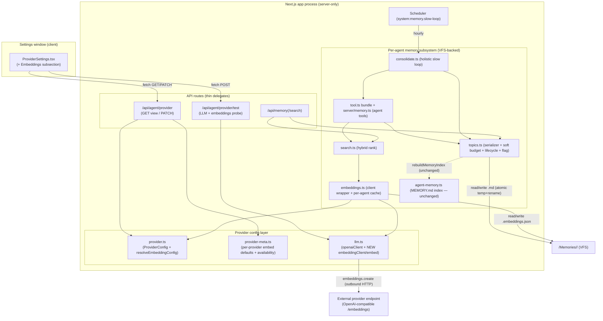

# Design: Memory Curation & Retrieval

**Spec**: `/Specs/user-specs/memory/028-memory-curation-retrieval/spec.md`
**App Target**: `bos-core` (see Classification)
**Scope**: five slices — T1 holistic slow-loop consolidation, T2 soft per-topic budget, T3 hybrid (dense+sparse) retrieval + provider embedding endpoint, T4 entry lifecycle (active/superseded, as-of), T6 `memory_replace`/`memory_remove` agent tools.
**Mockup**: `mockup.html` (Embeddings settings subsection — see §8).

---

## 1. Classification

**`bos-core`.** Every change lands inside existing BOS source under `src/`:

- `src/lib/agent/memory/` (the per-agent memory subsystem — topics/serializer, search, slow loop, tool bundle)
- `src/lib/agent/provider.ts` + `provider-meta.ts` + `llm.ts` (the AI provider config layer + LLM client)
- `src/app/api/agent/provider/**` (provider config/test API routes)
- `src/components/apps/ProviderSettings.tsx` (the Settings "AI Provider" surface)
- `src/lib/assistant/tools/server/memory.ts` (the live main-assistant memory tools)
- `src/lib/config/registry.ts` (the `ai-provider` config namespace fields)

It is **not** `builtin-app` (nothing is created under `src/apps/<id>/` — the "app" here is a *Settings surface* addition and an agent *toolset* addition, both `bos-core` shapes, not a window app). It is **not** `marketplace-item` (nothing under `data/user-apps/items/`; no worker-thread daemon, no service facet, no own port — the embedding call is an outbound HTTP request to a *provider endpoint* made by existing server code, not a BOS-bound port). There is no "background process / raw protocol" force here that would push it toward a service facet: retrieval and consolidation run inside the existing scheduler-driven slow loop and the existing tool execution path.

**Agrees with `spec.md`'s `App Target: bos-core`.** No disagreement to reconcile.

---

## 2. Constitution check

| Principle | Status |
|---|---|
| I. Spec-Driven | ✅ This design is the architecture artifact for an existing `spec.md`. |
| II. Server Authority & SSR Boundary | ✅ The embedding client is `server-only` (lives beside `provider.ts`, which already declares `"server-only"`). The embedding **API key is never returned to the client** — the config view exposes only `hasEmbeddingKey` (a boolean), exactly mirroring the existing `hasApiKey` handling (FR-011). Dense vectors are computed and cached server-side. |
| IV. Minimize Blast Radius | ✅ All on a `bos/*` feature branch via `dev_delegate`; no new top-level subsystem. No change to the two-loop model (retained; the slow loop becomes holistic and gains a soft-budget trigger — no third loop). |
| V. VFS Is Not the Source | ✅ New runtime state (the embedding cache, the consolidation flag, lifecycle tags) lives under `/Memories/<agentId>/` (VFS data), never in `src/`. |
| VI. Specs & Docs Stay in Sync | ✅ Doc updates are in the file plan (`docs/dev/memory/memory.md` + the user-facing memory docs). |
| VII. Respect Boundaries | ⚠️ **No *declared* new dependency — but one honest caveat.** Embeddings reuse the `openai` SDK (its `.embeddings` resource), consistent with `llm.ts`'s `openaiClient()`. **However, `openai` is imported by `llm.ts` but is NOT declared in `package.json` — it resolves today as a hoisted transitive** (via `ai`/`@ai-sdk/openai`); the new `embed()` inherits this. **Recommendation**: declare `openai` explicitly in `package.json` (one line) — that **would** touch the lockfile, so it is a small, explicitly-flagged Constitution VII tradeoff, not a clean "no lockfile change." `provider.json` already stores the LLM key; the embedding key follows the same storage pattern (no *build* change). |

No conflicts to paper over. One boundary worth naming: we add a secret-bearing field (`embeddings.apiKey`) to `provider.json`. This is the same store that already holds the LLM `apiKey`, so it does not introduce a *new* secret store — it extends an existing, already-accepted pattern. (Flagged in §7 as the one thing a security reviewer should consciously sign off.)

---

## 3. Architecture

### 3.1 Context

From the user/agent's point of view, three capabilities change:

1. **Writing memory no longer dead-ends.** Saving to a full topic succeeds and silently schedules a cleanup, instead of erroring with "Over budget … create a shard." The agent gains `memory_replace` / `memory_remove` so it can tidy a topic it has filled.
2. **Searching memory gets better.** `memory_search` returns semantically + lexically ranked results (with a relevance floor and per-result provenance), and degrades gracefully when the provider can't serve embeddings.
3. **A provider can serve embeddings.** The Settings → AI Provider surface gains an *Embeddings* subsection (base URL / API key / model) with per-field fallback to the LLM provider and an availability indicator.

### 3.2 Containers (BOS's real ones)



### 3.3 Components (what this feature actually does)

**Provider config layer**
- `provider.ts`: `ProviderConfig` gains a nested `embeddings?: { baseUrl?, apiKey?, model? }`. New `resolveEmbeddingConfig(c: ProviderConfig)` performs the **per-field fallback** (empty `baseUrl` → LLM `baseUrl`; empty `apiKey` → LLM `apiKey`; empty `model` → embeddings **disabled**) and returns a resolved `{ baseUrl, apiKey, model, enabled }`. `getProviderConfigView()` gains `embedBaseUrl` (the *resolved* base URL, safe to show — it's not a secret), `hasEmbeddingKey` (boolean only, never the key), and `embeddingsEnabled`. **`updateProviderConfig` merges `embeddings` per-field, mirroring the flat-field convention exactly** (`""` → clear *that* field, `undefined` → leave *that* field unchanged) — **not** `patch.embeddings ?? current.embeddings` (all-or-nothing, which would break per-field fallback and force a full-object send). The provider API route's PATCH **must forward the `embeddings` object** (today it forwards only the flat fields).
- `provider-meta.ts`: `PROVIDERS` gains per-provider `defaultEmbedModel?` (`openai`/`openai-codex`/`openai-responses` → `text-embedding-3-small`; `openai-compatible` → none (user picks); `anthropic` → none) and a derived `embedAvailability: "available" | "unsupported" | "unknown"` used for **provider inference** (anthropic → `unsupported`). This mirrors the mockup's `PROVIDERS` table field-for-field.
- `llm.ts`: add `embeddingClient(resolved)` (OpenAI-family only — anthropic family returns `null`/throws a typed "not supported") and `embed(resolved, text): Promise<number[] | null>` (null when the provider can't serve embeddings, so callers degrade). Reuses `normalizeApiBase`.

**Memory subsystem**
- `topics.ts`: 
  - `TopicEntry` gains `state?: "active" | "superseded"` and `supersededBy?: { id: string; timestamp: string }` (T4). The existing text-regex-derived `superseded` boolean is **replaced** by the persisted field (the parser keeps a backward-compat path — see ADR-5).
  - `Topic` gains `consolidate?: boolean` (the T2 flag), stored as a non-`>` marker line so `agent-memory.ts`'s digest scan is untouched.
  - `addTopicEntry` / `replaceTopicEntry`: the hard `Over budget` reject becomes **accept + set `consolidate` flag** (T2). `currentBudget` **keeps its existing baseline unchanged (full serialized length — slug + digest + entries + chrome, i.e. "as today")** and **excludes only the new `<!-- needs-consolidation -->` marker line** (treated as metadata), so setting/clearing the flag never changes the reported usage; `usageStr` is unaffected beyond that.
  - New `setTopicDigest(agentId, slug, digest)` (refresh digest after consolidation, FR-006) and `supersedeTopicEntry(agentId, slug, entryIdOrText, supersededBy)` (T4, background op).
- `search.ts`: hybrid ranking — dense (cosine) + sparse (BM25) + recency + importance, a relevance floor, provenance (already present), and graceful degradation. Public `SearchResult` keeps `source`/`content`/`score` and gains `state` (so recall can label superseded) and, optionally, a per-signal breakdown for diagnostics.
- `embeddings.ts` (new): wraps `embed()` and the **per-agent embedding cache** at `/Memories/<agentId>/.embeddings.json`. `getEmbedding(agentId, entry: { id, text })` returns a cached vector or computes+stores one. Invalidation is by construction (see ADR-3).
- `consolidate.ts`: the slow loop gains read + lifecycle capability — `topic_read` (read a topic's full entry list, FR-005), `topic_set_digest`, and `topic_supersede`. **Driver gating changes (M1)** — today `runSlowLoop` `continue`s past an agent whenever `listPendingEpisodes(agentId)` is empty, so a topic whose `consolidate` flag was set by a soft-budget overflow (which creates *no* episode) is skipped hourly forever and its flag never clears. The gating is widened: `runSlowLoop` runs a consolidation pass for an agent when it has **pending episodes OR ≥1 flagged topic** (it enumerates the agent's topic set for the `consolidate` flag), and `renderAgentPreamble`/`consolidateAgent` enumerate the **flagged topics** so the pass knows what to reorganize even with zero pending episodes. The pass merges/dedups/splits via the **existing atomic single-entry ops** (never a whole-file rewrite — see ADR-2) and **clears the flag only on success** (FR-007). (Driver change in `consolidate.ts`; the integration points are the existing `runSlowLoop`/`consolidateAgent`.) Contradiction detection is added to the system prompt as a background consolidation behavior (T4), not an inline check.
- `tool.ts` (`makeMemoryTools` bundle, used by self-improve + local sub-agents) and `server/memory.ts` (the **live** main-assistant tools): add `memory_replace` and `memory_remove` (T6), backed by the already-present `replaceTopicEntry`/`removeTopicEntry`. `memory_recall` output labels superseded entries as not-current (FR-019).
- `paths.ts`: add `agentEmbeddingsFile(agentId)`.
- `agent-memory.ts`: **no change** — the `MEMORY.md` index stays a derived `slug → digest` table; the consolidation flag and lifecycle tags live in the topic file and are read by the slow loop, not surfaced in the index (minimal blast radius; not required by any FR).

### 3.4 Integration points (existing BOS mechanisms this design *calls into*, does not create)

- **VFS atomic write** — `src/os/vfs.ts` `writeText` for an *unmounted* path (`/Memories/…` is not a spec/docs mount) delegates to `writeFileAtomic` (`src/os/atomic-write.ts`): temp file in the same dir + `fsync` + `rename`. This is the guarantee SC-006 relies on (each single-file write is all-or-nothing).
- **Scheduler** — `system:memory.slow-loop` job + `ensureSlowLoopJob`/`registerInternalRef` already wire the slow loop; this feature only changes what the loop *does*, not how it's scheduled.
- **`rebuildMemoryIndex`** (`agent-memory.ts`) — called by `topics.ts` after every write; unchanged, and the new topic-file fields are invisible to it (it only reads the first `> ` digest line).
- **`runToolLoop`** (`llm.ts`) — the slow loop's execution primitive; unchanged.
- **`/api/memory`** route family — already exposes topic `add`/`replace`/`remove`/`create` (via `topics.ts`) and `/api/memory/search` (via `memorySearch`); this feature changes their *behavior* (soft budget, lifecycle) without changing the route contracts.
- **`openai` npm SDK** (existing dependency) — `.embeddings.create({ model, input })` for the dense signal; no new dependency.
- **Settings namespace plumbing** — `ai-provider` in `config/registry.ts` already delegates load/save to `getProviderConfig`/`updateProviderConfig`; we only add field declarations so the generic config surface + auto-generated assistant config tools see the new keys (with `secret: true` on the embedding key).

---

## 4. Concrete file / module plan (ONLY what this feature creates/modifies)

**Create**
- `src/lib/agent/memory/embeddings.ts` — embedding client wrapper + per-agent cache (`getEmbedding`, cache read/write, prune, model-change invalidation).

**Modify**
- `src/lib/agent/memory/topics.ts` — soft budget (accept+flag), `Topic.consolidate` flag (parse/serialize, non-`>` marker), `TopicEntry.state`/`supersededBy` lifecycle, `setTopicDigest`, `supersedeTopicEntry`, `currentBudget` excludes only the marker line (baseline unchanged).
- `src/lib/agent/memory/search.ts` — hybrid ranking (BM25 sparse + dense + recency + importance), relevance floor, provenance retained, graceful degradation, `state` on results.
- `src/lib/agent/memory/consolidate.ts` — `topic_read`/`topic_set_digest`/`topic_supersede` ops, flagged-topic preamble, clear-flag-on-success, contradiction-detection guidance.
- `src/lib/agent/memory/tool.ts` — `memory_replace`/`memory_remove`; `memory_recall` superseded labeling.
- `src/lib/agent/memory/paths.ts` — `agentEmbeddingsFile`.
- `src/lib/agent/provider.ts` — `embeddings` sub-config, `resolveEmbeddingConfig`, view fields (`embedBaseUrl`, `hasEmbeddingKey`, `embeddingsEnabled`).
- `src/lib/agent/provider-meta.ts` — per-provider `defaultEmbedModel` + `embedAvailability`.
- `src/lib/agent/llm.ts` — `embeddingClient` + `embed()`.
- `src/lib/assistant/tools/server/memory.ts` — live `memory_replace`/`memory_remove`; `memory_search` description; `memory_recall` labeling.
- `src/components/apps/ProviderSettings.tsx` — Embeddings subsection (3 fields, per-field fallback hints, has-key indicator, per-provider model default, availability indicator, Test).
- `src/app/api/agent/provider/route.ts` — PATCH accepts `embeddings`; GET returns extended view.
- `src/app/api/agent/provider/test/route.ts` — probe embeddings availability by **actually attempting a 1-token `embed()` and reporting its result distinctly** (a separate field from the LLM completion probe), so an `unknown` provider can be resolved to `available` on a real call (N1), alongside the existing LLM completion probe.
- `src/lib/config/registry.ts` — `ai-provider` `fields[]`: add embedding fields (`secret: true` on the key).
- `src/lib/agent/capabilities-registry.ts` — add `memory_replace` / `memory_remove` capability entries with **`context: "action"`** (parity with the `memory_*` family; see N3 note in §5.7).

**Modify (docs, Constitution VI)**
- `docs/dev/memory/memory.md` — soft budget, lifecycle, hybrid search, embedding endpoint, cache.
- `docs/usage/memory/*` (and the Memory-app doc) — agent now self-cures; embeddings config; superseded/active labeling.

**Runtime data (created at runtime, not source)**
- `/Memories/<agentId>/.embeddings.json` — per-agent embedding cache (path helper in `paths.ts`).

---

## 5. Key design details

### 5.1 Embedding client + per-field fallback
`resolveEmbeddingConfig(c)` is the single source of truth:
```
baseUrl  = c.embeddings?.baseUrl  || c.baseUrl   || undefined
apiKey   = c.embeddings?.apiKey   || c.apiKey    || undefined
model    = c.embeddings?.model    || undefined
enabled  = model != "" && familyOf(c.provider) !== "anthropic"
```
`llm.ts`'s `embed(resolved, text)` uses `new OpenAI({ apiKey: resolved.apiKey || "local", baseURL: normalizeApiBase(resolved.baseUrl || "") })` and returns `vector.data[0].embedding` on success, or `null` on 404/auth/`not supported` (which is the *degradation* signal, not an error — the search layer treats `null` as "dense unavailable for this query"). This matches FR-010's per-field fallback and the edge case "only the base URL (and not the key) left empty." **Persisting the same per-field contract (S3)**: `updateProviderConfig` must merge the nested `embeddings` object **field-by-field** (per-field `""` → clear, `undefined` → leave unchanged), mirroring how the flat `apiKey`/`baseUrl`/`maxInputTokens` fields are handled in `provider.ts` — **not** `patch.embeddings ?? current.embeddings` (an all-or-nothing object merge, which would force a full-object send and break independent per-field fallback). The provider API route's PATCH currently forwards only the flat fields; it **must additionally forward the `embeddings` object** for this to work end-to-end.

### 5.2 Embedding cache shape + invalidation
```jsonc
// /Memories/<agentId>/.embeddings.json
{
  "model": "text-embedding-3-small",        // model active when the cache was last written
  "entries": {
    "<entryId>": { "model": "text-embedding-3-small", "dim": 1536, "vector": [ /* ... */ ] }
  }
}
```
- **Key = the entry id**, with the **hash invariant pinned (S4)**: `id = hashId(CLEAN entry text)`, where the CLEAN text is the entry body **with the `⟦superseded by=…⟧` lifecycle tag and any `<!-- … -->` marker parsed as metadata and EXCLUDED from the hash** (the parser strips them before hashing, as it already strips the `- [date] ` prefix). Because the id *is* a content hash of the clean text, **recompute-on-text-change (FR-013) falls out by construction**: unchanged text → same id → cache hit; changed text → new id → miss → compute, and the old id is simply no longer referenced. This invariant is load-bearing for the ADR-3 cache (recompute-by-construction) and for `supersededBy.id` reference integrity (R5). **The 32-bit FNV-1a collision risk is inherited from the existing `hashId`, not introduced here.**
- **Model change invalidation**: each entry records the `model` that produced it; if it differs from the active `resolveEmbeddingConfig().model`, treat it as a miss and recompute (lazily, on the next search).
- **Pruning**: on a slow-loop pass (or lazily after a search), drop cache ids not present in any current topic entry, to bound the file.
- The cache is **never** inlined into the topic `.md` (it would pollute the human-readable file and count toward the budget).

### 5.3 Soft-budget flag + lifecycle in the topic file format
Current line format: `# slug` / `> digest` / `- [YYYY-MM-DD] text`.
New format (backward compatible):
```
# <slug>
> <one-line digest>
<!-- needs-consolidation -->          ← present only when flagged; NOT a "> " line, so the index's digest scan is unaffected
- [2026-01-05] active entry text
- [2026-01-12] superseded entry text ⟦superseded by=<entryId>@2026-02-01⟧
```
- The **consolidation flag** is an HTML-comment marker line directly under the digest. The parser sets `Topic.consolidate`; the serializer emits it only when set. `currentBudget` measures entry lines only, so the marker never inflates the number. Clearing = removing the line in the final atomic write (FR-007).
- **Lifecycle** is an inline trailing tag `⟦superseded by=<entryId>@<ts>⟧` on the entry line. The parser's `ENTRY_LINE` regex is extended to optionally capture it; absent → `state: "active"` (FR-020 edge case: no contradiction → active by default). The existing regex-derived `superseded` heuristic is kept as a *read-time* fallback for legacy files that predate the explicit tag, then the explicit tag is the authority (see ADR-5).
- **`rebuildMemoryIndex` effect**: none. It reads only the first `> ` line per topic; the marker (comment) and lifecycle tags (on entry lines) are invisible to it. The index stays a clean `slug → digest` table.

### 5.4 Slow loop made holistic without corruption (T1, FR-005/006/007, SC-006)
The ACE anti-collapse rule in `topics.ts` ("the slow loop MUST go through the incremental add/replace/remove helpers, never a raw file write") is **retained and is what makes SC-006 easy**. T1's "holistic" is achieved by *visibility + composition*, not by a new whole-file-rewrite primitive:
1. **Read**: a new `topic_read(topic)` op returns the full entry list (FR-005) so the model can *see* what's in a topic, not just the slug+digest.
2. **Reorganize as INVARIANT-ENFORCING atomic single-entry ops (M2)**: merge near-dups = `topic_remove_entry` ×N + `topic_add_entry` ×1 (the merged text); drop stale = `topic_remove_entry`; **split** = `topic_create` (sibling) + `topic_add_entry` (each moved entry) + `topic_remove_entry` (from source); **refresh digest** = `topic_set_digest`. Each op is one atomic `vfs.writeText` (temp+rename) that also rebuilds the index. The pass preserves three invariants across **any** intermediate state: **(a) no entry is lost, (b) no entry is duplicated, (c) every entry's id/content-hash is conserved** — a split **moves** entries (never deletes-then-recreates), and a merge folds N into 1 **only** via the existing atomic remove×N + add×1, where the merged entry is a **new** entry (so nothing is lost; the *meaning* is preserved by the LLM's judgment, which is acceptable). An intermediate-but-**CONSISTENT** state (source shrunk, sibling partially populated, digest stale) is **permitted and is NOT corruption** (ADR-2).
3. **Surviving flag ⇒ monotonic convergence (M2)**: the pass clears the source topic's `consolidate` flag in a final write *after* the reorganization completes (FR-007). If the pass is interrupted mid-sequence, every file is still valid, and the flag **survives** (it's still in the source). Because the invariants hold and a finished sub-operation is never undone (monotonic), the next pass **converges to a consistent state**. This is deliberately *not* a claim that the original reorganization is "idempotently completed": a re-run sees an already-modified starting state the LLM cannot reconstruct into the exact original set. The guarantee is **no entry lost/duplicated + surviving flag ⇒ monotonic convergence to a consistent state**. The existing per-agent overlap lock + 30-min staleness prevents concurrent passes racing the same agent.
4. **No gratuitous rewrites (FR-008)**: the preamble tells the loop to *leave well-organized topics unchanged*; merge/split is opt-in per the model's read.

### 5.5 `memory_search` fusion (T3, FR-012/014/015/016/017, SC-003/007)
Per candidate entry `e`:
- `dense_d(e)` = cosine(queryEmb, eEmb), clamped to `[0,1]`; **0 for all** when embeddings are disabled (blank model / anthropic / endpoint 404).
- `sparse_s(e)` = BM25(query tokens, e, corpus) — a lightweight in-memory BM25 over the agent's topic corpus loaded at search time (replaces the naive token count; the code already isolates ranking "for a BM25 swap"). Normalized to `[0,1]` (saturating / max-normalized within the result set).
- `recency_r(e)` = `exp(-age_days / 30)` in `[0,1]`; missing timestamp → neutral `0.5` (FR-017).
- `importance_i(e)` = best-effort in `[0,1]`, default neutral `0.5` when absent (FR-017).

`fused(e) = 0.4·dense + 0.3·sparse + 0.2·recency + 0.1·importance` (weights sum to 1). **When dense is disabled, drop the dense term and renormalize over sparse+recency+importance** — no error (FR-016, SC-007).

**Relevance floor (FR-014)**: a candidate must have real support — require `max(dense_d, sparse_s) ≥ relevanceFloor` (default ~0.15) before it may rank; otherwise it's dropped. When dense is disabled the floor applies to `sparse_s`. If nothing passes → **empty result** (no low-confidence false positives).

**Provenance (FR-015)**: retained — each result already carries `source = <path>#<anchor>` (`#entry-N` for topics, `#<section>` for episodes) plus the entry `state` (so a superseded hit is labeled, not silently presented as current).

**Query embedding**: one `embed()` call per search (the corpus-side vectors are cached). If that call returns `null`, the whole search degrades to sparse+recency+importance for that query — still no error. **First-search dense burst is bounded by default (N2)**: on a cold cache, do **not** embed every candidate. **By default**, take the **top-K sparse (BM25) candidates and `embed()` only those** to seed the dense signal (K a small constant, ~8–10, config-exposable); the remaining candidates join the dense signal on later searches once their vectors are cached. This bounds cold-cache cost (one query embed + at most K corpus embeds per cold search) while still giving a dense signal to the most-promising hits — the previous "open question" is now the default design.

### 5.6 T4 as-of + default view
- **Default retrieval** (`memory_recall` with a slug, and `memory_search`): active entries returned as current; superseded entries clearly labeled "not current" (FR-019). "Current" for a subject = the most recent **active** entry.
- **As-of** (FR-020): `entryStateAt(e, T)` = `active` iff `e.timestamp ≤ T` AND NOT(`e.state == "superseded"` AND `e.supersededBy.timestamp ≤ T`). Exposed as an optional `asOf` parameter on `memory_recall(topic, asOf?)`. Superseded entries are **retained, not deleted** (enables as-of; hard deletion out of scope).
- **Contradiction detection is a background slow-loop op** (spec Assumption): the loop's `topic_read` sees both entries, the system prompt instructs it to `topic_supersede` the older one (pointing at the newer) when it detects a contradiction. Until the pass runs, both are visible with the most-recent preferred (Edge Case). This is an LLM judgment inside the slow loop, not a deterministic inline check — see Risk R4.

### 5.7 T6 tool exposure
The low-level ops **already exist** (`replaceTopicEntry`, `removeTopicEntry` in `topics.ts`, already exposed to the slow loop and `/api/memory`). T6 is *exposure to the agent toolset*, in **both** live surfaces for parity:
- `src/lib/assistant/tools/server/memory.ts` (the **live** main-assistant engine tools, registered in `assistant/registry.ts`) — add `memory_replace(topic, entryIdOrText, content)` and `memory_remove(topic, entryIdOrText)`, keyed by entry id (with the existing unique-substring fallback for ergonomics), returning the same not-found / usage messages.
- `src/lib/agent/memory/tool.ts` (`makeMemoryTools` — used by self-improve and local sub-agents) — same two tools, so the two surfaces don't drift.
- Exact-duplicate-on-replace (Edge Case / FR-004): `replaceTopicEntry`'s result text already goes through the same content pipeline; a replace whose new text equals another entry's text is deduped by the same `topic.entries.some(e => e.text === text)` check the save path uses. Not-found → clear error, no change (SC, US2).

---

## 6. ADRs

### ADR-1 — Classification: `bos-core`, not a service facet
- **Context**: T3 adds an outbound embedding call; T1/T4 run on a schedule. A reviewer might ask whether this "background + network" shape belongs in a marketplace-item service facet (own worker-thread daemon, own port).
- **Options**: (a) `bos-core` — extend the existing memory subsystem + provider layer; (b) a `marketplace-item` service facet for the embedding/retrieval engine.
- **Decision**: (a).
- **Consequences**: The embedding call is a *client* request from existing server code to an external provider endpoint — not a BOS-bound port, not a raw protocol, not a continuous process. The scheduler and tool-execution machinery already exist. A service facet would add an install/symlink/port/`services.json` surface and split one coherent subsystem across two repos for no capability gain. Rejected.

### ADR-2 — Holistic consolidation via *atomic single-entry ops*, not a whole-file rewrite
- **Context**: T1/FR-006 wants the slow loop to read a topic and merge/dedup/split/reorganize. `topics.ts` enforces an ACE anti-collapse rule: the slow loop uses incremental add/replace/remove, never a raw file write. SC-006 requires no corruption on interruption.
- **Options**: (a) add a `topic_reorganize(topic, newEntries[])` whole-file-replace primitive (simpler model, but a multi-entry atomic write + it violates the anti-collapse rule and creates a new corruption surface); (b) give the loop `topic_read` + express merge/split as *sequences* of the existing atomic single-entry ops.
- **Decision**: (b).
- **Consequences**: Each op is one atomic temp+rename write (SC-006 holds by construction); the anti-collapse rule is preserved; a split = create sibling + add + remove (all atomic). Downside: a large reorganization is more round-trips (more tool steps within the loop's `maxSteps`), and an interruption can leave a *valid intermediate* state (source shrunk, sibling partially populated) rather than strictly "unchanged or fully done." We interpret SC-006's "no partial state" as **no corrupted file**, not **no intermediate-but-valid files** — the surviving flag makes the next pass idempotent. *If a reviewer reads SC-006 as forbidding intermediate-but-valid files, this is the ADR to push back on.*

### ADR-3 — Embedding cache keyed by content-hash id, in a sidecar file
- **Context**: FR-013 — cache per entry, recompute only when text changes.
- **Options**: (a) inline vectors in the topic `.md`; (b) a per-agent sidecar `.embeddings.json` keyed by entry id.
- **Decision**: (b), keyed by `hashId(text)` (the entry id).
- **Consequences**: (a) would bloat/pollute the human-readable file and count vectors toward the budget — rejected. (b) makes text-change invalidation *automatic* (new text → new id → miss) and isolates the binary-ish payload from the markdown. Model change is handled by per-entry `model` comparison. Tradeoff: a sidecar file that can (in principle) drift if pruned aggressively — mitigated by recomputing on miss (a missing/stale entry never produces a wrong result, just a cache miss).

### ADR-4 — Consolidation flag lives in the topic file (not a sidecar)
- **Context**: T2/FR-001/007 — a per-topic flag set on soft overflow, cleared after a successful pass, that must survive interruption.
- **Options**: (a) in-file marker line; (b) a per-agent sidecar `.flags.json`.
- **Decision**: (a).
- **Consequences**: (a) co-locates the flag with the topic it describes, survives the atomic single-file write, and cannot drift out of sync with a deleted/renamed topic. (b) is cleaner for a richer flag model but adds a file that must be kept in sync with the topic set (and the index already proves a "derived, can't-drift" philosophy — we avoid a new derivable source of truth). Tradeoff: the flag isn't visible in the `MEMORY.md` index (acceptable — the slow loop reads it from the file; no FR requires index visibility).

### ADR-5 — Lifecycle as an inline `⟦superseded by=…⟧` tag, with a read-time legacy fallback
- **Context**: T4 needs a persisted `active`/`superseded` state + superseding ref. Today `superseded` is *derived* at parse time from a regex on the entry text, and there is no ref.
- **Options**: (a) inline tag on the entry line + keep the existing text-regex as a read-time fallback for pre-existing files; (b) a separate sidecar lifecycle file keyed by entry id.
- **Decision**: (a).
- **Consequences**: (a) keeps one human-readable file and formalizes what the regex was already approximating; absent tag = `active` (FR-020 default). (b) would decouple lifecycle from the entry (drift risk, and the entry is the natural owner of its own state). Tradeoff / risk: the superseding ref is a **content-hash id + timestamp**, which is *fragile if the superseding entry is later edited* (its id changes). We accept this (the ref is a pointer for humans/as-of, and "current" is computed from active+timestamp, not from dereferencing the ref) and flag it as R5.

### ADR-6 — Reuse the `openai` SDK for embeddings; no new dependency
- **Context**: T3 needs to call an OpenAI-compatible `/embeddings` endpoint.
- **Options**: (a) hand-rolled `fetch` to `<base>/embeddings`; (b) the already-present `openai` SDK's `client.embeddings.create` (consistent with `llm.ts`'s `openaiClient`).
- **Decision**: (b).
- **Consequences**: Zero new external dependency (Constitution VII). Reuses existing base-URL normalization and auth handling. The `openai` SDK works against any OpenAI-compatible endpoint (local, OpenAI, Codex, Responses-compatible) — exactly the provider set in `provider-meta.ts`. Anthropic has no such resource → `embed()` returns `null` → degradation. (Hand-rolled fetch was rejected: it would duplicate the normalization/auth logic `llm.ts` already handles and add a maintenance surface.)

### ADR-7 — Hybrid floor is on the *support* signal, not the fused score
- **Context**: FR-014 — no low-confidence false positives; must also work when dense is unavailable.
- **Options**: (a) floor on the fused weighted score; (b) floor on the raw *support* signal `max(dense, sparse)` before ranking.
- **Decision**: (b).
- **Consequences**: (a) makes the floor weight-dependent and behaves differently when dense drops out (the fused scale shifts). (b) is a stable, interpretable gate ("does this entry have real lexical or semantic support for the query?") that is identical across the enabled/disabled cases (degrades to a sparse floor). *Weights (0.4/0.3/0.2/0.1) and `relevanceFloor` are initial defaults; both are config-exposable later — see Risk R6.*

---

## 7. Risks / open questions

- **R1 — Dual memory surface (drift to be aware of, out of scope to fix).** There are *two* live-ish memory toolsets: the unified assistant engine's `memoryTools()` (`server/memory.ts`, targeting the **topic** store — the one this spec targets) and the legacy CopilotKit `MemoryActions.tsx` (still mounted in `CopilotProvider.tsx`, targeting the **older curated** `data/memory/USER.md`+`MEMORY.md` store via `/api/memory` `target:"user"|"memory"`). This feature modifies the **topic** surface only. A reviewer should confirm the legacy curated surface is intentionally being left as-is (it is *not* the "per-agent memory subsystem" the spec names) and that no user-visible tool name collides. **Decision requested**: is the legacy `MemoryActions.tsx` curated path being retired separately, or does it coexist?
- **R2 — Soft budget + slow loop latency.** Between a soft-budget overflow and the next hourly slow-loop pass, a topic can sit over budget (unbounded in the worst case if the loop is disabled or has no credentials). This is the accepted trade for unblocking the write path (SC-001). Mitigation: the flag is idempotent and the pass runs hourly; the slow loop already no-ops without `hasCredentials()`. Open: should overflow also *nudge* the agent in-band to call `memory_replace`/`memory_remove` (a soft in-band signal, not a hard reject)? Currently designed as silent flag-only.
- **R3 — Embedding cost/latency on first search.** The first search over a corpus with no cached vectors issues one embed call per entry (a burst). Cached thereafter. Open: cap first-pass embeds per query (e.g. embed only the top-K sparse hits for the dense signal) to bound the burst — not in the default design; flag for review.
- **R4 — Contradiction detection is LLM-judgment, not deterministic.** T4's contradiction marking depends on the slow loop's model correctly recognizing contradictions. It is best-effort; a missed contradiction leaves both entries active (the most recent is preferred on retrieval). This matches the spec's "background pass, not inline" Assumption, but the *recall* of contradictions is only as good as the model — no guarantee. Open: is that acceptable for P3, or does a higher-confidence pair need a stricter rule?
- **R5 — Superseding ref fragility (content-hash id).** See ADR-5: if the superseding entry is later edited, its id changes and the stored `supersededBy.id` no longer resolves to it. We compute "current" from active+timestamp (robust) and treat the ref as informational; as-of uses timestamps (robust). Flagging in case a reviewer wants the ref to be a stable, edit-invariant id.
- **R6 — Fusion weights + floor are tuned defaults.** `0.4/0.3/0.2/0.1` and `relevanceFloor≈0.15` are starting points, not measured optima. SC-003 (≥90% top-1 on a fixed set) will need empirical tuning against the retrieval test set. Recommend both be surfaced in the `bos-memory` plugin config (`memoryLoops`) so they're tunable without a code change.
- **R7 — `openai-responses` provider + embeddings.** The LLM path for `openai-responses` uses the Responses API, but embeddings use the plain `/embeddings` resource via the OpenAI client. This is correct (embeddings are not a Responses call) but worth confirming the user's `openai-responses` endpoint actually exposes `/embeddings` (the mockup marks it `unknown`, test-driven).
- **R8 — Secret surface growth (see Constitution check).** Adding `embeddings.apiKey` to `provider.json` extends the existing key store. Standard, but a security reviewer should consciously sign off that the view redaction (`hasEmbeddingKey` only, never the key) covers *every* path that reads `getProviderConfigView()` (provider route, config registry load).

---

## 8. UI mockup reference

**Path**: `/Specs/user-specs/memory/028-memory-curation-retrieval/mockup.html`.

The mockup is the authoritative visual contract for the **Embeddings subsection** added to `ProviderSettings.tsx`. Its screens/states map onto the Component design as:

| Mockup element | Maps to |
|---|---|
| "Embeddings" subsection (Base URL / API key / Model + per-field hint lines) | `ProviderSettings.tsx` new subsection; fields bind to `embeddings.{baseUrl,apiKey,model}` via the extended `/api/agent/provider` GET/PATCH. |
| Base URL placeholder `Uses: <resolved>` + "Leave blank to use the LLM provider's base URL" hint | `getProviderConfigView().embedBaseUrl` (the resolved value) + a static hint. |
| API key field + **has-key indicator** (`set` / `fallback`) — value never shown | `embeddings.apiKey` is a password field; the indicator is driven by `hasEmbeddingKey` (set) vs. the LLM `hasApiKey` (fallback). The key value is **never** in the view (FR-011). |
| Model field with per-provider default + note (OpenAI→`text-embedding-3-small`, local→user-picked placeholder, Anthropic→"no first-party embeddings" note) | `provider-meta.ts` `defaultEmbedModel` + `embedAvailability`; blank model = disabled (FR-010). |
| Availability indicator (`available` / `not supported` / `unknown`) top-right of the subsection | **Provider inference** from `provider-meta.embedAvailability` (anthropic→`unsupported`, known OpenAI→`available`, local/responses→`unknown`) **updated by an explicit Test connection** (POST `/api/agent/provider/test` → the new embeddings probe), **not** by an auto-probe on save. |
| "Test connection" button | Existing test action, extended to also issue a 1-token `embed()` and report `embeddings.available` + any error. |

The mockup's client-side `PROVIDERS` table is the spec of what `provider-meta.ts` must expose — the implementation should keep `provider-meta.ts` (server+client shared) as the single source so the mockup's per-provider defaults and the real defaults can't diverge.
