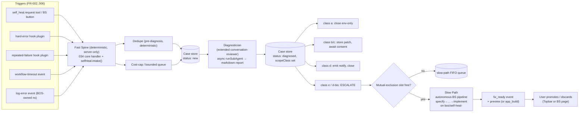

# Design: Self-Healing Mechanism (031-self-healing)

**Spec**: `/Specs/user-specs/self-modification/031-self-healing/spec.md`
**Mockup**: `/Specs/user-specs/self-modification/031-self-healing/mockup.html`
**Date**: 2026-09-07
**Author**: Architect

---

## 1. Classification

**App Target: `bos-core`** — agrees with `spec.md`'s own `App Target` field. No disagreement to flag.

The feature is a *mechanism that spans several BOS subsystems*, not a self-contained app: it adds (a) a server-side deterministic coordinator + case store, (b) a hook plugin that watches tool-call errors, (c) a server tool + agent extension, (d) a Settings config namespace + custom tab, and (e) a new **content pane inside the existing `build-studio` built-in app** (the Self-Heal page, FR-022) modeled on that app's existing `conflict/` pane. None of that is independently installable/removable; all of it is first-class BOS plumbing that ships as part of BOS. That is the definition of `bos-core` (with one `builtin-app`-shaped leaf — the BS pane — which is *part of* the bos-core change, not a separate target).

**The one classification-shaped decision that is NOT a target split, and that I had to make explicitly: the fast spine is not a "workflow."** `spec.md`'s *Assumptions* state "The Workflow Manager service (with event-triggered runs, per spec 002) is available for the fast-spine workflow," and the User Stories/Entities call the fast spine "the deterministic, fast-path **workflow**." That framing does **not** match what actually exists in BOS:

- `docs/dev/architecture-overview.md` §14: the bos-core workflow engine (`src/lib/workflows/*`) is **retired**.
- `specs/user-specs/workflow-manager/001-.../spec.md`: its replacement is a **marketplace-item service** whose nodes are **LLM agents** (static BOS agents or ephemeral agents; outputs delegate/tool/research/ag-ui). It has **no deterministic-code node type**, and I found **no event-triggered-run capability** anywhere in its spec/design (`workflow_run` is tool/agent-invoked and fire-and-poll; nothing subscribes to events to start a run).
- The fast spine, by definition (spec *Key Entities*: "deterministic, fast-path … completes in minutes"), is **deterministic code except for the single Diagnostician LLM step**, and it must (i) run inside a single-server deterministic context for the mutual-exclusion slot, and (ii) **create a BOS-source feature branch and set a conversation's `activeFeatureBranch`** (FR-015b) — both of which are `src/lib` server capabilities reachable only in-process (the Supervisor's `supervisorBegin` and `setConversationActiveFeatureBranch`). A worker-thread marketplace service (002) cannot do either; it can only loopback-HTTP BOS APIs, and it has no branch-creation API to call anyway.

So the fast spine is designed here as **deterministic bos-core server code** — a 034 **core headless handler** (`registerCoreExecutor`, `src/lib/events/dispatch.ts`) fronting a **server-only case store** — not a 002 workflow. This is ADR-1's spine. I flag it prominently for Build Studio to reconcile the *Assumptions* text before `plan` (the assumption is factually wrong against the actual 002; the *intent* — "a deterministic fast path that escalates to a long-lived BS conversation" — is preserved exactly, just on the correct mechanism).

> Reaching for "the workflow engine" here would have been a third flavor of the failure mode in `references/target-*.md` (a technical framing that points at the wrong existing mechanism). The 034 core-handler + hook-plugin + case-store combination is the mechanism BOS already has for "react deterministically to an event, enforce a bound, and drive a bounded async pipeline," and it needs no new engine.

---

## 2. Constitution check

| Principle | Status |
|---|---|
| I. Spec-Driven | ✅ Compliant — this is the design artifact; the pipeline continues to plan/tasks/implement. |
| II. Server Authority & SSR Boundary | ✅ Compliant — the coordinator, case store, dedupe, cost ledger, and all trigger intake are `server-only` under `src/lib/self-heal/`; the BS pane and Settings tab talk to `/api/self-heal/**` over `fetch`. No secrets to the client. |
| III. Always Delegate; Claude Codes | ✅ Compliant — all *fix implementation* is delegated to the `developer` (Claude) agent inside the autonomous BS pipeline; the Diagnostician is a `type:local` agent (diagnosis is analysis, not code). The fast spine itself is deterministic code (no LLM) except the one Diagnostician call. |
| IV. Minimize Blast Radius | ✅ Compliant — every class-e/d-bis fix lands on a feature-branch preview or `app_build`; promotion is always explicit (FR-024); the mechanism never touches the Supervisor or base (FR-023). |
| V. VFS Is Not the Source | ✅ Compliant — the diagnostics report and (Mode 1) reports are written to the VFS `/Documents/BOS Improvements/` as *user-authored content*; code changes go through the Developer on a branch. |
| VI. Specs & Docs Stay in Sync | ✅ Required of the implement step — this feature adds `docs/dev/self-healing/self-healing.md` (and a user-facing page); recorded here as a deliverable. |
| VII. Respect Boundaries | ✅ Compliant — no `package.json`/lockfile/build-config change; new deps: none (SHA-256 via `node:crypto`, already used by the event store). |

**No conflicts to flag.** One *adjacent* note: the feature's autonomous "run the full BS pipeline without stopping" (FR-015) intentionally relaxes the Build Studio agent's default "stop after every step and let the user drive" contract **for this one conversation only**, via the pre-authorization brief. That relaxation is scoped to the self-heal conversation and does not change the `build-studio` agent definition globally — consistent with Principle I (the spec pre-authorized the user stories) and with the spec's own TDD/scope-constraint guards (FR-014). Documented in ADR-1.

---

## 3. Architecture

### 3.1 Context

From the user's/agent's seat, self-heal has three surfaces:

1. **Triggers** — a problem gets noticed five ways: an explicit `self_heal.request` (user button or agent/app tool call), a hard tool error, N repeated same-signature failures, a workflow/long-op timeout, or an error-level log in a BOS-owned component.
2. **The mechanism** (invisible until a case exists) — a deterministic coordinator dedupes, classifies the *route* (not the fix), and either resolves cheaply (env/skill/workflow/notify) or escalates to an autonomous Build Studio pipeline on a feature branch.
3. **The review surface** — the **BS Self-Heal page** (case list + detail + consent/decision/preview actions) and a **`fix_ready` event** in the Event Viewer/Topbar. The user's only *required* action is to promote (or discard); every fix is human-gated at the end.

The headline invariant: **detect → diagnose → classify → (fix or resolve) → notify → human-gated promote**, with a hard boundary that the mechanism never promotes and never touches the Supervisor/base.



### 3.2 Container

The real BOS containers this feature touches:

- **The Next.js server process (BASE)** — hosts everything deterministic: the 034 event kernel (a `globalThis` daemon, sibling to the scheduler), the new self-heal case store, the hook plugin (runs inside the agent run loop), the `/api/self-heal/**` routes, and the settings/config registry. The fast spine's core headless handler executes here.
- **The 034 event system** (`src/lib/events/`, `data/events/`) — the **transport and audit layer**, not the case store. The fast spine *registers* a core handler for `self_heal.*` trigger/decision events and *emits* the `self_heal.case_*`/`fix_ready`/`dedupe_suppressed`/`cost_cap_evicted` lifecycle events (FR-026). Events are immutable bodies + projections; they never hold the mutable case state machine (that's the case store's job — ADR-6).
- **The agent system** (`src/lib/agent/`, `src/lib/assistant/`) — the Diagnostician is a `type:local` sub-agent (`seed/agents/conversation-reviewer`, extended) run headless via `runSubAgent` (`src/lib/agent/subagents/runner.ts`'s `runLocalHeadless`), exactly the way the scheduler's `prompt` handler runs an agent in-process. The slow path is the `build-studio` local agent run through the same `runSubAgent` entry on a seeded conversation.
- **The Supervisor** (`tools/supervisor/supervisor.mjs`) + **preview worktrees/data clones** — the slow path's *preview* machinery. The fast spine does not drive the Supervisor directly; it provisions the branch by *setting the conversation's `activeFeatureBranch`*, and the real git ref/worktree is created lazily by the first `dev_delegate` in the pipeline (`runClaudeAgent` → `supervisorBegin`, idempotent). Promotion/discard are the user's, via the normal Topbar controls (FR-023/024).
- **The user's `user-apps` GitFS repo** (`data/user-apps/`) — the ownership predicate for class `d` vs `d-bis` (item present ⇒ owned ⇒ fixable via `app_build`).
- **Bastion** — deployment-relevant only in that the self-heal port is *not* a new network service; everything is same-origin in-process + loopback to existing BOS APIs, so there is **no new externally-reachable port** and no §11 reachability concern. (Deliberate: I did not reach for a worker-thread service, so there is no port to bind and nothing to proxy.)

```mermaid
flowchart TB
  subgraph BOS["Next.js BASE process"]
    subgraph SPINE["src/lib/self-heal (server-only)"]
      INTAKE["intake() · dedupe · cost ledger · mutual-excl slot"]
      STORE[("case store\ndata/self-heal/")]
      SPINEH["034 core headless handler\n(registerCoreExecutor)"]
    end
    HOOK["bos-self-heal hook plugin\n(afterToolCall / onError)"]
    API["/api/self-heal/**"]
    CFG["config: selfHeal namespace"]
  end
  EKV["034 event kernel (data/events/)"]
  AGT["agent system\nrunSubAgent (local)"]
  SUB["Supervisor + preview worktrees\nbos/self-heal-<caseId>"]
  UA["user-apps GitFS repo\n(ownership predicate)"]

  HOOK -->|emit self_heal.trigger| EKV
  EKV -->|dispatch to core handler| SPINEH
  SPINEH --> INTAKE
  INTAKE --> STORE
  INTAKE -->|async| AGT
  AGT -->|Diagnostician report| INTAKE
  INTAKE -->|escalate: seed BS conv + runSubAgent| AGT
  AGT -->|dev_delegate (implement)| SUB
  INTAKE -.ownership check.-> UA
  API --> INTAKE
  CFG --> INTAKE
  API --> STORE
  INTAKE -->|emit case_*/fix_ready| EKV
```

### 3.3 Component

The concrete modules this feature creates/modifies. The spine is a small deterministic server library; the LLM intelligence lives entirely in two agents (Diagnostician = extended conversation-reviewer; slow path = existing build-studio agent).

**New server-only library — `src/lib/self-heal/`**
- `types.ts` — framework-free types: `ScopeClass` (`'a'|'b'|'c'|'d'|'d-bis'|'e'`), `Ownership`, `CaseStatus` (state machine), `HealingCase`, `FailureSignature`, `CostLedgerEntry`. (Shared by server code and the BS pane/Settings, like `events/types.ts`.)
- `signature.ts` — **deterministic** dedupe-key computation (FR-019): `error_category` mapping (exception type / HTTP status / message pattern → `timeout|not_found|permission_denied|type_mismatch|auth|unhandled_exception`), variable-token stripping, SHA-256 (`node:crypto`), and the relaxed explicit-trigger key. Pure functions, no LLM.
- `allowlist.ts` — the static environmental allowlist (FR-002, C2): network/socket, DNS, 401, 429, OOM/SIGKILL, external timeout. `permission_denied` is **not** in it.
- `store.ts` — the case store: `data/self-heal/index.json` (warm index: id→status, in-flight slot, dedupe-signature map, cost ledger, slow-path queue) + `data/self-heal/cases/<id>.json` (full record + timeline), atomic writes (`@/os/atomic-write`). Single source of truth for state (ADR-6).
- `intake.ts` — **the one deterministic front door** (ADR-1): `selfHealIntake({trigger, signature, context})` → enabled? → allowlist? → re-entrancy? → dedupe → cost-cap/queue → create case → launch Diagnostician async. Plus the **Phase-B resolver** (report frontmatter → scope-class routing) and the **slow-path escalation** (mutual-exclusion check → seed BS conversation with `activeFeatureBranch` set → `runSubAgent`).
- `diagnostician.ts` — launches the Diagnostician via `runSubAgent` (headless), parses the markdown report frontmatter, writes the report to `/Documents/BOS Improvements/<caseId>.md`.
- `cost.ts` — the per-day cost ledger (ADR-5): record usage per case at run completion; `capExhaustedForToday()`; reset at midnight UTC.
- `queue.ts` — the bounded slow-path FIFO (max 100, 7-day TTL, FR-020) + the suspended-timeout sweep helper.
- `reentrancy.ts` — the self-heal-origin **conversation marker** (written when the spine seeds a self-heal conversation) + the deterministic **event-payload filter** predicate (any event carrying `selfHeal.role` is never intake'd). See ADR-4: the guard is satisfied by construction for headless runs (they don't fire the hook) with the marker + event filter as the backstop.
- `spine-handler.ts` — registers the 034 **core headless handler** for `self_heal.*` (trigger, decision_resolved, preview-ready) at boot; thin, delegates to `intake.ts`.

**New agent tool — server**
- `src/lib/assistant/tools/server/self-heal.ts` — `self_heal.request` (FR-001; fires intake), `self_heal.request_decision` (FR-016; emits `decision_needed`, suspends), `self_heal.complete_fix` (FR-017; validates preview/tests, emits `fix_ready`, terminal transition). Registered in `src/lib/agent/capabilities-registry.ts` + `tool-manifest.ts` (a new `Self Heal` group, or under `Build Studio`).

**Hook plugin (tool-error capture) — FR-002/003**
- `src/plugins/self-heal/init.ts` + the plugin def (like `bos-compaction`): `afterToolCall` (feeds the repeated-failure tracker + emits `self_heal.trigger` for non-allowlisted hard errors) and `onError`. Registered via `instrumentation.ts` + `api/plugins`. It fires **only on main chat runs** (headless self-heal runs don't pass `hooks` to the loop, so they never reach it — ADR-4); for the chat path it checks whether `ctx.conversationId` carries a `selfHeal` marker and skips if so. The 300s/3-count rolling window lives here (per-conversation, in-memory) and calls `selfHealIntake`.

**Agent extension — the Diagnostician (FR-008, C7)**
- `seed/agents/conversation-reviewer/AGENT.md` — extended: Mode 2 (failure-signature → diagnostics report), the **unified tool set** (add `app_list`, `query_events`, `get_event` to the existing set, which already includes `bos_source_*`), and a **markdown-diagnostics-report write** (a new `submit_diagnostics_report` server tool writing `/Documents/BOS Improvements/<caseId>.md` with YAML frontmatter, or a mode on `submit_review_report`). Mode 1 behavior unchanged. **This is the one existing-agent modification; it is additive.**
- `src/lib/assistant/tools/server/diagnostics.ts` — `submit_diagnostics_report` (the Diagnostician's single write; validates frontmatter fields).

**Config namespace + Settings tab — FR-027**
- `src/lib/config/registry.ts` — add a `selfHeal` `ConfigRegistration` (all fields as `fields`, so the generic `/api/config` coercion + `config_set` work; `customComponent: "self-improvement"` for the grouped UI).
- `src/components/apps/settings/SelfImprovementTab.tsx` — the two-column grouped UI (Global | Triggers | Autonomy | Limits), mapped in `src/apps/settings/index.tsx`'s `CUSTOM_TABS`.

**BS Self-Heal page (FR-022) — a pane in the existing `build-studio` app**
- `src/apps/build-studio/selfheal/SelfHealPane.tsx` (+ `CaseList`, `CaseDetail`, `ConsentCard`, `SuspendedCard`, `PreviewStatus`, `useSelfHealCases.ts`) — mirrors the existing `src/apps/build-studio/conflict/` structure. Wired into `src/apps/build-studio/index.tsx` as a navigation peer of the conflict pane (a `paneParam === "self-heal"` branch + a nav entry).
- `src/app/api/self-heal/route.ts` — `GET` list, `GET ?caseId` detail, `POST ?op=consent|answer|dismiss|report` (the pane's actions). Thin delegates to `src/lib/self-heal/store.ts`/`intake.ts`.
- `src/apps/build-studio/manifest.ts` — optionally declare a UI `eventHandler` for `self_heal.fix_ready` / `self_heal.decision_needed` so clicking such an event opens the BS Self-Heal page on that case (mirrors the existing `conflict-escalated` handler + `ConflictLaunch.tsx` auto-launch).

**Diagnostics report location** — `/Documents/BOS Improvements/` (VFS), filename `<caseId>.md` (FR-028). Same dir as Mode 1 reports.

### 3.4 The state machine (FR-018), concretely

The case `status` field is the spine's single source of truth for routing and mutual exclusion:

```
new ──► diagnosing ──► diagnosed ──┬─► env-only          (class a)      [terminal]
                                   ├─► awaiting-consent ─► applied | dismissed   (class b/c)
                                   ├─► notified          (class d)      [terminal]
                                   └─► queued-slow ─► bs-pipeline ─┬─► preview-ready  (class e/d-bis) [terminal → user promotes/discards]
                                                              │        dismissed (user discards) [terminal]
                                                              │        failed (build/test fail)  [terminal → no auto-retry]
                                                              └─► suspended ─► (resume) bs-pipeline
                                                                    abandoned (suspended timeout) [terminal]
```

The **in-flight mutual-exclusion slot** is occupied exactly while a case is in `bs-pipeline` (released on any of `preview-ready`/`dismissed`/`failed`/`abandoned`). `queued-slow` is the FIFO behind that slot. `suspended` holds the slot (an unanswered question still blocks the pipeline; the suspended-timeout sweep releases it as `abandoned`). ADR-1 details the handoff.

### 3.5 The slow-path handoff (FR-015/015b/015c, C3/C4/C5) — the spine of the feature

This is the riskiest seam and deserves the full story:

1. **Escalate (deterministic, server-side, Phase-B of the spine):** the spine checks the in-flight slot. If free, it **seeds a new BS conversation**: `saveConversationMessages(caseConvId, "build-studio", [firstUserMessage])` where `firstUserMessage` = the pre-authorization brief (FR-015: "The user has pre-authorized this fix. Run the full pipeline autonomously. Stop only if you encounter a decision you cannot resolve autonomously.") **+ the Diagnostician report as *user intent*** (C3: the report is input, the `specify` step produces `spec.md`). It then sets the branch: `setConversationActiveFeatureBranch(caseConvId, "bos/self-heal-" + caseId)`. **This is the entirety of FR-015b** — the git ref is created lazily by the first `dev_delegate` (ADR-3). Finally `runSubAgent(buildStudioAgent, brief, { conversationId: caseConvId, contentOnly: false, featureBranch: "bos/self-heal-" + caseId })`.
2. **Run (autonomous):** the `build-studio` agent runs `specify → clarify → design → plan → tasks → implement → converge` **without stopping at step boundaries** (the pre-authorization brief overrides its default stop-at-each-step contract *for this conversation only*). `dev_delegate` at `implement` resolves the branch from the conversation (`getConversationActiveFeatureBranch`) and provisions the preview. The developer is briefed with TDD + ≥95% coverage + the **plan file-list as a hard scope constraint** (FR-014); `converge` verifies modified-files ⊆ plan list.
3. **Decision in flight (FR-016, C5):** the agent calls `self_heal.request_decision` → the spine transitions the case to `suspended` and emits `self_heal.decision_needed`; the run **ends** (terminate-and-retrigger; no HITL node in v1). The user answers on the BS page → `POST /api/self-heal?op=answer` → emits `self_heal.decision_resolved` → the spine's core handler **re-enters the SAME conversation** (`runSubAgent(buildStudioAgent, "Resume; answer to the pending question: …", { conversationId: caseConvId, ... })`). The agent recovers all confirmed decisions from the artifacts on disk (commit-before-advance, FR-015) and continues.
4. **Complete (FR-017):** at the end of `implement`, on a healthy preview + passing tests, the agent calls `self_heal.complete_fix` → the spine validates the `bos/self-heal-<caseId>` preview is `ready` and emits `self_heal.fix_ready` with the branch/summary/link, transitioning to `preview-ready`. (Class d-bis: `app_build` result instead of a branch.)
5. **Cold restart / in-flight recovery:** on boot, the spine reconciles any case still in `bs-pipeline`/`suspended` by querying the Supervisor for the branch's preview state (ready → `preview-ready` if no fix_ready was emitted; failed → `failed`; absent → leave for the next resume). This guarantees the in-flight slot is never leaked.

**Why not a 002 workflow here (repeated for the ADR):** a 002 run is (a) LLM-node-driven with no deterministic-code node type, (b) fire-and-poll with no in-run suspension/resume primitive, (c) unable to hold a cross-run in-process mutual-exclusion slot, and (d) unable to do in-run suspend/resume. Note: setting `activeFeatureBranch` IS loopback-HTTP reachable via `src/app/api/assistant/feature-branches/route.ts`, so a 002 service *could* set a conversation's branch — but the firm disqualifiers for 002 are the absence of a deterministic-code node (the spine must be deterministic), the absence of event-triggered runs (the spine must react to `self_heal.*` events), the absence of a cross-run in-process mutual-exclusion slot (the slot is shared state across the entire server, not per-run), and the absence of an in-run suspend/resume primitive (FR-016 requires the pipeline to suspend and resume, which a fire-and-poll worker thread cannot do). The deterministic spine + case store + `runSubAgent` on a persistent conversation gives *all four* using mechanisms BOS already has.

### 3.5.6 Classification verification at the plan→tasks boundary (FR-015a)

The pre-authorization brief (FR-015) instructs the autonomous BS agent to perform a **classification verification** at the `plan` → `tasks` boundary: the plan's file list must plausibly map to the Diagnostician's `proposedSurface` description. This is a behavioral constraint on the BS agent, verified by the pipeline's existing plan artifact.

**Mechanism (deterministic + one re-diagnosis, then hard-stop):**
1. **Compare:** After the BS agent writes `plan.md`, it compares the plan's file list against the Diagnostician report's `proposedSurface` field (both are on disk: the report at `/Documents/BOS Improvements/<caseId>.md`, the plan at the spec directory). The comparison is heuristic: if the plan modifies files in a subsystem (top-level `src/` directory, `seed/agents/` agent, `src/apps/<id>/` app) that the `proposedSurface` does not reference, that is a divergence.
2. **Single re-diagnosis attempt:** On divergence, the BS agent calls `agent_delegate(conversation-reviewer, <task>)` (it has `agent_delegate` in its tools) with a re-diagnosis prompt: "Here is the plan's file list: [list]. The original `proposedSurface` was: [X]. Do the plan's files plausibly implement the proposed surface, or is there a divergence? Respond with 'confirmed' or 'diverges: [reason]'." This is a bounded, one-shot LLM call — not a full pipeline re-run.
3. **Second disagreement is never resolved by further LLM arbitration.** If the re-diagnosis returns 'diverges', the BS agent calls `self_heal.request_decision` (the spine's tool) with the justification for each divergent file → the spine transitions the case to `suspended` and emits `self_heal.decision_needed`. The run ends (terminate-and-retrigger, per FR-016/C5). The user answers on the BS Self-Heal page; the pipeline resumes with the answer. **A second re-diagnosis is never attempted** — the brief's instruction is explicit: "If the divergence persists after ONE re-diagnosis attempt, call `self_heal.request_decision`. Do not attempt further LLM arbitration."

**Why this is safe:** The check is at a well-defined pipeline boundary (after `plan`, before `tasks`), so the agent has both artifacts available. The re-diagnosis is a single bounded call (not a recursive pipeline). The hard-stop on second disagreement means the mechanism never enters an infinite LLM-arbitration loop — it always degrades to human decision. The `converge` step's existing modified-files ⊆ plan-list check (FR-014) is a separate, later guard that catches scope creep at implementation time; FR-015a catches *classification drift* at planning time.

---

## 4. Concrete file/module plan

**Create (new):**
```
src/lib/self-heal/types.ts
src/lib/self-heal/signature.ts
src/lib/self-heal/allowlist.ts
src/lib/self-heal/store.ts
src/lib/self-heal/intake.ts
src/lib/self-heal/diagnostician.ts
src/lib/self-heal/cost.ts
src/lib/self-heal/queue.ts
src/lib/self-heal/reentrancy.ts
src/lib/self-heal/spine-handler.ts
src/lib/assistant/tools/server/self-heal.ts
src/lib/assistant/tools/server/diagnostics.ts
src/plugins/self-heal/index.ts
src/plugins/self-heal/init.ts
src/components/apps/settings/SelfImprovementTab.tsx
src/apps/build-studio/selfheal/SelfHealPane.tsx
src/apps/build-studio/selfheal/CaseList.tsx
src/apps/build-studio/selfheal/CaseDetail.tsx
src/apps/build-studio/selfheal/ConsentCard.tsx
src/apps/build-studio/selfheal/SuspendedCard.tsx
src/apps/build-studio/selfheal/PreviewStatus.tsx
src/apps/build-studio/selfheal/useSelfHealCases.ts
src/app/api/self-heal/route.ts
data/self-heal/                      # runtime: index.json + cases/<id>.json (gitignored, created at boot)
docs/dev/self-healing/self-healing.md   # Constitution VI
docs/usage/self-healing.md              # user-facing (Constitution VI)
```

**Modify (existing):**
```
seed/agents/conversation-reviewer/AGENT.md        # +Mode 2, unified tool set (add app_list, query_events, get_event), markdown-report write
src/instrumentation.ts                            # register self-heal spine handler + self-heal plugin + scheduled-Diagnostician job at boot
src/lib/config/registry.ts                        # +selfHeal ConfigRegistration
src/apps/settings/index.tsx                       # map "self-improvement" → SelfImprovementTab in CUSTOM_TABS
src/apps/build-studio/index.tsx                   # +self-heal nav pane (peer of conflict pane)
src/apps/build-studio/manifest.ts                 # +eventHandler(s) for self_heal.fix_ready / decision_needed (open BS Self-Heal on that case)
src/lib/agent/capabilities-registry.ts            # +self_heal.* / submit_diagnostics_report capabilities
src/lib/agent/tool-manifest.ts                    # mirror the new server tools
src/lib/agent/subagents/types.ts                  # +optional usage field on AgentRunResult (ADR-5 M1 fix)
src/lib/assistant/agent-loop.ts                   # +optional usage field on TurnResult (ADR-5 M1 fix)
src/lib/assistant/model-turn.ts                   # anthropicTurn reads message_delta.usage; openai/responses read final-chunk usage (ADR-5 M1 fix)
src/lib/agent/subagents/runner.ts                 # runLocalHeadless accumulates per-turn usage → AgentRunResult.usage (ADR-5 M1 fix)
src/lib/agent/subagents/claude-runner.ts          # parse usage from result stream-json event / OpenCode final event (ADR-5 M1 fix)
```

**Omit (do NOT create) because the mechanism is not what the spec's wording implies:**
- No `src/lib/workflows/**` and no `/api/workflows/**` — the fast spine is not a 002 workflow (§14 retired the core engine; 002 is an LLM service). See ADR-1.
- No `src/middleware.ts`, no new route/middleware for the spine — it is in-process 034 + hook plugin + case store.
- No worker-thread service, no new network port — deliberately, so there is no §11 reachability surface. (If a future revision wants the spine in a service, it would have to loopback every branch/conversation capability that does not exist as an API today; not worth it.)
- No new dependency — `node:crypto` (SHA-256) and the existing 034/scheduler/agent/config/plugins systems cover it.

---

## 5. Integration points (existing BOS mechanisms this design CALLS INTO, does not create)

Each is a dependency the implement step must not re-invent:

- **034 event kernel — core headless handler.** `registerCoreExecutor(handlerId, fn)` + `api.register({mode:"headless", declaredBy:"core"})` (`src/lib/events/dispatch.ts`). The spine subscribes to `self_heal.trigger.*`, `self_heal.decision_resolved`, and (for preview completion, if the Supervisor-watch variant is chosen) a preview-ready event. Emits via `api.emit` (`src/lib/events/api.ts`). Lifecycle events FR-026 ride here. *Note the core-executor timeout* — the Diagnostician run is launched **fire-and-forget** so it never blocks the ack window (ADR-1).
- **Hook plugin pipeline.** `BosPluginHooks.afterToolCall` / `onError`, `registerPlugin`, `composePluginHooks` (`src/lib/plugins/`, recipe in `docs/dev/extending-bos.md`). The trigger-capture plugin rides the agent run loop.
- **Sub-agent headless run.** `runSubAgent(agent, task, { conversationId, contentOnly, featureBranch, onEvent })` (`src/lib/agent/subagents/runner.ts`) — the same entry the scheduler's `prompt` handler uses (`src/lib/scheduler/executor.ts`). Runs the Diagnostician and the BS conversation.
- **Conversation seeding + branch field.** `saveConversationMessages` (creates the file) and `setConversationActiveFeatureBranch` (race-safe via the per-conversation queue, `src/lib/assistant/conversation-store.ts`); read back by `getConversationActiveFeatureBranch` (`src/lib/agent/conversations-server.ts`). The slow path's branch resolution for `dev_delegate` flows through these.
- **Supervisor preview lifecycle.** `supervisorBegin(branch)` (idempotent — "a missing branch is created off base"), `supervisorState`, `/__supervisor/state` (`src/lib/devharness/supervisor.ts`). The spine *provisions by naming the branch*; it does not drive promote/discard (user-only, FR-024). `self_heal.complete_fix` reads the branch's preview state here to validate before `fix_ready`.
- **Branch-name rules.** `isValidFeatureBranch` / `FEATURE_BRANCH_RE` (`src/lib/agent/feature-branch.ts`). `bos/self-heal-<caseId>` is valid **iff `<caseId>` is a single lowercase dash-separated segment of `[a-z0-9-]`** — the case id scheme must honor this (ADR-3).
- **Ownership predicate.** `listInstalledItems()` / `getInstalledItem(id)` (`src/system/items/installed.ts`, which derives provenance via `deriveOrigin` from where the `data/system/<id>` symlink resolves). The precise d/d-bis predicate: the item is **INSTALLED** (the `data/system/<id>` symlink resolves, i.e. `isItemInstalled(id)` is true) **AND** `origin === "local"` (the symlink resolves into `data/user-apps/items/<id>`, per `deriveOrigin`). `origin === "marketplace"` (resolves into `data/marketplace/<mktId>/items/<id>`) is class `d` (not owned). **The spine's server-side check is the AUTHORITATIVE d/d-bis decider** — the Diagnostician's `app_list` frontend tool does **not** expose `origin`, so the Diagnostician's own classification is advisory and the spine confirms it against `getInstalledItem(id).origin` before routing. Cited home: `src/system/items/installed.ts` (NOT `src/lib/apps/store.ts` / `src/lib/gitfs/store.ts`).
- **Settings/config.** `ConfigRegistration` + `readNamespace`/`patchNamespace` (`src/lib/config/`); auto-exposed to the assistant as `config_*` tools. The `selfHeal` namespace.
- **Scheduler (for the scheduled Diagnostician, FR-021).** A recurring `internal`/`prompt` job with `owner: "self-heal"`, registered at boot (`src/lib/scheduler/`). Time-based only (no event-driven jobs exist — this is also why the *reactive* spine cannot be a scheduler job and must be an event handler).
- **Event Viewer / Topbar.** `self_heal.fix_ready` is a normal event; the user acts on it via the standard promote/discard controls (`VersionControls.tsx`) or the BS page. No new topbar surface required (the spec's "link to the preview" is the BS page's own control).

---

## 6. ADRs

### ADR-1 — The fast spine is a deterministic 034 core handler + async Diagnostician, not a 002 workflow

**Context.** The spec's *Assumptions* name "the Workflow Manager service (with event-triggered runs, per spec 002)" as the fast-spine vehicle, and the entities call the spine "a workflow." But (a) `docs/dev/architecture-overview.md` §14 retired the core workflow engine; (b) the 002 service (`specs/user-specs/workflow-manager/001-...`) is an **LLM-agent-node** engine with **no deterministic-code node** and **no event-triggered-run capability** (verified: nothing subscribes to events to start a run); (c) the spine must be **deterministic** (only the Diagnostician step is LLM), must hold a **cross-run in-process mutual-exclusion slot** (shared server-wide state, not per-run), must react to `self_heal.*` **events** to start, and must support an **in-run suspend/resume** (FR-016). Note: a 002 worker service *could* loopback-HTTP a few of these — e.g. setting a conversation's `activeFeatureBranch` is reachable via `src/app/api/assistant/feature-branches/route.ts` — so "can't touch a branch" is NOT a disqualifier. The firm ones are the four capabilities a worker-thread 002 service structurally lacks: no deterministic-code node, no event-triggered runs, no cross-run in-process slot, and no in-run suspend/resume primitive. A single synchronous "workflow run" also cannot host a multi-minute Diagnostician LLM step, because a 034 core executor has a `timeoutMs` and the dispatch engine settles on it.

**Options.**
- *A — 002 workflow service with a deterministic "tool" node driving the spine.* Rejected: 002 has no deterministic node type, no event trigger, no cross-run in-process slot, and no in-run suspend/resume. (It *could* loopback-set a conversation's branch via the feature-branches route, but that single reachable op does not make up the missing deterministic-node / event-trigger / slot / suspend-resume primitives.) Extending 002 to add all four is a new engine — the opposite of "reuse what exists."
- *B — A 002 agent-node workflow for the Diagnostician step only, spine logic in a service.* Rejected: splits the spine across two owners; the deterministic guards (dedupe/cap/slot) would live in a worker that still can't do branch/conversation ops.
- *C — Deterministic bos-core spine: a 034 core headless handler (`registerCoreExecutor`) on `self_heal.*` events + a server-only case store + a hook plugin for error capture; the Diagnostician launched as a **fire-and-forget async `runSubAgent`** (Phase A settles the ack immediately; Phase B runs on Diagnostician completion and is re-entrant-safe because it is idempotent against the case store).**  Chosen.
- *D — A scheduler job.* Rejected for the reactive path: the scheduler is time-based only (verified: `ScheduleType = one-time | recurring`; no event trigger). Used only for the *scheduled* Diagnostician pass (FR-021).

**Decision.** Option C. The spine is `src/lib/self-heal/intake.ts` behind `spine-handler.ts`'s core handler. **Phase A** (synchronous, at intake): guards → dedupe → cost-cap/queue → create case → emit `case_created` → `void runDiagnosticianAsync(case)` → return (ack settles). **Phase B** (async, on Diagnostician completion): parse report → `diagnosed` → scope-class routing → (escalate ⇒ seed BS conversation + set branch + `runSubAgent` for the slow path). Every Phase-B transition is an idempotent read-modify-write on the case store keyed by case id, so at-least-once redelivery and cold-restart reconcile cannot double-act.

**Consequences.** + The spine is deterministic, testable, single-owner, and uses only existing mechanisms (034 handler, hook plugin, `runSubAgent`, conversation store, Supervisor-by-name). + The async split cleanly sidesteps the executor timeout. − The Diagnostician run is "loose" from the handler: a crash between launch and Phase-B completion must be recovered by boot-reconcile (the case sits in `diagnosing`; on boot, re-launch or re-read the report). − `spec.md`'s *Assumptions* text is now inaccurate and must be reconciled by Build Studio before `plan` (flagged in §1). − The "workflow timeout" trigger (FR-004) is an *event the 002 service emits* that the spine *subscribes to* — an integration point, not the spine's own engine.

---

### ADR-2 — Diagnostician = extended `conversation-reviewer` (one agent, one tool set, two modes)

**Context.** FR-008/C7: the Diagnostician is the existing `conversation-reviewer` agent with a second mode (Mode 2: failure-signature → diagnostics report) sharing Mode 1 (behavioral review) and the `agent-behavior-review` skill; it must not write code or delegate; its only write is the report.

**Verified base.** `seed/agents/conversation-reviewer/AGENT.md`: `type: local`; tools already include `conversation_overview`, `conversation_page`, `submit_review_report`, `agent_definition_get`, `bos_source_list/read/search`, `skill_*`, `file_list/read`. It is **already read-only everywhere except the report** and **cannot delegate** (no `agent_delegate`/`dev_delegate` in its tools) — so FR-008's "no code, no delegation" is already true by construction; we only *add* tools and a mode.

**Decision.** Extend the agent (additive only): (1) add `app_list`, `query_events`, `get_event` to the `tools` list (the unified Mode-2 set, C7); (2) add a `submit_diagnostics_report` tool (writes `/Documents/BOS Improvements/<caseId>.md`, validates the YAML frontmatter `scopeClass`/`ownership`/`proposedSurface`/`caseId`/`triggeredAt`) as its *one* new write; (3) add a Mode-2 section to the prompt ("you receive either a conversationId (Mode 1) or a failure signature (Mode 2); mode is selected by input type") and the matching section in the `agent-behavior-review` skill (or a new Mode-2 method doc the skill references). Mode 1's report path (`.json`, existing `submit_review_report`) is untouched.

**Consequences.** + No new agent id to manage; the two modes share one definition, one gate, one skill — matches C7 exactly. + Re-entrancy is uniform (ADR-4 tags the run, not the mode). − The `agent-behavior-review` skill body grows; keep Mode-2 method in a `references/` file to avoid bloat. − `submit_diagnostics_report` must be scoped so the agent *cannot* use it to write anywhere except the one report file (the tool enforces the path, not the prompt).

---

### ADR-3 — "Branch pre-creation" = set the conversation's `activeFeatureBranch` before the first token; the git ref is created lazily

**Context.** FR-015b/C4: the fast spine must create `bos/self-heal-<case-id>` server-side and set the BS conversation's `activeFeatureBranch` **before** the BS agent's first token, so the agent never calls `dev_branch_request` (a frontend elicitation that would block an autonomous run).

**Verified mechanics (this reshapes the requirement).** `conversations-server.ts` documents it explicitly: "Under the Supervisor, `dev_branch_request` **only records the name** on the originating conversation — the actual branch + worktree aren't created until `dev_delegate` first runs under it (provisioned lazily, at delegate time)." `supervisorBegin(branch)` is idempotent: "an existing branch is checked out with its history; a missing branch is created off base." `runClaudeAgent` calls `supervisorBegin(featureBranch)` at `dev_delegate` time, and the branch is resolved server-side from `getConversationActiveFeatureBranch(conversationId)`. The spec-fs write gate for `/Specs/user-specs/**` opens purely on the conversation having a valid `activeFeatureBranch`.

**Options.**
- *A — Spine calls a git API to create the ref now.* Unnecessary and partly impossible from the spine's context (the ref lives in the Supervisor's worktree management, not a plain `git` the spine owns). It would also risk colliding with `supervisorBegin`'s provisioning.
- *B — Spine sets `activeFeatureBranch` on the seeded conversation via `setConversationActiveFeatureBranch`; the ref/worktree materialize on the first `dev_delegate` (at `implement`).* **Chosen.**
- *C — Spine sets the field AND force-provisions the preview up front.* Adds a build cost for the `specify→…→plan` steps that don't need a built preview, and duplicates `supervisorBegin`'s job.

**Decision.** Option B. On escalation the spine does exactly two conversation ops (race-safe, same per-conversation queue): `saveConversationMessages(caseConvId, "build-studio", [brief+report])` then `setConversationActiveFeatureBranch(caseConvId, "bos/self-heal-"+caseId)`. Because the field is set *before* the first agent turn, the `specify`-step `/Specs` write passes its gate and `dev_branch_request` is never invoked — the elicitation gap is closed by *preconditioning the field*, which is all FR-015b actually needs. The real branch is created by `supervisorBegin` on the first `dev_delegate`.

**Consequences.** + Minimal, uses two existing race-safe primitives; the git side is delegated to the machinery that already owns it. + No extra build before it's needed. − **The case id must be a valid branch segment**: `bos/self-heal-<caseId>` must match `FEATURE_BRANCH_RE` (`^bos/[a-z0-9]+(-[a-z0-9]+){0,3}$`). The mockup uses ids like `EHS-0141` (uppercase) — **those are not valid branch names.** The case *id* and the *branch slug* must be decoupled: keep the human id as-is, derive the branch from a lowercased/`[a-z0-9-]` slug of it (e.g. case `EHS-0141` → branch `bos/self-heal-0141` or `bos/self-heal-ehs-0141`). This is a **spec-visible detail** the mockup's `EHS-` prefix conflicts with — flag for the user. − If the pipeline never reaches `implement` (e.g. suspends at `plan`), no ref exists yet; that's fine, `supervisorBegin` still creates it on the later `dev_delegate`.

---

### ADR-4 — Re-entrancy guard: satisfied by construction for headless runs, with a conversation-marker + event-filter backstop

**Context.** FR-025: the Diagnostician's own execution must not create a new self-heal case. The triggers are (i) tool errors / (ii) repeated failures (hook plugin on the agent run loop), (iii) workflow-timeout events, (iv) BOS-owned log errors. A failing Diagnostician (or a tool error *inside* the BS pipeline it spawned) must not recurse.

**Verified mechanics (this makes FR-025 satisfied more robustly by construction than a first draft assumed).** Two facts about the run path change the shape of the guard:
1. **Self-heal's autonomous runs are headless, and headless runs do NOT fire plugin hooks.** `runLocalHeadless` (`src/lib/agent/subagents/runner.ts`) calls `runAgentLoop` **without passing a `hooks` argument** — `composePluginHooks` is wired only in `src/lib/assistant/start-run.ts` (the main chat run). So the `bos-self-heal` hook plugin's `afterToolCall`/`onError` is **never invoked** on a Diagnostician run or a slow-path BS pipeline run (both go through `runSubAgent` → `runLocalHeadless`). A failing Diagnostician therefore **cannot reach the hook capture path at all** — FR-025's primary recursion risk is closed by construction, not by a marker the hook must check.
2. **The hook ctx is only `{runId, conversationId, agentId}`** (`src/lib/assistant/hooks.ts` `HookContext`) — there is no free-form role field. So the hook can't be handed an arbitrary `selfHeal.role` out-of-band; the only thing it can reliably read to identify a run is the `conversationId`.

**Decision.** Two complementary guards, neither relying on the headless run reaching a hook:
- **Conversation-carried marker (for the chat-based trigger path).** When the spine seeds a self-heal conversation (the slow-path BS conversation, and any diagnostician conversation), it writes a `selfHeal: { role: "pipeline" | "diagnostician", caseId }` field onto that **conversation record** (readable via `conversationId`). The `bos-self-heal` hook plugin — which only ever fires on *main chat* runs, i.e. on a conversation the user is driving — checks: *does `ctx.conversationId` carry a `selfHeal` marker?* If so, it is a self-heal-origin conversation and the hook **skips** (no `self_heal.trigger` emission). This covers the one path where a self-heal-tainted run *would* fire the hook: a self-heal conversation that is later driven from the main chat UI.
- **Event-based belt-and-braces rule (deterministic, no hook involved).** Every *event* trigger the spine intakes (workflow-timeout, log-error, and any future event-shaped trigger) is filtered in `intake.ts` itself: **any event whose payload carries `selfHeal.role` is never intake'd.** This is the authoritative, hook-independent guard — it lives in the deterministic spine front door, so it holds regardless of which run path produced the event. Workflow-timeout and BOS-owned log-error events are additionally scoped to *user/workflow* component namespaces, so a self-heal run (whose components are `self-heal`/`assistant.*` under the spine) does not even match the log-error predicate.

**Consequences.** + FR-025 holds by construction on the dominant path (headless runs don't reach the hook), with a deterministic event filter as the backstop — strictly more robust than the "tag the run and hope the hook reads it" design. + No dependency on the hook ctx exposing a role field (it doesn't); the marker lives on the conversation where `conversationId` can reach it. + The single choke point for *event* triggers is `intake.ts` (drop self-heal-origin payloads), and the single choke point for *hook* triggers is the hook's conversation-marker check. − The conversation record gains a `selfHeal` field (a small additive field, written only for spine-seeded conversations). − If a future BOS change wires `hooks` into `runLocalHeadless`, the headless-path assumption changes — but the event-based filter in `intake.ts` still holds, so recursion stays bounded either way.

---

### ADR-5 — Cost cap = per-case ledger written at run completion, checked at enqueue (not a live meter)

**Context.** FR-020: total LLM tokens across all self-heal cases in a calendar day ≤ `costCapPerDay`; when reached, **new** triggers are **queued** (not dropped) and processed next day; queue bounded (≤100, 7-day TTL); reset midnight UTC; emit `cost_cap_evicted` on eviction.

**Verified: BOS currently does NOT surface token usage to callers.** `AgentRunResult` (`src/lib/agent/subagents/types.ts:22`) is `{agent, type, task, output, steps, toolCalls, error?}` — no usage field. `TurnResult` (`src/lib/assistant/agent-loop.ts:34`) is `{text, toolCalls}` — no usage. `anthropicTurn` in `model-turn.ts` iterates the stream's `content_block_start`/`content_block_delta` events but never reads `message_delta` (where Anthropic reports `input_tokens`/`output_tokens`). `claude-runner.ts`'s `StreamEvent` interface parses `type`/`result`/`subtype`/`is_error` but not `usage`. `total_tokens` appears nowhere in `src/`. This means self-heal cannot read usage from an existing result — it must be added.

**Options.**
- *A — Real-time metering across all LLM calls in BOS.* Rejected: disproportionate blast radius.
- *B — Surface usage on the existing turn/result types (a small, contained extension), then maintain a self-heal-scoped ledger.* **Chosen.** Extend `TurnResult` with an optional `usage?: { input_tokens: number; output_tokens: number }` field; extend `AgentRunResult` with an optional `usage?: { input_tokens: number; output_tokens: number; total_tokens: number }` field (aggregated across all turns in the run). `anthropicTurn` reads `message_delta.usage` from the stream (the Anthropic SDK emits it); `openaiChatTurn` and `responsesTurn` read their respective `usage` fields from the final stream chunk. `runLocalHeadless` accumulates per-turn usage into the run's total and includes it in the returned `AgentRunResult`. `claude-runner.ts` reads the `usage` field from the final `result` event (Claude Code's stream-json includes `usage` with `input_tokens`/`output_tokens`/`total_cost_usd` on the result line; OpenCode's final event has a `tokens` field). This is a small, backward-compatible extension (the field is optional; existing callers are unaffected). The self-heal cost ledger then reads `result.usage` and records it — no estimation needed on the primary path.
- *C — Estimate from context window only.* Rejected as primary: too coarse to enforce a token cap honestly. Retained as a **secondary fallback** for the rare case where a provider omits usage (local servers that don't report tokens).

**Decision.** Option B. The cost mechanism has two layers:
1. **Surface usage (primary, deterministic).** The four files listed in §4 are extended to capture and propagate token usage from the LLM stream. This is a one-time, backward-compatible platform improvement — BOS should know what its own agent runs cost. After this, `runSubAgent` returns `AgentRunResult.usage` populated (or `undefined` if the provider omits it).
2. **Self-heal ledger (secondary, scoped).** `cost.ts` maintains `ledger: CostLedgerEntry[]` in `data/self-heal/index.json` (`{caseId, role, tokens, estimated?: boolean, at}`), pruned to the current UTC day at read time. `capExhaustedForToday()` sums the day's entries vs `costCapPerDay`. At intake, if exhausted → the case goes to the **bounded slow-path queue** (or a *pending-retry* queue for cheap classes), **not dropped**; at the UTC midnight rollover the next intake processes them FIFO. **A single in-flight case may overshoot the cap** — this matches FR-020's explicit "reached mid-pipeline: the current case completes; NEW triggers are queued." When a run's `usage` field is `undefined` (provider omitted it — e.g. some local servers), fall back to a conservative estimate from the final message token count and set `estimated: true` on the ledger entry.

**Consequences.** + The cap is grounded in *real* provider-reported token counts, not estimates — a platform-level improvement. + The extension is backward-compatible (optional field; no breaking change to existing callers). + Self-heal-scoped ledger, no global instrumentation. + Matches FR-020's mid-pipeline semantics exactly. − The cap is *enforced between cases*, not *within* one — an autonomous multi-hour pipeline is one ledger entry recorded at its end, so a very large single case can blow past the daily cap. Acceptable per FR-020. − Touching `TurnResult`/`AgentRunResult`/`model-turn.ts`/`claude-runner.ts` is a small cross-cutting change; it benefits any future feature that needs usage visibility (telemetry, rate-limiting, billing). − The estimate fallback keeps the ledger honest when providers omit usage.

---

### ADR-6 — Case store is a dedicated server store; 034 events are the audit/notification layer, not the store

**Context.** FR-018 (case record + state machine + timeline) and FR-026 (lifecycle events for every transition). The question the task asked: *file store, 034 event system, or dedicated API?*

**Decision.** **Both, with a clean split.** The **case store** (`src/lib/self-heal/store.ts`, `data/self-heal/`) is the **source of truth** for mutable state: `id`, `trigger`, `failureSignature`, `status`, `scopeClass`, `ownership`, `proposedSurface`, `reportPath`, `linkedPreview/appId`, `activeFeatureBranch`, the **dedupe-signature map**, the **cost ledger**, the **in-flight slot**, the **slow-path queue**, and the **timeline** (state transitions with timestamps). It is a server-only store with atomic writes, exactly like the gitops conflict-session store and the event store's own persistence. **034 events** are **projections + notifications**: on every transition the spine `api.emit`s the matching `self_heal.*` event (FR-026) so the Event Viewer/bell/audit trail and the BS page's live view update, but the events do **not** hold the state machine.

**Why not 034 events as the store:** 034's model is *immutable event bodies + a processing/read two-axis state* — it has no per-entity mutable record or timeline, and its `ack`/`processing` semantics are about handler settlement, not case lifecycle. Cramming the case state machine into events would fight the kernel and make FR-018's timeline/dedupe-map/slot/queue awkward. **Why not a bare file store with no events:** FR-026 requires queryable lifecycle events and the BS page wants live updates; 034 gives us emit/query/stream/ack for free. The precedent is the conflict-session feature (035): durable server session record + event notifications.

**Consequences.** + Single writer for state (the spine), single source of truth; events are a derived, replayable audit + live-update channel. + The BS page reads the case store (authoritative) via `/api/self-heal` and can additionally subscribe to `GET /api/events/stream` for live refresh. + Boot-reconcile (ADR-1/§3.5.5) operates on the store. − Two artifacts to keep consistent; the spine is the only place both are written, so consistency is guaranteed by construction (emit-after-commit).

---

### ADR-7 — Dedupe is deterministic and pre-diagnosis; normalization rules are the design surface

**Context.** FR-019: dedupe by failure signature **before** diagnosis, deterministic (no LLM), key `(tool_name, error_category, normalized_message_hash)`; `error_category` a coarse bucket from exception type / HTTP status / message pattern; `normalized_message_hash` = SHA-256 of the message after stripping variable tokens (IDs, UUIDs, timestamps, quoted strings, numerics); explicit trigger uses a shorter window (3600s) and a relaxed key `(tool_name, "explicit", description_hash)`; suppressed triggers emit `self_heal.dedupe_suppressed` referencing the original case.

**Decision.** `signature.ts` is pure code, run in Phase A **before** the Diagnostician launches. The case store keeps a **dedupe map** `signature → { caseId, status, ts }`; intake checks it against the current `dedupeWindowSec` (or the 3600s explicit window). **Normalization rules** (the part that determines dedupe quality) are defined concretely here so implementation is unambiguous:
- `error_category`: map from (in order) HTTP status (401→`auth`, 404→`not_found`, 429→`auth`/`rate-limit`→allowlist, 5xx→`unhandled_exception`), exception class (`TimeoutError`/`ETIMEDOUT`→`timeout`, `EACCES`/`EPERM`→`permission_denied`, type/shape errors→`type_mismatch`, else `unhandled_exception`).
- `normalized_message`: lowercase; replace UUIDs, hex ids, timestamps (ISO + epoch), quoted strings, and standalone numerics with a single stable placeholder (`<x>`); collapse whitespace; strip absolute paths' leading user-specific segment if present (so the same logical error at different paths still dedupes — a tuning knob, default on).
- `hash`: SHA-256 hex of the normalized message.

**Consequences.** + Deterministic, testable, no LLM cost, pre-diagnosis (a duplicate never spends Diagnostician tokens). + The relaxed explicit key means a user intentionally re-firing the same report within an hour is treated as a new case (per FR-019). − Normalization is a judgment call: too aggressive (stripping paths) can merge distinct bugs; too conservative (keeping paths) misses the same bug at different paths. The default (strip user-specific path prefix, keep the rest) is a stated choice the user can flip. − `dedupe_suppressed` and the map give full auditability; suppression is never silent (FR-019).

---

### ADR-8 — `self_heal.complete_fix` (a terminal BS-agent tool) is the `fix_ready` emitter, not a Supervisor watcher

**Context.** FR-017: when the preview passes health + tests, emit `self_heal.fix_ready` (case id, branch/app id, summary, link) so the user can promote/discard. Two ways to detect "the slow path finished successfully."

**Options.**
- *A — The BS agent calls `self_heal.complete_fix` at the end of `implement`* (invoked per the autonomous brief). The tool validates the `bos/self-heal-<caseId>` preview is `ready` (Supervisor state) and tests passed, then emits `fix_ready` + transitions to `preview-ready`.
- *B — The spine watches the Supervisor for the self-heal branch reaching `ready`* and emits on that.

**Decision.** Option A (primary). It is explicit, auditable (the agent's deliberate terminal action), gives the case store its transition from the side that *knows* tests passed, and needs no long-running watcher. The autonomous brief (FR-015) already instructs the pipeline to "stop only on an unresolvable decision" — adding "when `implement` completes and the preview is healthy + tests pass, call `self_heal.complete_fix`" is one more line in the same brief. Option B is retained only as a **reconcile fallback** (boot/in-flight recovery, §3.5.5) for the case where the agent's run was killed *after* a healthy preview but *before* it called the tool: on reconcile, the spine sees the preview is `ready` with no `fix_ready` yet and emits it.

**Consequences.** + Minimal moving parts; no persistent watcher thread. + Fallback covers the crash-between-build-and-tool window. − Relies on the agent honoring the brief (mitigated by the reconcile fallback and by the fact that a healthy preview is itself detectable). − For class d-bis, `complete_fix` takes the `app_build` result instead of a branch and emits `fix_ready` with the app id (FR-013).

---

### ADR-9 — Mutual exclusion is a single slot in the case store, released at terminal states, swept for suspended timeouts

**Context.** FR-015c/C6: exactly one class-e/d-bis case in `bs-pipeline` at a time; new escalations queue FIFO behind it; the store tracks the in-flight case; escalation checks the slot before starting.

**Decision.** One field on the store index: `inFlightSlowPathCaseId: string | null`, set on escalation and cleared on any terminal slow-path state (`preview-ready` via ADR-8, `dismissed` via user discard, `failed` via build/test failure, `abandoned` via the suspended-timeout sweep). `queued-slow` cases sit in the bounded FIFO (`queue.ts`); whenever the slot clears, the spine dequeues the next and escalates it (this is re-entry, not a new trigger, so it is **not** subject to dedupe/cap re-checks — it's already an accepted case). The **suspended-timeout** (default 7 days, `selfHeal.suspendedTimeoutDays`) is a boot-registered recurring reconcile: any case in `suspended` past the timeout → `abandoned` + emit + release the slot. Because the slot lives in the *durable* store (not in-process memory), it survives restarts and is correct under the Supervisor's multiple server processes (the store's atomic writes are the authority, like the scheduler's disk locks).

**Consequences.** + Simple, durable, restart-safe. + FIFO + TTL are the same bounded-queue machinery as the cost queue. − Two distinct FIFOs exist (cost-cap queue vs slow-path mutual-exclusion queue); they are separate concerns and must not be conflated — the cost queue holds *unstarted* cases (not yet diagnosed or pending a cap reset), the slow-path queue holds *escalated* cases awaiting the single slot. − A `suspended` case holding the slot for up to 7 days is a real throughput cost by design (the user's unanswered question blocks the next auto-fix); the BS page's prominent suspended state (amber pulse) is the mitigation.

---

## 7. Risks / open questions

1. **R1 (RESOLVED) — Spec's "workflow" assumption is wrong.** §1/ADR-1. The *Assumptions* line has already been reconciled in `spec.md` (the current text reads "a deterministic bos-core coordinator" and explicitly states 002 is NOT the spine). No further action.
2. **R2 — Case id vs branch name (ADR-3).** The mockup's `EHS-<n>` ids are not valid `bos/*` branch segments. The branch slug is `lowercased(caseId)` — e.g. case `EHS-0141` → branch `bos/self-heal-0141` — stored on the case's `activeFeatureBranch` field; the human id (`EHS-0141`) is displayed in the UI. The mockup's card already shows this decoupling ("branch · bos/self-heal-0141" against human id "EHS-0141"). No further decision needed.
3. **R3 — Hook plugin must see run origin (ADR-4).** RESOLVED by ADR-4's re-grounded mechanism: `runLocalHeadless` does NOT pass `hooks` into `runAgentLoop`, so self-heal headless runs never fire a plugin hook — a failing Diagnostician or BS pipeline run cannot reach the trigger path at all. The re-entrancy guard is satisfied by construction for the headless path; the hook ctx `{runId, conversationId, agentId}` + the conversation-carried marker covers the (non-self-heal) chat path. No further verification needed.
4. **R4 — Core-executor timeout vs async Diagnostician (ADR-1).** The Diagnostician MUST be launched fire-and-forget (not awaited inside the handler) or the 034 ack window (default 30s) times out and the kernel marks the handler failed. The Phase-B completion path is a *separate* re-entry (a `void` promise that calls back into `intake.ts`), not a continuation of the handler call. Ensure the kernel's at-least-once redelivery of the *trigger* event is idempotent against the case store (it is, by ADR-1's keyed transitions) so a redelivered trigger while the Diagnostician is already running does not spawn a second Diagnostician.
5. **R5 (RESOLVED) — Cost fidelity (ADR-5).** The primary cost mechanism is now real provider-reported usage, surfaced by extending `TurnResult`/`AgentRunResult`/`model-turn.ts`/`claude-runner.ts` (see §4). The estimate fallback covers only providers that omit usage (rare local servers). **Open:** confirm the default `costCapPerDay` unit and a realistic value (the mockup shows "50k" — is that 50,000 tokens? A full Diagnostician + BS pipeline + Developer run likely exceeds 50k tokens; a realistic default for a self-heal budget might be 500k–1M tokens/day. Confirm with user at spec-clarify time).
6. **R6 — Scheduled Diagnostician idle detection (FR-021/US6).** "Conversation idle past threshold" needs a concrete definition of *idle* (last user/agent message age) and a source for the conversation list. Reuse the existing memory fast-loop idle-review machinery if it already computes idle conversations; otherwise query `/Documents/Chats/*.json` `updatedAt` > threshold. Implement-step decision; keep it in `diagnostician.ts`.
7. **R7 — Workflow-timeout trigger integration (FR-004).** Requires the 002 service to *emit* a timeout event the spine subscribes to. If 002 does not currently emit one, this is a small 002-side addition (out of scope for 031's bos-core change; track as a cross-spec dependency). The spine's handler must be tolerant of the event shape (only read `workflow id`, `node`, configured-vs-actual duration).
8. **R8 — Log-error "BOS-owned component" predicate (FR-005).** The set of "BOS-owned" logging component namespaces is a v1 static list (the environmental allowlist is already static per the spec). Define the list (e.g. exclude `gsuite`, `telegram`, MCP-server, and any third-party `component` values). Implement-step decision; keep in `allowlist.ts` alongside the error allowlist.
9. **R9 — Cold-restart in-flight recovery (ADR-8/§3.5.5).** The boot-reconcile that re-derives `bs-pipeline`/`suspended` state from the Supervisor must run exactly once (single-owner, like the scheduler daemon election) to avoid double-emitting `fix_ready`. Reuse the scheduler's daemon-lock or the event kernel's boot ordering.
10. **R10 — Pre-authorization scope.** FR-015's "run autonomously without stopping" overrides the `build-studio` agent's default stop-at-each-step contract *for the self-heal conversation only*. Confirm this is acceptable as a per-conversation instruction (it is — the agent definition is unchanged; the brief is the override). No constitution concern (Principle I is satisfied because the spec pre-authorized the user stories). Stated in §2.

---

## 8. UI mockup reference

`mockup.html` (same dir). Four sections; each maps to a concrete component in §3.3/§4:

| Mockup section | Maps to | Notes |
|---|---|---|
| **1 · BS Self-Heal Page — Case List** | `SelfHealPane` + `CaseList` | Columns are **Status (leading) → Case → Trigger → Scope Class** (the binding column order). `Status` uses the mockup's status vocabulary (`bs-pipeline` w/ spinner, `diagnosed`, `suspended`, `dismissed`) + the full state machine from §3.4. `Case` = human id (`EHS-0141`) + one-line title. `Trigger` = one of the five. `Scope Class` = the badge. "＋ Report a problem" button → C1's entry point (`self_heal.request` via `/api/self-heal?op=report`). Age is *not* a column (derivable from the case timeline's first entry) — matches the mockup. |
| **2 · Case Detail — Scope-class-dependent Action Area** | `CaseDetail` + `ConsentCard`/`SuspendedCard`/`PreviewStatus` | Four action cards keyed by scope class: `a` (no durable change / Close), `b` (proposed skill/workflow diff / Approve edit / Dismiss — consent-gated, FR-010/011), `e` (preview status + branch + "Pin & open preview"; promote stays in Topbar per FR-024), and **suspended** (amber border + pulse — the binding visual for the HITL state; the pending question + answer input → `POST /api/self-heal?op=answer`). The `d` and `d-bis` cards follow the same pattern (d = notify-only notice; d-bis = `app_build` status + app id). **The mockup already shows the case-id/branch decoupling (ADR-3/S4):** the `e`-class card reads `branch · bos/self-heal-0141` while the list row above it shows the human id `EHS-0141` — i.e. **branch slug = `lowercased(caseId)`**, stored on the case's `activeFeatureBranch` field, while the human id is what the UI displays. No design change needed; it is already consistent. |
| **3 · Settings → Self Improvement** | `SelfImprovementTab` | Two-column grouped layout, binding: **Global** (enable switch) | **Triggers** (5 toggles: explicit/hard-error/repeated-failure/workflow-timeout/log-events) ‖ **Autonomy** (autonomous-implement, TDD-required, coverage target) | **Limits** (cost cap/day, dedupe sec, suspend days). Maps 1:1 to the `selfHeal` namespace fields (FR-027). |
| **4 · Scope Class Badge System (legend)** | `ScopeClassBadge` (shared in the pane + legend) | **Six distinct colors** are the binding visual vocabulary: `a` gray (env/no change), `b` violet (skill), `c` blue (workflow), `d` amber (notify/not-owned), `d-bis` pink (app/app_build), `e` green (core/feature branch). Reuse these exact hues/tokens so the badge is the same object in the list, detail, and legend. |

The suspended amber pulse and the six-badge palette are the two *binding* visual decisions; everything else in the mockup is illustrative of the data model above.
